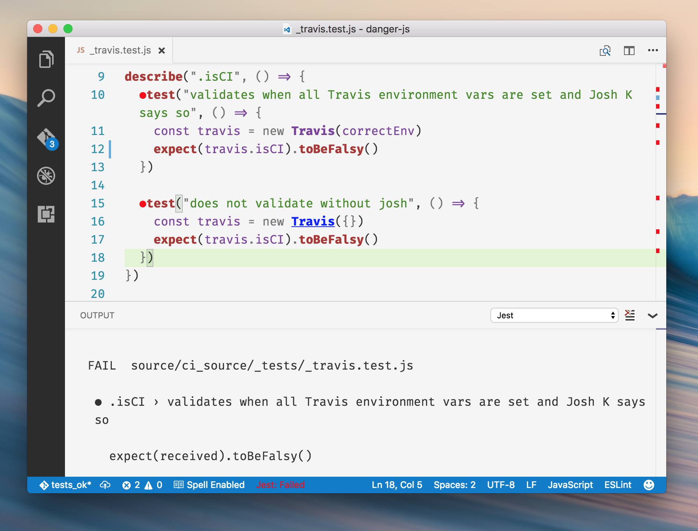

 ## The Aim

A comprehensive experience when using [Faceook's Jest](https://github.com/facebook/jest) within a project. 

* Useful IDE based Feedback
* Session based test watching

## Features

* Starts Jest automatically when you're in a project with it installed.
* (WIP) Show individual fail / passes inline.
* Show the overall pass/fail for the suite.
* (WIP) Show fails inside the problem inspector.
