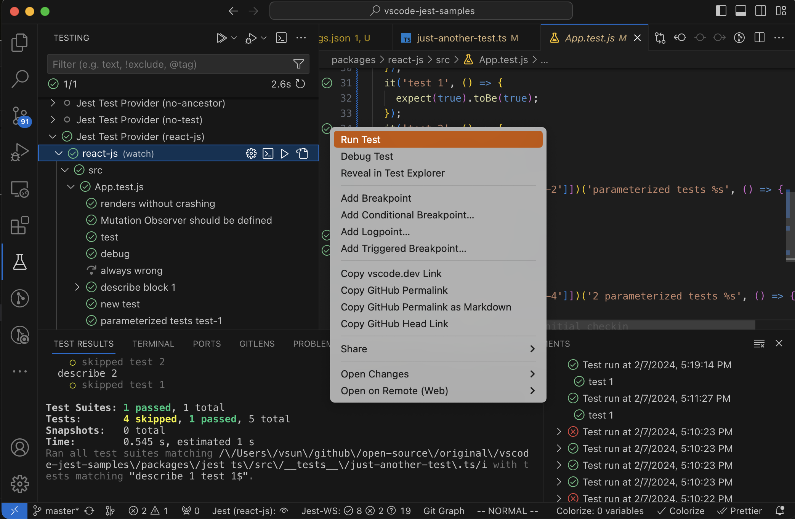
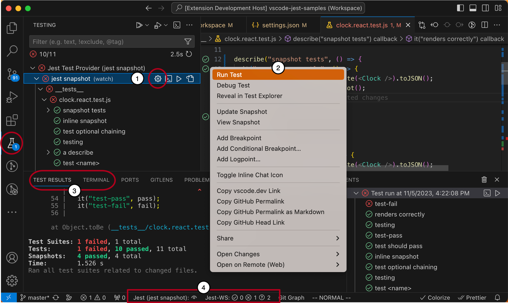
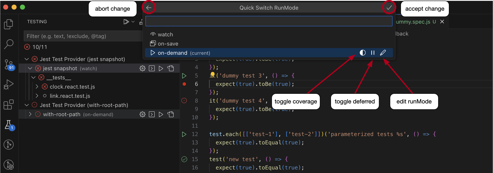
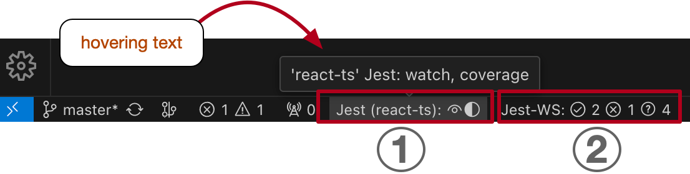
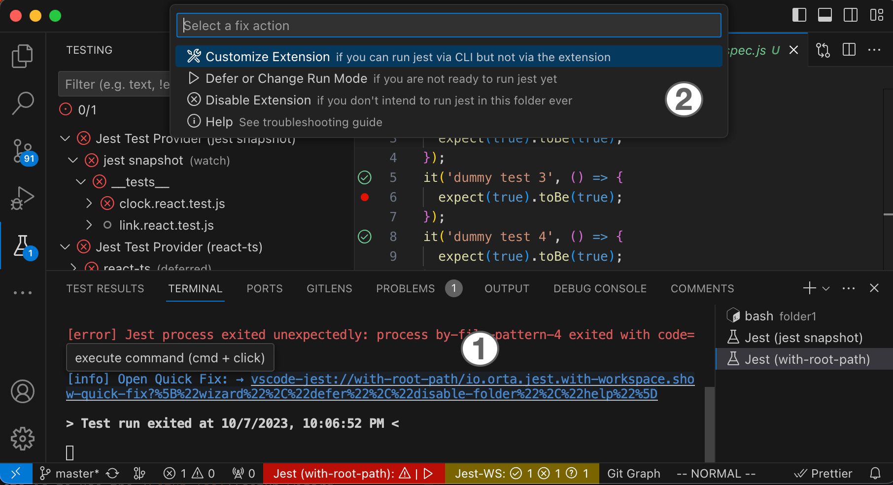
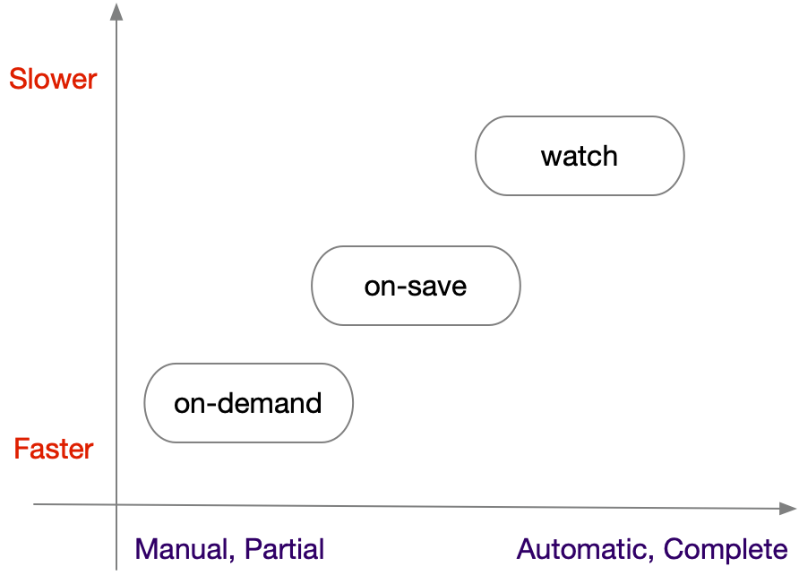

# vscode-jest

[](https://github.com/jest-community/vscode-jest/actions) [](https://coveralls.io/github/jest-community/vscode-jest?branch=master) [](https://marketplace.visualstudio.com/items?itemName=Orta.vscode-jest)

---
## Getting Started 

This extension supports full [jest](https://jestjs.io/) features in vscode environment to make testing more intuitive and fun. It should work out-of-the-box for most common jest projects. To get started:

1. Setup [jest](https://jestjs.io/docs/getting-started) in your project if you haven't.
2. [install](#installation) **"Jest"** extension in vscode.
3. reload or restart vscode 

If the extension can find the jest command, by default it will automatically run and monitor all tests in watch mode upon launch, and you should see tests, status, errors, coverage (if enabled) in TestExplorer and editors like this:



If you have a more sophisticated project configuration or prefer to run tests differently, fear not, the extension supports extensive [customization settings](#customization). For example:

- you can use [jest.jestCommandLine](#jestcommandline) to tell the extension to use `yarn test` instead of the default jest command.
- you can use [jest.runMode](#runmode) to optimize performance and control when the extension should run your tests. 
- you can use the extension with monorepo projects, see [monorepo project support](#how-to-use-the-extension-with-monorepo-projects) for details.

You can see the full [features](#features) and learn more details in the [How-To](#how-to) section. If you encounter an unexpected error, feel free to checkout the [Troubleshooting](#troubleshooting) or file an [issue](https://github.com/jest-community/vscode-jest/issues). 

Happy testing!

## Releases 
- **Current** ([v6.4.4](https://github.com/jest-community/vscode-jest/releases/tag/v6.4.4)): [release note](release-notes/release-note-v6.md#v644)
- **Previous** ([v6.4.0](https://github.com/jest-community/vscode-jest/releases/tag/v6.4.0)): [release note](release-notes/release-note-v6.md#v640)

 
All: [Release Notes](release-notes/release-notes.md)

---

Content
- [vscode-jest](#vscode-jest)
  - [Getting Started](#getting-started)
  - [Releases](#releases)
  - [Features](#features)
  - [Installation](#installation)
  - [User Interface](#user-interface)
  - [How To?](#how-to)
    - [How to set up the extension?](#how-to-set-up-the-extension)
    - [How to change runMode for the current session?](#how-to-change-runmode-for-the-current-session)
    - [How to trigger a test run?](#how-to-trigger-a-test-run)
    - [How to debug tests?](#how-to-debug-tests)
    - [How to use code coverage?](#how-to-use-code-coverage)
      - [How to read coverage scheme and customize it](#how-to-read-coverage-scheme-and-customize-it)
    - [How to update and view snapshots](#how-to-update-and-view-snapshots)
    - [How to use the extension with monorepo projects?](#how-to-use-the-extension-with-monorepo-projects)
    - [How to read the StatusBar?](#how-to-read-the-statusbar)
    - [How to perform Quick-Fix?](#how-to-perform-quick-fix)
    - [How to see more debug info (self-diagnosis)?](#how-to-see-more-debug-info-self-diagnosis)
  - [Customization](#customization)
    - [Settings](#settings)
      - [jestCommandLine](#jestcommandline)
      - [rootPath](#rootpath)
      - [coverageFormatter](#coverageformatter)
      - [coverageColors](#coveragecolors)
      - [outputConfig](#outputconfig)
      - [runMode](#runmode)
      - [autoRun](#autorun)
      - [testExplorer](#testexplorer)
      - [shell](#shell)
      - [monitorLongRun](#monitorlongrun)
      - [autoRevealOutput](#autorevealoutput)
      - [parserPluginOptions](#parserpluginoptions)
      - [virtualFolders](#virtualfolders)
    - [Debug Config](#debug-config)
      - [Debug Config v2](#debug-config-v2)
  - [Commands](#commands)
  - [Menu](#menu)
  - [Troubleshooting](#troubleshooting)
    - [Jest failed to run](#jest-failed-to-run)
    - [Performance issue?](#performance-issue)
    - [Intermittent errors for (npm/yarn/node) command not found during test run or debugging](#intermittent-errors-for-npmyarnnode-command-not-found-during-test-run-or-debugging)
    - [I don't see "Jest" in the bottom status bar](#i-dont-see-jest-in-the-bottom-status-bar)
    - [What to do with "Long Running Tests Warning"](#what-to-do-with-long-running-tests-warning)
    - [The tests and status do not match or some tests showing question marks unexpectedly?](#the-tests-and-status-do-not-match-or-some-tests-showing-question-marks-unexpectedly)
  - [Want to Contribute?](#want-to-contribute)
  - [License](#license)

---
## Features

* Starts Jest automatically for most projects with runnable jest configurations.
* Supports monorepo, react, react-native, angular, vue and various configurations/platforms.
* Supports running multiple jest processes within the same workspace folder.
* Fully integrated with the vscode TestExplorer.
* Help debug jest tests in vscode.
* View and update snapshots interactively. 
* Show coverage information in files being tested.
* Supports both automatic and manual test runs at any level, and easy-switch via UI.
* Supports additional IntelliSense for jest methods.
* Show fails inline of the `expect` function, as well as in the problem inspector.
* active community support.

## Installation

Simply open Visual Studio Code, go to the extension view and search for "Jest". Alternatively, open [Jest - Visual Studio Marketplace](https://marketplace.visualstudio.com/items?itemName=Orta.vscode-jest) and click "Install".

For detailed releases and migration help, please see [releases](https://github.com/jest-community/vscode-jest/releases).

## User Interface 

This extension fully integrates with the VSCode testing framework, supporting both automatic and on-demand test runs. In addition to the standard VSCode Test Explorer interface, the extension provides additional UI elements to simplify the development workflow:



<br>

1. **Dynamic Run Mode**: [Run mode](#runmode) dictates the overall user experience, determining when tests should run, with or without coverage, error display style, etc. Different run modes may have different [performance implications](#runmode-tradeoff), particularly for larger projects. 
   
   We realized that runMode preference could change even within a given project, for example developers  prefer "watch" runMode when doing light code changes to ensure nothing breaks, may prefer the 'on-demand' mode during heavy test development for greater control over test execution. A static runMode config in "settings.json" is simply not sufficient. Therefore, we added the [runMode quick switch](#runmode-chooser) so users can easily switch to different runMode without permanently modifying the "settings.json".
   <br> 

2. **Interactive Test Run**: Besides automatic test executions ("watch", "on-save"), users can initiate full test actions, such as run, debug, [update/view snapshot](#how-to-update-and-view-snapshots), from both editor and Test Explorer through various [UI components](#how-to-trigger-a-test-run).
   <br>

3. **Test Output**: The extension offers native jest run outputs in both the "TERMINAL" and "TEST RESULTS" panel. "TEST RESULTS" panel mainly displays test run output in execution order, while "TERMINAL" groups test output by workspace folder/virtual-folder, and also includes extension configuration details, [quick-fix](#quick-fix-chooser) suggestions, etc. By default, the output appears when tests run, but this can be adjusted via the [outputConfig](#outputconfig) setting.
   <br>

4. **Extension Status**: Upon successful launch of the extension, the [status bar](#how-to-read-the-statusbar) shows the run status for the active folder, and the aggregated test status for the whole workspace. Clicking on each status reveals the associated output window.  

## How To?
### How to set up the extension?

Hopefully, you don't have to do anything. If you can run jest from the terminal, you should be able to use this extension.

The extension will try to auto-config a jest command and debug config when needed. If the auto-config fails, or any  non-test error occurred, users should see an [quick-fix-chooser](#quick-fix-chooser) link in the output terminal to  help resolving the issues. 

For more details see the [setup tool](setup-wizard.md) and the complete customization options in [settings](#settings).

### How to change runMode for the current session?
<a id='runmode-chooser'></a>
To adjust the runMode during your current session:

1. Click on the runMode buttons referenced in the [User Interface](#user-interface) section. This action will prompt a runMode chooser.

2. Within the chooser, you can swiftly switch the runMode type, toggle coverage, opt for deferred mode, or directly edit the runMode within an editor.



3. Confirm your adjustments by clicking the "Apply" button located on the top right. Or discard changes with the "Return" button on the top left.

Note: Changes to runMode using the UI will apply only to the ongoing session. Upon restarting the extension or reloading the window, the runMode will revert to the value in settings.json. However, you can write the current runMode value to `settings.json` with command: `"Jest: Save Current RunMode"` via command palette.

For an in-depth understanding of each type and the available options, refer to [runMode](#runmode).

### How to trigger a test run?

By default, the extension uses jest watch mode that automatically runs tests upon related file changes. In addition, users can also trigger individual tests/suites on-demand:


1. trigger test runs via the gutter menu of each test and describe blocks.
2. trigger test runs via the TestExplorer tree item's inline menu.
3. trigger test runs via command palette, such as `Jest: Run All Tests`
4. trigger test runs via the editor context menu: `Jest: Run Related Tests`

The extension will try to auto-config a jest runner, if it fails, you can try the [quick-fix-chooser](#quick-fix-chooser).
### How to debug tests?

There are 2 ways to debug a specific test:


1. via the editor gutter context menu
2. via the test tree item inline menu

The extension will try to generate a debug config, but if you encounter a debug error or want to change the configuration, please see [Customization - Debug Config](#debug-config).

### How to use code coverage?

---

**v6.3.0 and up**

Test coverage can also be run interactively via the TestExplorer tree view, by clicking the "Run with Coverage" button.


**v6.2.5 and below**

> [!Note]
> Note: The following describes the original test coverage feature, which remains available as of 2024/08/13. With the introduction of the new, more intuitive integration in v6.3.0, we plan to deprecate this feature soon. If you have any concerns or would like to share your thoughts on this change, please let us know.

Code coverage can be triggered via
1. change [runMode](#runmode) config via [chooser](#runmode-chooser) or settings.
2. [Command Palette](https://code.visualstudio.com/docs/getstarted/userinterface#_command-palette), select command like **Jest: Toggle Coverage** to activate or deactivate code coverage (see full list in [commands](#commands). 
  
The coverage stats will be displayed at the source code editor: summary at the top and inline coverage indicator based on the formatter selected.


To verify the coverage mode is on, one can check the [runMode chooser](#runmode-chooser) or the status bar (see [how to read the status bar](#how-to-read-the-statusbar))

Note: this extension supports both `babel` and `v8` coverageProviders. However, please note the coverage might not be exactly the same, see [facebook/jest#11188](https://github.com/facebook/jest/issues/11188) for more details.

#### How to read coverage scheme and customize it

In addition to the coverage summary that is shown on the top of the file, each line will be marked by its coverage status according to the coverage formatter configured. There are 3 types of coverage you might see in your source code, distinguished by colors:

- "covered": if the code is covered. Either not marked or "green" by default, depends on the formatter.
- "not-covered": if the code is not covered. Marked as "red" by default.
- "partially-covered": Usually this mean the branch (such as if, switch statements) only partially tested. Marked as "yellow" by default.
  - Please note, istanbuljs (the library jest used to generate coverage info) reports switch branch coverage with the first "case" statement instead of the "switch" statement.

You can customize coverage start up behavior, style and colors, see [customization](#customization) for more details.

### How to update and view snapshots


Users can update snapshots in any granularity from the context menu:
1. in the TestExplorer tree view: Update snapshot for the workspace, folder, test file, or just a single test.
2. in the Editor's gutter menu: Update and view the snapshot for a test block. 
  
Snapshots are now fully supported for parameterized (`test.each`) and template-literal named tests.

### How to use the extension with monorepo projects?

The extension supports monorepo projects with the following mechanisms:

1. Single-root workspace: If all tests from monorepo packages can be run from a centralized location, such as project root, then a single-root workspace with proper ["jest.jestCommandLine"](#jestcommandline) and ["jest.rootPath"](#rootpath) setting should work. 
2. Multi-root workspace: If each monorepo package has its own local jest root and configuration, a [multi-root workspaces](https://code.visualstudio.com/docs/editor/multi-root-workspaces) is required. Users can use `"jest.disabledWorkspaceFolders"` to exclude the packages from jest run. 
3. Virtual folders: Starting from v6, users can also use virtual folders to configure monorepo packages from the root folder. See [virtual folders](#virtual-folders) for more details.

For option 1 and 2, the easiest way to setup the monorepo projects is to use the [Setup Tool](setup-wizard.md#setup-monorepo-project) and choose **Setup monorepo project**. 

Please note, a working jest environment is a prerequisite for this extension. If you are having problem running the tests from a terminal, please follow [jest](https://jestjs.io/docs/configuration) instruction to set it up first.
   
### How to read the StatusBar?

StatusBar shows 2 types of information, illustrated below:



1. `Jest (folder-name)`: shows the mode and state of the "active" workspace folder or virtual folder (based on the active editor). As the hovering text showed, the "active" folder "react-ts" is in "watch" mode with coverage on.
2. `Jest-WS`: shows the total test suite stats (pass, failed, unknown) for the whole workspace. Unknown test suites usually mean the test files are not yet run.

Hovering over the status items will show tooltips with descriptions; clicking on the items open the corresponding output window. 

### How to perform Quick-Fix?
<a id="quick-fix-chooser"></a>
Upon non-test errors, such as jest command not found, the extension can help user fix common errors with quick fix:



1. `cmd + click` on the quick fix link in the output terminal will open a quick-fix chooser.
2. A quick-fix chooser listed the fixes and hints to help resolve common errors:
   - **Customize Extensions**: If you can run jest with CLI in the terminal but not with the extension, chances are you might need to configure the `jest.jestCommandLine`, `jest.rootPath`, monorepo settings, etc. This action will open the [setup tools](setup-wizard.md) to continue. 
   - **Defer or Change Run Mode**: If the project has not yet ready to run jest, you can use this action to defer the test run or change the [runMode](#runmode) to on-demand mode. This action brings up a [runMode chooser](#runmode-chooser) to continue. 
   - **Disable Extension**: If you do not intend to run jest for this folder, you can choose this action to disable the extension. This action will set `"jest.enable": false` in the `.vscode/settings.json` file.
   - **Help**: If you are not sure what to do, you can choose this action to open the [troubleshooting](#troubleshooting) page.
   

### How to see more debug info (self-diagnosis)?

It is sometimes helpful to see the actual command and shell environment spawned, as well as internal debug messages, to diagnose issues:

1. Turn on the debug mode: set `"jest.debugMode": true` in `.vscode/settings.json`
2. Open the developer console (via `Help > Toggle Developer Tools` menu), for example, to examine the PATH environment variables: look for the "spawn" log, expand the "options" object, expand the "env" property, all env variables (inherited from vscode process) should be there (view [animation](https://github.com/jest-community/vscode-jest/blob/master/images/vscode-jest-env-log.gif)).

## Customization
### Settings
Users can use the following settings to tailor the extension for their environments.
- All settings are prefixed with `jest` and saved in standard `.vscode/settings.json`.
- settings marked with :x: are deprecated and subject to removal in the future.
- settings marked with 💼 apply to the whole workspace, otherwise on workspace-folder level.


|setting|description|default|example/notes|available|
|---|---|---|---|---|
|**Process**|
|[jestCommandLine](#jestcommandline)|The command line to start jest tests|undefined|`"jest.jestCommandLine": "npm test --"` or `"jest.jestCommandLine": "yarn test"` or `"jest.jestCommandLine": "node_modules/.bin/jest --config custom-config.js"`|
|[rootPath](#rootPath)|The path to your frontend src folder|""|`"jest.rootPath":"packages/app"` or `"jest.rootPath":"/apps/my-app"`|
|nodeEnv|Add additional env variables to spawned jest process|null|`"jest.nodeEnv": {"PORT": "9800", "BAR":"true"}` |
|[shell](#shell)|shell (path or LoginShell) for executing jest|null|`"jest.shell": "/bin/bash"` or `"jest.shell": "powershell"` or `"jest.shell": {"path": "/bin/bash"; args: ["--login"]}`  |
useDashedArgs| Determine if to use dashed arguments for jest processes |undefined|`"jest.useDashedArgs":true`| >= v6.0.0
|[parserPluginOptions](#parserpluginoptions)|Configure babel parser plugins|null|`"jest.parserPluginOptions": {decorators: 'legacy'}`|
|[virtualFolders](#virtual-folders)|defines multiple jest runs in a given vscode workspace folder|undefined|`"jest.virtualFolders": [{"name": "front-end", "rootPath": "packages/front-end"}, {"name": "back-end", "rootPath": "packages/back-end"} ]`| >= v6.0.0 
|useJest30|instruct the extension to use jest 30 command line syntax|undefined|`"jest.useJest30": true`| >= v6.3.0
|**UX**|
|[outputConfig](#outputconfig) 💼|Controls test output experience across the whole workspace.|undefined|`"jest.outputConfig": "neutral"` or `"jest.outputConfig": {"revealOn": "run", "revealWithFocus": "terminal", "clearOnRun": 'terminal"`| >= v6.1.0
|[runMode](#runmode)|Controls most test UX, including when tests should be run, output management, etc|undefined|`"jest.runMode": "watch"` or `"jest.runMode": "on-demand"` or `"jest.runMode": {"type": "on-demand", "deferred": true}`| >= v6.1.0
|:x: autoClearTerminal|Clear the terminal output at the start of any new test run.|false|`"jest.autoClearTerminal": true`| v6.0.0 (replaced by outputConfig)
|:x: [testExplorer](#testexplorer) |Configure jest test explorer|null|`{"showInlineError": "true"}`| < 6.1.0 (replaced by runMode)
|:x: [autoRun](#autorun)|Controls when and what tests should be run|undefined|`"jest.autoRun": "off"` or `"jest.autoRun": "watch"` or `"jest.autoRun": {"watch": false, "onSave":"test-only"}`| < v6.1.0 (replaced by runMode)
|:x: [autoRevealOutput](#autoRevealOutput)|Determine when to show test output|"on-run"|`"jest.autoRevealOutput": "on-exec-error"`| < v6.1.0 (replaced by outputConfig)
|**Coverage**|
|:x: showCoverageOnLoad|Show code coverage when extension starts|false|`"jest.showCoverageOnLoad": true`| < v6.1.0 (replaced by runMode)
|[coverageFormatter](#coverageFormatter)|Determine the coverage overlay style|"DefaultFormatter"|`"jest.coverageFormatter": "GutterFormatter"`|
|[coverageColors](#coverageColors)|Coverage indicator color override|undefined|`"jest.coverageColors": { "uncovered": "rgba(255,99,71, 0.2)", "partially-covered": "rgba(255,215,0, 0.2)"}`|
|**Misc**|
|enable|Enable/disable jest extension for the given workspace folder/virtual-folder|true|`"jest.enable": false`|>=6.0.0|
|disabledWorkspaceFolders 💼|Disabled workspace folders names in multi-root environment|[]|`"jest.disabledWorkspaceFolders": ["package-a", "package-b"]`|
|debugMode|Enable debug mode to diagnose plugin issues. (see developer console)|false|`"jest.debugMode": true`|
|[monitorLongRun](#monitorlongrun)| monitor long running tests based on given threshold in ms|60000|`"jest.monitorLongRun": 120000`|


#### jestCommandLine

This should be the command users used to kick off the jest tests in the terminal. However, since the extension will append additional options at run time, please make sure the command line can pass along these options, which usually just means if you uses npm, add an additional "--" at the end (e.g. `"npm run test --"`) if you haven't already in your script.
It is recommended not to add the following options as they are managed by the extension: `--watch`, `--watchAll`, `--coverage`

---
#### rootPath

If your project doesn't live in the root of your repository, you may want to customize the `jest.rootPath` setting to enlighten the extension as to where to look. For instance: `"jest.rootPath": "src/client-app"` will direct the extension to use the `src/client-app` folder as the root for Jest.

---
#### coverageFormatter

There are 2 formatters to choose from:
  <details>
  <summary> DefaultFormatter: high light uncovered and partially-covered code inline as well as on the right overview ruler. (this is the default)</summary>
  


</details>

 <details>
 <summary>GutterFormatter: render coverage status in the gutter as well as the overview ruler.</summary>
  


</details>


_(Note, there is an known issue in vscode (microsoft/vscode#5923) that gutter decorators could interfere with debug breakpoints visibility. Therefore, you probably want to disable coverage before debugging or switch to DefaultFormatter)_

---

#### coverageColors

Besides the formatter, user can also customize the color via `jest.coverageColors` to change color for 3 coverage categories: `"uncovered", "covered", or "partially-covered"`,
<details>
<summary>example</summary>

for example:
  ```json
  "jest.coverageColors": {
    "uncovered": "rgba(255,99,71, 0.2)",
    "partially-covered": "rgba(255,215,0, 0.2)",
  }
  ```
  the default color scheme below, note the opacity might differ per formatter:
  ```json
  "jest.coverageColors": {
    "covered": "rgba(9, 156, 65, 0.4)",
    "uncovered": "rgba(121, 31, 10, 0.4)",
    "partially-covered": "rgba(235, 198, 52, 0.4)",
  }
  ```
</details>

---

#### outputConfig

The `outputConfig` controls the Jest output experience by specifying when and where to create, display, and clear the output content. It supports 2 output panels: `TEST RESULTS` and `TERMINAL`. The `TEST RESULTS` panel displays test results in the order they were run, while the `TERMINAL` panel organizes outputs by workspace folder. `TERMINAL` panel also contains the non-test run outputs, such as [quick-fix link](#quick-fix-chooser), extension auto-config info, and tips. 

**Type Definitions**
```ts
// typescript type definition
export interface JestRawOutputSetting {
  revealOn?: 'run' | 'error' | 'demand';
  revealWithFocus?: 'terminal' | 'test-results' | 'none';
  clearOnRun?: 'both' | 'terminal' | 'test-results' | 'none';
}
export type JestPredefinedOutputSetting = 'neutral' | 'terminal-based' | 'test-results-based';
export type JestOutputSetting = JestPredefinedOutputSetting | JestRawOutputSetting;
```
**JestOutputSetting** 
This setting can be one of the predefined types or a custom object.

- **Predefined OutputConfig Settings** (JestPredefinedOutputSetting): 
    Predefined outputConfig|Description|JestRawOutputSetting|
    |:---:|---|---|
    |"neutral"| A passive setting that does not favor either panel | {revealOn: "run", revealWithFocus: "none", clearOnRun: "none"} |
    |"terminal-based"| A terminal-centric output experience|{revealOn: "run", revealWithFocus: "terminal", clearOnRun: "none"}|
    |"test-results-based"|A test-results-centric output experience|{revealOn: "run", revealWithFocus: "test-results", clearOnRun: "none"} | 

- **Custom Config Object** (JestRawOutputSetting): 
  - **revealOn**: Create or make output window available (without automatic focus switch). Possible values:
    1. "run": On test starts. (default)
    2. "error": On test failure.
    3. "demand": On manual trigger.
  - **revealWithFocus**: When revealing the output, which panel should have the focus, i.e. panel will become active. Possible values:
    1. "terminal": Show output in terminal panel and focus on it.
    2. "test-results": Show output in test results panel and focus on it.
    3. "none": No automatic focus change. (default)
  - **clearOnRun**: Determine if to automatically clear the output before each test run. Possible values:
    1. "both": Clear both terminal and test results panel.
    2. "terminal": Clear the terminal panel only.
    3. "test-results": clear the test results panel only.
    4. "none": Do not clear any panel. (default)
    (_**Note**: As of the current version, the testing framework does not support the clearing of the "TEST RESULTS" panel without side effects. The closest available command also clears all test item statuses, which may not be desirable. We are aware of this limitation and will raise the issue with the vscode team._)


<a id="outputconfig-conflict"></a>
**Handling Conflicts with "TEST RESULTS" panel setting**

_The Problem_

The behavior of the "TEST RESULTS" panel is influenced by VSCode's native `"testing.automaticallyOpenTestResults"` setting. This can cause inconsistencies with your `"jest.outputConfig"` settings.

For instance, if you set `"jest.outputConfig": {"revealWithFocus": "none"}` to prevent automatic focus changes, but leave `"testing.automaticallyOpenTestResults"` at its default value of `"openOnTestStart"`, the "TEST RESULTS" panel will still automatically switch focus when the tests are run via UI.

_The Universal Solution_

For a consistent Jest output experience, the simplest solution is to set `"testing.automaticallyOpenTestResults": "neverOpen"`. This allows the extension to manage the "TEST RESULTS" and "TERMINAL" panels together using `"jest.outputConfig"` alone.

_Further Customization_

However, if you prefer "TEST RESULTS" and "TERMINAL" panels to behave differently and don't mind managing 2 settings yourself, you could play with different combinations. 

For instance, if `"testing.automaticallyOpenTestResults"` is set to `"openOnTestFailure"`, and you want your terminal panel to still reveal when any tests run, your setting would look like this: `"jest.outputConfig": {revealWithFocus: "terminal"}`.  

_Validation and Diagnosis_

The extension features output config diagnosis information in the jest terminal, as well as the built-in conflict detection and quick fixes to assist with the transition.

<a id="default-output-focus"></a>
**Default Output Focus Behavior by RunMode**
When none of the output settings (`"testing.automaticallyOpenTestResults"` and `"jest.outputConfig"`) are present, The default output behavior is determined by [runMode](#runmode):

| runMode| auto reveal "TEST RESULTS" | auto reveal "TERMINAL" |
|:--:|:--:|:--:|
| "watch" | :heavy_multiplication_x: | :heavy_multiplication_x:|
| "on-save" | :heavy_multiplication_x: | :heavy_multiplication_x: |
| "on-demand" | :heavy_check_mark: | :heavy_multiplication_x:|


**Configuration Examples**
- Choose a passive output experience that is identical to the previous version: no automatic focus switch, no automatic clear.
  ```json
  "testing.automaticallyOpenTestResults": "neverOpen",
  "jest.outputConfig": "neutral"
  ```
- Choose a terminal-based experience and switch focus to it when test run starts.
  ```json
  "testing.automaticallyOpenTestResults": "neverOpen",
  "jest.outputConfig": "terminal-based"
  ```
- Choose a test-results-based experience and switch focus to it only when test fails.
  ```json
  "testing.automaticallyOpenTestResults": "neverOpen",
  "jest.outputConfig": {
    "revealOn": "error",
    "revealWithFocus": "test-results",
  }
  ```
- Clear the terminal output on each run but do not automatically switch focus to any panel.
  ```json
  "testing.automaticallyOpenTestResults": "neverOpen",
  "jest.outputConfig": {
    "clearOnRun": "terminal"
  }
  ```

> [!NOTE] 
> <a id="outputconfig-migration"></a>
> **Migration Guide**
>
> Migrating to the new `"jest.outputConfig"` might require some manual adjustments, especially if you're working in a multi-root workspace. Here are some guidelines to help with the transition:
> 
> 1. **Workspace Level vs Workspace-Folder Level**: The new `"jest.outputConfig"` is a workspace-level setting, unlike legacy settings like `"jest.autoClearTerminal"` and `"jest.autoRevealOutput"`, which are workspace-folder level settings.
> 
> 2. **Backward Compatibility**: If no `"jest.outputConfig"` is defined in your settings.json, the extension will attempt to generate a backward-compatible outputConfig in memory. This uses the `"testing.automaticallyOpenTestResults"` setting and any legacy settings (`"jest.autoClearTerminal"`, `"jest.autoRevealOutput"`) you might have. Note that this might only work for single-root workspaces.
> 
> 3. **Customization Steps**:
In general it should work out of the box, but if you encounter any issues, here are some steps to help adjusting the output behavior:
>    - Use the `"Jest: Save Current Output Config"` command from the command palette to update your settings.json. Then adjust it to fit your needs.
>    - Fix warning if any: The save does not include `"testing.automaticallyOpenTestResults"`, so you might see the conflict warning message. You can either use the "Quick Fix" action or adjust the `settings.json` manually (see [handling conflict](#outputconfig-conflict)).
>    - Finally, remove any deprecated settings.
> 
> 4. **`testing.openTesting` Migration**:  
> **Note:** As of December 2024, the `testing.openTesting` setting has been renamed to `testing.automaticallyOpenTestResults` in vscode. If you previously used `testing.openTesting` in your settings, vscode should have automatically updated it. If not, please update it manually to ensure the extension functions as expected.  
>
> Following these steps will help you transition smoothly to using `"jest.outputConfig"`.

---

#### runMode

The `runMode` controls test UX, determining when tests should run, and housing the common run-time toggles like coverage.

**Type Definitions**
```ts
// typescript types
interface JestRunModeOptions {
  runAllTestsOnStartup?: boolean;
  coverage?: boolean;
  deferred?: boolean;
  showInlineError?: boolean;
}
export type JestRunMode = JestRunModeOptions & (
  | { type: 'watch' }
  | { type: 'on-demand' }
  | { type: 'on-save'; testFileOnly?: boolean }
);
```
- **JestRunMode**: Here's what each type does:
  - **watch**: Automatically triggers tests using watchman.
  - **on-demand**: Manually run tests through the UI.
  - **on-save**: Triggers tests every time you save a test or source file.
  
- **JestRunModeOptions**: Options applicable for all `runMode` types:
  - **runAllTestsOnStartup**: Want to run all tests as soon as the extension starts? Use this.
  - **coverage**: To get those coverage metrics, turn this on.
  - **deferred**: Usually, the extension sets things up before any test run, verifying the Jest env and discovering tests. This process is generally quick, but if you've got a hefty project or your setup isn't Jest-ready, this option helps:
    - `true`: Suspend the initial setup. Most UI components remain active. If you toggle `runMode.deferred` or manually trigger a test run, the setup will resume, deferred option will be set to false, and the runMode will operate as usual.
    - `false`: Default behavior, the setup process gets going before any test run.

    <details>

    <summary> defer vs. disable? 🤔 </summary>

    📌 Note: There's a distinction between the deferred mode and disabling the extension via "jest.enable: false". Disabling the extension will remove all test features for the given workspace-folder. In contrast, deferred just delays the setup but most UI features are still visible.

    </details>


**Predefined RunMode**

The following are the predefined `runMode` configurations for convenience. They are mapped to the specified `JestRunMode` type at run time.

|Predefined runMode|Description|JestRunMode|
|:---:|---|---|
|"watch"| run tests by watchman | {type: "watch"} |
|"on-save"| run tests when test or source files are saved|{type: "on-save"}|
|"on-demand"|run tests on-demand through UI | {type: "on-demand"} |
|"deferred"|defer test run and discovery until the first on-demand run | {type: "on-demand", deferred: true} |

**Examples**
- Run jest with watch mode - the default runMode if none is specified.
  ```json
  "jest.runMode": "watch"
  ```
- Run jest tests via UI only.
  ```json
  "jest.runMode": "on-demand"
  ```
- Delay extension setup until the actual on-demand run.
  ```json
  "jest.runMode": "deferred"
  ```
- Run tests with coverage when test files are saved.
  ```json
  "jest.runMode": {
    "type": "on-save",
    "testFileOnly": true,
    "coverage": true
  }
  ```
- Delay extension setup until the actual (on-demand) run; after that, automatically run tests when test/src files are saved.
  ```json
  "jest.runMode": {
    "type": "on-save",
    "deferred": true
  }
  ```
**runMode performance tradeoff**
<a id="runmode-tradeoff"></a>

Balancing performance, convenience and completeness is often challenging. The runMode offers a tool to fine-tune this equilibrium according to your preferences.



While the concepts of performance and automation are generally clear, "completeness" may require some elaboration:

1. Test coverage might not be comprehensive since it only captures the tests that were executed.
2. If you modify the source or test code, potential failures in other tests may remain hidden until they are explicitly run.
3. Tests bearing dynamic names, like those using test.each with variables or template literals, won't be translated. As a result, they must be executed through higher-level constructs, such as describe blocks with static names or entire test suites.

> [!NOTE] 
> <a id="runmode-migration"></a>
> **Migration Guide**
> 
> Starting from v6.1.0, if no runMode is defined in settings.json, the extension will automatically generate one using legacy settings (`autoRun`, `showCoverageOnLoad`). To migrate, simply use the `"Jest: Save Current RunMode"` command from the command palette to update the setting, then remove the deprecated settings.

---

#### autoRun

> [!WARNING]
>  As of v6.1.0, autoRun will be replaced by <a href="#runmode">runMode</a>. For transition details, please refer to the <a href="#runmode-migration">runMode migration</a>.

AutoRun controls when tests should be executed automatically.

Performance and automation/completeness are often a trade-off. autoRun is the tool to fine-tune the balance, which is unique for every project and user. 


Performance and automation are self-explanatory, "completeness" might not: 
1. test coverage might not be complete as it only includes the tests that ran.
2. when changing the source or test code, you might not see all the tests broken until you run them explicitly.
3. tests with dynamic names (test.each with variables, template-literals, etc.) will not be translated; therefore, they can only be run through parent blocks (describe-with-static-name or test suite, etc.).

There are 2 ways to change autoRun: 
1. Temporarily toggle autoRun on/off in TestExplorer
2. Change "jest.autoRun" in `settings.json` file.

<a id="autorun-config">**autoRun Configuration**</a>

  ```ts
  AutoRun =
    | "watch" | "off" | "legacy" | "on-save"
    | { watch: true, onStartup?: ["all-tests"] }
    | {
        watch: false,
        onStartup?: ["all-tests"],
        onSave?: "test-file" | "test-src-file",
      }
  ```

  The string type are short-hand for the most common configurations:

  | Short Hand | description | actual config | note |
  |:-:|---|---|---|
  |**"watch"** |run jest in watch mode| {"watch": true} | the default mode|
  |**"off"**|turn off jest autoRun| {"watch": false} | this is the manual mode | 
  |**"legacy"**|starting a full test-run followed by jest watch| {"watch": true, "onStartup": ["all-tests"]} | he default mode prior to v4.7 | 
  |**"on-save"**|run jest upon source or test file changes| {"watch": false, "onSave": "test-src-file"} | | 

  User can also pass the actual config in the `.vscode/settings.json`, see more example below.

  <details>
  <summary>example</summary>

  - Turn off auto run, users need to trigger tests run manually via run commands or context menu:
    ```json
    "jest.autoRun": "off"
    ```
  - Run all the tests in the workspace upon extension startup, followed by jest watch run for subsequent test/src file changes.
    ```json
    "jest.autoRun": "legacy"
    ```
    or
    ```json
    "jest.autoRun": {
      "watch": true,
      "onStartup": ["all-tests"]
    }
    ```

  - Only run tests in the test file when the test file itself changes. It will neither run all tests for the workspace upon startup nor trigger any test run when the source file changes. 
    ``` json
    "jest.autoRun": {
       "watch": false,
       "onSave": "test-file"
    }
    ```
  - Like the one above but does run all tests upon extension start up
    
    ``` json
    "jest.autoRun": {
      "watch": false,
      "onSave": "test-file",
      "onStartup": ["all-tests"]
    }
    ```

</details>

**Please note**, _even when the `autoRun` is "off", the extension will still perform the usual setup upon start-up, such as checking jest env and parsing test blocks, so users can run test blocks manually. To turn off the extension completely for the given workspace, you can use `jest.enable` setting instead._


---

#### testExplorer

> [!WARNING]
>   As of v6.1.0, this setting has been folded into <a href="#runmode">runMode</a>. For transition details, please refer to the <a href="#runmode-migration">runMode migration</a>.

  ```ts
  testExplorer = {showInlineError?: boolean}
  ```
  - `showInlineError`: (optional) show vscode style inline error and error message viewer. Default is false.

---

#### shell
```ts
shell = string | LoginShell;

interface LoginShell 
{
  path: string;
  args: string[];
}
```
By default, jest command is executed in default shell ('cmd' for windows, '/bin/sh' for non-windows). Users can use the `"jest.shell"` setting to either pass the path of another shell (e.g. "/bin/zsh") or a LoginShell config, e.g. `{"path": "/bin/bash", "args": ["--login"]}`)

Note the LoginShell is only applicable for non-windows platform and could cause a bit more overhead.

<a id="auto-recovery-login-shell"></a>
**Auto recovery with login shell**
Since v5, if detected shell env issue, such as `node: command not found` or `npm: no such file or directory`, the extension will fallback to a login shell to ensure tests can run correctly. If will try to auto generate a login shell configuration based on the `jest.shell` setting, otherwise, it will use the default `bash` login-shell. Currently supported auto-fallback shells are `bash`, `zsh`, `fish`.


---

#### monitorLongRun
```ts
monitorLongRun = number | 'off'
```

- specify a number (milliseconds) means any run exceeds this threshold will trigger a warning. The number has to be > 0. 
- specify "off" to disable long-run process monitoring

Default is `"jest.monitorLongRun":60000` (1 minute)


---

#### autoRevealOutput

> [!WARNING]
>  As of v6.1.0, this setting has been folded into <a href="#outputconfig">outputConfig</a>. For transition details, please refer to the <a href="#outputconfig-migration">outputConfig migration</a>.

```ts
autoRevealOutput = "on-run" | "on-exec-error" | "off"
```
- `on-run`: reveal test run output when test run started.
- `on-exec-error`: reveal test run output only when execution error (note, not test error) occurred.
- `off`: no auto reveal test output. Note this could mask critical error, check status bar status for detail.

---

#### parserPluginOptions

```ts
parserPluginOptions = { decorators?: 
  | 'legacy' 
  | {
      decoratorsBeforeExport?: boolean;
      allowCallParenthesized?: boolean;
    }
  }
```
This extension uses babel to parse the test files. For decorators [plugin options](https://babeljs.io/docs/en/babel-parser#plugins-options), it uses  `'decorators', {decoratorsBeforeExport: true}` by default, which can be customized with this setting. Examples:
```json
"jest.parserPluginOptions": {"decorators": "legacy"}

"jest.parserPluginOptions": {"decorators": {"decoratorsBeforeExport": false}}
```

---

<a id="virtual-folders"></a>
#### virtualFolders

Much like a vscode workspace folder, which manages a runtime environment for a specific folder, a virtualFolder manages a custom Jest runtime environment. Each virtualFolder can have its own resource-level [settings](#settings), such as `jestCommandLine` and `rootPath`.

You can configure multiple virtual folders within any given vscode workspace folder using the `jest.virtualFolders` setting. Here are a few common use cases and examples:

1. Your project contains multiple jest configurations, such as unit test and integration test. While they run on the same set of source files, you want to run them separately and with different frequency: for instance, unit tests should always run automatically ("runMode": "watch") while the integration tests should only run on-demand ("runMode": "on-demand"): 

   ```json
   // settings.json for unit and integration test environments under the root folder:
   {
     "jest.virtualFolders": [
       {"name": "unit-tests", "jestCommandLine": "yarn test --config jest.unit.config.js", "runMode": "watch"},
       {"name": "integration-tests", "jestCommandLine": "yarn test --config jest.integration.config.js", "runMode": "on-demand"}
     ]
   }
   ```

2. Your project is a monorepo and you want to run tests for each package separately. You can configure a virtual folder for each package:
   
   ```json
   // settings.json for a monorepo project under the root folder:
   {
     "jest.virtualFolders": [
       {"name": "package1", "rootPath": "packages/package1"},
       {"name": "package2", "rootPath": "packages/package2"}
     ]
   }
   ```


**Virtual Folders Inherit and Override Workspace Folder Settings**
Virtual folders inherit settings from the parent workspace but can override these settings as needed. For instance, you can set the runMode to "watch" in the workspace, but set it to "on-demand" for the virtual folders with many or expensive tests. This flexibility allows for granular control over the testing environments within a single workspace folder.


```json
// settings.json in the "project" folder
{
  ...
  "jest.runMode": "watch",
  "jest.jestCommandLine": "yarn test",
  "jest.virtualFolders": [
    {"name": "unit-tests"},
    {"name": "integration-tests", , "runMode": "on-demand", "jestCommandLine": "yarn test --config=jest.integration.config.js"}
  ]
}
```

In this scenario, the "project" workspace will not run its own Jest environment but will instead spawn two separate Jest environments for "unit-tests" and "integration-tests".

<details>

<summary> 🤔 VirtualFolders vs. Multi-root Workspace?</summary>

**VirtualFolders vs. Multi-root Workspace**
While virtual folders are primarily designed to address the gap of supporting multiple test configurations for the same set of source files, they are also capable of supporting monorepo projects. Some developers might prefer this approach over traditional multi-root workspaces due to the simplified and centralized settings over individual package settings.

However, there are some key differences between virtual folders and multi-root workspaces to consider:

1. Debug configurations for all virtual folders will appear in the same launch.json or debug configuration dropdown menu, each marked with the folder name for differentiation.
2. Any changes to settings within the same VSCode folder will trigger a refresh or relaunch of all virtual folders within that folder.
3. The StatusBar might display the status of multiple Jest runtime environments if the active editor document is shared by multiple virtual folders, such as a source code file that both unit and integration tests depend on.
4. You might receive additional prompts to select target folders when running commands for shared files.
5. virtualFolders only contains jest settings. If your project require non-jest settings from the package's own `.vscode/settings.json` (like in a multi-root workspace), then you are probably better off continue with multi-root workspace.

</details>

---


### Debug Config

This extension looks for jest specific debug config (`"vscode-jest-tests.[folder-name]"` or `"vscode-jest-tests.v2.[folder-name]"`) in the following order:
1. workspace folder `.vscode/launch.json`. 
2. workspace `xxx.code-workspace`, if exists
3. if none found, generated a debug config
  
The generated config should work for most standard jest or projects bootstrapped by `create-react-app`, however it might fall short for more sophisticated projects. Please use the [setup tool](setup-wizard.md) to help you configure or edit the `launch.json` file manually. 

There are many information online about how to setup vscode debug config for specific environments/frameworks, you might find the following helpful:
  - [vscode debug config properties](https://code.visualstudio.com/docs/nodejs/nodejs-debugging#_launch-configuration-properties)
  - [Launch configurations for common scenarios](https://code.visualstudio.com/docs/nodejs/nodejs-debugging#_launch-configurations-for-common-scenarios)
  - [vscode-recipes for debug jest tests](https://github.com/microsoft/vscode-recipes/tree/master/debugging-jest-tests)

#### Debug Config v2

v4.3 introduces a "variable substitution" based config with name `"vscode-jest-tests.v2.[folder-name]"`. The extension will merely substitute the jest variables in the config, without adding/removing anything else. 

Currently supported variables:
- **${jest.testNamePattern}** - will be replaced by the test block's full name (include the surrounding describe block names).
- **${jest.testFile}** - will be replaced by the test file name.
- **${jest.testFilePattern}** - will be replaced by the test file name suitable for regex arguments such as `--testPathPattern`.
  
<details>
<summary>Examples</summary>

- Plain jest debug config:
  ```json
  {
    "type": "node",
    "name": "vscode-jest-tests.v2",
    "request": "launch",
    "program": "${workspaceFolder}/node_modules/.bin/jest",
    "args": [
      "--runInBand",
      "--watchAll=false",
      "--testNamePattern",
      "${jest.testNamePattern}",
      "--runTestsByPath",
      "${jest.testFile}"
    ],
    "cwd": "${workspaceFolder}",
    "console": "integratedTerminal",
    "internalConsoleOptions": "neverOpen",
    "disableOptimisticBPs": true,
    "windows": {
      "program": "${workspaceFolder}/node_modules/jest/bin/jest"
    }
  }
  ```
- Angular users using yarn:
  ```json
  {
    "type": "node",
    "name": "vscode-jest-tests.v2",
    "request": "launch",
    "runtimeExecutable": "yarn",
    "args": [
      "test",
      "--run-in-band",
      "--watch-all=false",
      "--test-name-pattern",
      "${jest.testNamePattern}",
      "--test-path-pattern",
      "${jest.testFilePattern}"
    ],
    "cwd": "${workspaceFolder}",
    "console": "integratedTerminal",
    "internalConsoleOptions": "neverOpen",
    "disableOptimisticBPs": true
  }
  ``` 
  
</details>

## Commands

This extension contributes the following commands and can be accessed via [Command Palette](https://code.visualstudio.com/docs/getstarted/userinterface#_command-palette):


|command|description|availability|
|---|---|---|
|Jest: Start All Runners| start or restart all jest runners|always
|Jest: Stop All Runners| stop all jest runners |always
|Jest: Toggle Coverage| toggle coverage mode for all runners|always
|Jest: Start Runner (Select Workspace)| start or restart the jest runner for the selected workspace|multi-root workspace
|Jest: Stop Runner (Select Workspace)| stop jest runner for the selected workspace |multi-root workspace
|Jest: Toggle Coverage (Select Workspace)| toggle coverage mode for the selected workspace|multi-root workspace
|Jest: Run All Tests| run all tests for all the workspaces|always
|Jest: Run All Tests (Select Workspace)| run all tests for the selected workspace|multi-root workspace
|Jest: Run All Tests in Current Workspace| run all tests for the current workspace based on the active editor| always
|Jest: Toggle Coverage for Current Workspace| toggle coverage mode for the current workspace based on the active editor| always
|Jest: Save Current RunMode| update `"jest.runMode"` in `settings.json` based on the current value| always (>= 6.1.0)
|Jest: Save Current Output Config| update `"jest.outputConfig"` in `settings.json` based on the current value| always (>= 6.1.0)
|Jest: Setup Extension| start the setup tool|always|

In addition, TestExplorer also exposed many handy commands, see the full list by searching for `testing` in  [vscode keyboard shortcuts editor](https://code.visualstudio.com/docs/getstarted/keybindings#_keyboard-shortcuts-editor). One can assign/change keyboard shortcut to any of these commands, see [vscode Key Bindings](https://code.visualstudio.com/docs/getstarted/keybindings) for more details.

## Menu
User can trigger the following action from the text editor context-menu


|menu|description|keyboard shortcut
|---|---|---|
|Jest: Run Related Tests| if in test file, run all tests in the file; if in source file, run all tests with dependency to the file|Ctrl-Option-t (Mac) or Ctrl-Alt-t|

Please see [vscode Key Bindings](https://code.visualstudio.com/docs/getstarted/keybindings) if you want to change the keyboard shortcut.


## Troubleshooting
Sorry you are having trouble with the extension. If your issue did not get resolved after checking out the [how-to](#how-to) section and the tips below, feel free to [ask](https://github.com/jest-community/vscode-jest/issues) the community, chances are some one else had a similar experience and could help resolving it.

### Jest failed to run

  If you can't run jest in the terminal, please reference [jest configuration](https://jestjs.io/docs/configuration) to setup accordingly.

  If you can run jest manually in the terminal but the extension showed error like "xxx ended unexpectedly", following are the most common causes (see [self-diagnosis](#how-to-see-more-debug-info-self-diagnosis) if you need more debug info):

  
  - <a id="trouble-jest-cmdline"></a>**jest command line issue**: such as you usually run `yarn test` but the extension uses the default `jest` instead.
    - Try configuring the [jest.jestCommandLine](#jestcommandline) to mimic how you run jest from the terminal, such as `yarn test` or `npm run test --`. The extension can auto-config common configurations like create react apps but not custom scripts like [CRACO](https://github.com/gsoft-inc/craco).
  - **root path issue**: When jest test root path is different from the workspace folder. You can set [jest.rootPath](#rootPath) to the actual jest root. 
  - **monorepo project issue**: you have a monorepo project but might not have been set up properly. 
    - Please reference [how to use the extension with monorepo projects](#how-to-use-the-extension-with-monorepo-projects).
  
Feel free to try the [quick-fix chooser](#quick-fix-chooser), or check out the [customization](#customization) section to manually adjust the extension.

A few known failure scenarios:
- PNP without node_modules nor a "test" script in package.json will need to set up jest.jestCommandLine explicitly.

### Performance issue? 

The extension should be a thin wrapper on top of the jest process, i.e., it shouldn't use much more resources than the jest process itself. 

Having said that, we have definitely seen sluggish performance for some projects/users. The short answer is [try changing runMode in the explorer](#how-to-change-runmode-for-the-current-session), which should usually show noticeable improvement. 

The long answer is a bit more complicated:
- The jest/node/watchman might be slow due to code changes, your test setup, environment, etc. See [facebook/jest#11956](https://github.com/facebook/jest/issues/11956) for a glimpse of such examples. However, this issue should impact with or without this extension. There are many resources and tips online about optimizing jest performance; we will leave it at that. 
- Depending on the degree of cross-dependency or your development habit (e.g., save frequently even before the code is complete), the runMode system ( "watch" or "on-save") might decide to run many more tests than you intended to. Imagine adding a single test could trigger 90% of all the tests in the project... yeah we have been there, and it's not fun. If that's you, try [changing runMode to "on-demand"](#how-to-change-runmode-for-the-current-session) and only trigger test-run when ready with the run button in the gutter or test tree.
  - But keep in mind while performance is important, turning runMode to be less "complete" does come with a cost, such as incomplete coverage and missing-broken-tests-detection. Please read up on the [runMode trade-off](#runmode-tradeoff) and experiment to find the one that works for you.
- Never say never; it is possible that we did something stupid. :cold_sweat: Feel free to log an issue if your performance awe still needs to be resolved after you patiently read and tried the above.

### Intermittent errors for (npm/yarn/node) command not found during test run or debugging

This should only happen in Linux or MacOS, and is due to vscode not able to fully initialize the shell env when it starts up (more details [here](https://code.visualstudio.com/docs/supporting/faq#_resolving-shell-environment-fails)).

- for test run:
  A solution is introduced in [v5.0.2](release-notes/release-note-v5.md#v50-pre-release-roll-up), which will [automatically recover with a login-shell](#auto-recovery-login-shell) during such situation. Hopefully, this should not be an issue any more 🤞.
- for test debugging:
  - you can instruct vscode debugger to use a login shell via [task/debug profile](https://code.visualstudio.com/docs/terminal/profiles#_configuring-the-taskdebug-profile), for example, adding the following in your user's settings then restart:

    ```json
    "terminal.integrated.automationProfile.osx": {
      "args": ["-l"],
      "path": "/bin/bash"
    },
    ```

Alternatively, you can try the following methods if you prefer a non-login-shell solution:
  - simply restart vscode sometimes can fix it
  - start vscode from a terminal: type `code` from your external terminal

### I don't see "Jest" in the bottom status bar
This means the extension is not activated. 
  
vscode will automatically activate the extension upon detecting any of the following patterns:
  - jest config file (`jest.json`, `jest.config.js`, `jest.config.ts`, `jest.config.mjs`, `jest.config.cjs`, `jest.config.json`) any where under the project root.
  - jest command (`node_modules/.bin/jest`, `node_modules/react-scripts/node_modules/.bin/jest`) or react-native script (`node_modules/react-native-scripts`) **under the project root**.

If none of the auto activation criteria is met, you can do the following to manually activate the extension:
- create an empty `.vscode-jest` file at your actual project root.
- start jest run via command palette: `"Jest: Start All Runners"` will also activate the extension for the current vscode process.

### What to do with "Long Running Tests Warning"
The extension monitor excessive test run with ["jest.monitorLongRun"](#monitorlongrun) setting. By default if any runs exceed 60 seconds, a warning message will be shown. 
- If running the tests with the extension seems to be longer than running it from a terminal, chances are you can use ["jest.runMode"](#runmode) to optimize it, for example:
  - for process type "all-tests", you can turn off the all-tests from `runMode`.
  - for process type "watch-tests" or "watch-all-tests", you can maybe turn off watch mode and use "on-save" or "on-demand" instead. 
  
- If the tests are slow even from the terminal, i.e. without the extension, you will need to optimize your tests, feel free to check out [jest troubleshooting](https://jestjs.io/docs/troubleshooting) or other online articles.
- If the run appeared to hang, i.e. the TestExplorer or statusBar showed test running when it is not. It might be related to this [jest issue](https://github.com/facebook/jest/issues/13187), which should be fixed after release `29.0.2`. If you believe your issue is different, please [file a new issue](https://github.com/jest-community/vscode-jest/issues) so we can take a look.

You can also turn off the monitor or change the threshold with ["jest.monitorLongRun"](#monitorlongrun) to meet your needs. 

### The tests and status do not match or some tests showing question marks unexpectedly?

If your test file happen to have parameterized tests, i.e. `test.each` variations, please make sure you have jest version >= 26.5.

If the above did not resolve your issue, please see the [self-diagnosis](#how-to-see-more-debug-info-self-diagnosis) to show more insight of why the test and result could not be matched.

## Want to Contribute?

Thanks for considering! Check [here](CONTRIBUTING.md) for useful tips and guidelines.

## License

vscode-jest is [MIT licensed.](LICENSE)
