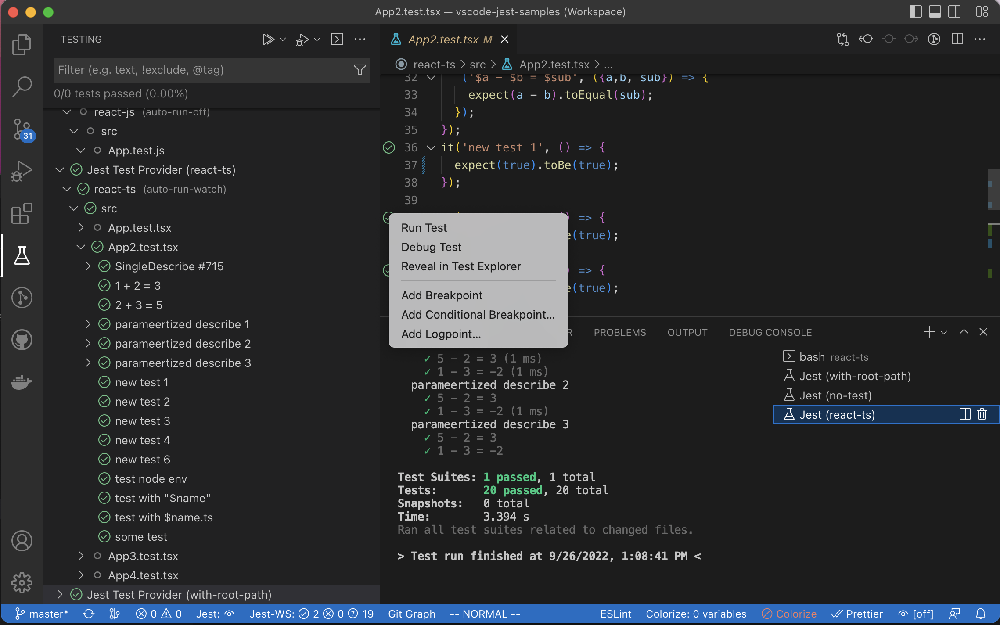
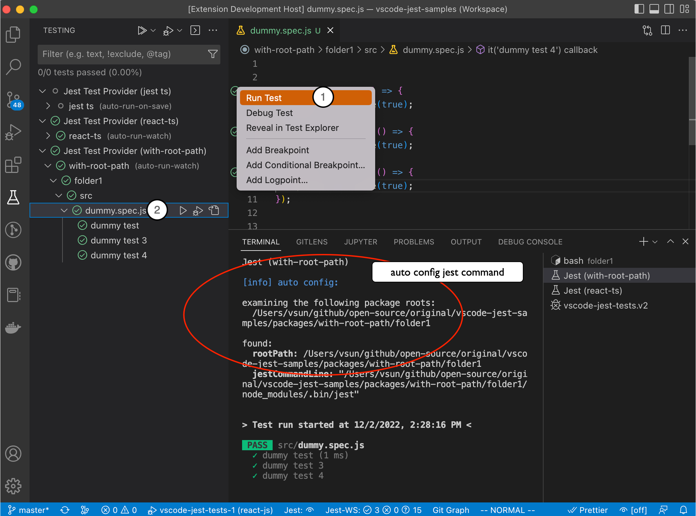
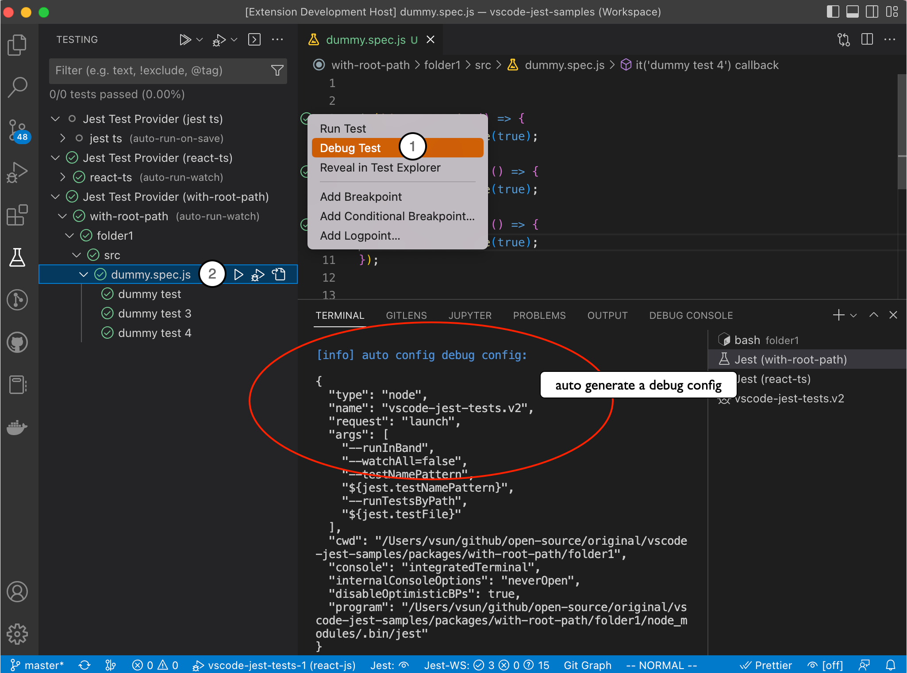
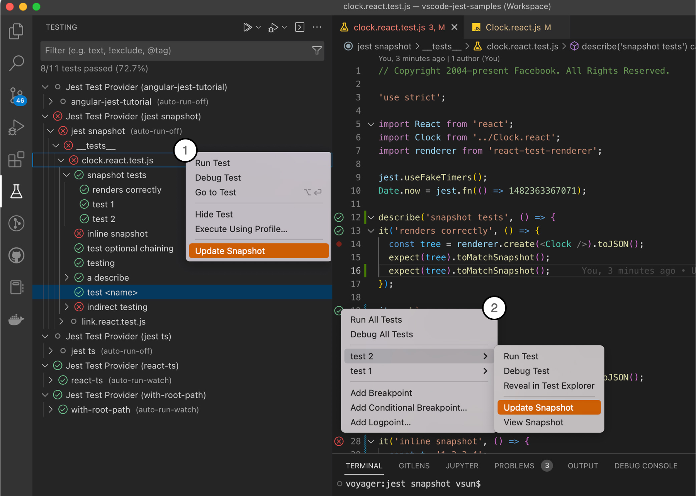
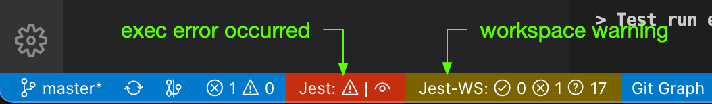
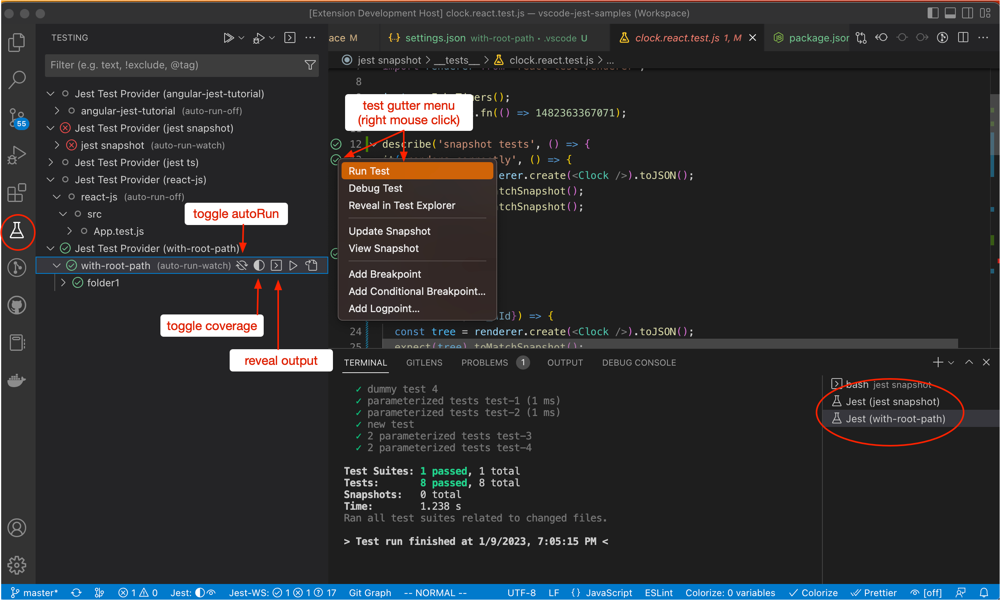
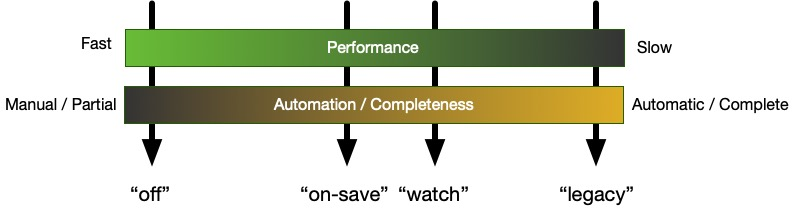

# vscode-jest

[](https://github.com/jest-community/vscode-jest/actions) [](https://coveralls.io/github/jest-community/vscode-jest?branch=master) [](https://marketplace.visualstudio.com/items?itemName=Orta.vscode-jest)

---
## Getting Started 

This extension supports full [jest](https://jestjs.io/) features in vscode environment to make testing more intuitive and fun. It should work out-of-the-box for most common jest projects. To get started:

1. Setup [jest](https://jestjs.io/docs/getting-started) in your project if you haven't.
2. [install](#installation) **"Jest"** extension in vscode.
3. reload or restart vscode 

If the extension can find the jest command, by default it will automatically run and monitor all tests in watch mode upon launch, and you should see tests, status, errors, coverage (if enabled) in TestExplorer and editors like this:



If you have a more sophisticated project configuration or prefer to run tests differently, fear not, the extension supports extensive [customization settings](#customization). For example:

- you can use [jest.jestCommandLine](#jestcommandline) to tell the extension to use `yarn test` instead of the default jest command.
- you can use [jest.autoRun](#autorun) to optimize performance and control when the extension should run your tests. 
- you can use the extension with monorepo projects, see [monorepo project support](#how-to-use-the-extension-with-monorepo-projects) for details.

You can see the full [features](#features) and learn more details in the [How-To](#how-to) section. If you encounter an unexpected error, feel free to checkout the [Troubleshooting](#troubleshooting) or file an [issue](https://github.com/jest-community/vscode-jest/issues). 

Happy testing!

## Releases 
- **Current** ([v5.2.3](https://github.com/jest-community/vscode-jest/releases/tag/v5.2.3)): [release note](release-notes/release-note-v5.x.md#v523)
- **Previous** ([v5.1.0](https://github.com/jest-community/vscode-jest/releases/tag/v5.1.0)): [release note](release-notes/release-note-v5.x.md#v510)
 
All: [Release Notes](release-notes/release-notes.md)

---

Content
- [vscode-jest](#vscode-jest)
  - [Getting Started](#getting-started)
  - [Releases](#releases)
  - [Features](#features)
  - [Installation](#installation)
  - [How To?](#how-to)
    - [How to set up the extension?](#how-to-set-up-the-extension)
    - [How to trigger the test run?](#how-to-trigger-the-test-run)
    - [How to debug tests?](#how-to-debug-tests)
    - [How to use code coverage?](#how-to-use-code-coverage)
    - [How to update and view snapshots](#how-to-update-and-view-snapshots)
    - [How to use the extension with monorepo projects?](#how-to-use-the-extension-with-monorepo-projects)
    - [How to read the StatusBar?](#how-to-read-the-statusbar)
    - [How to use the Test Explorer?](#how-to-use-the-test-explorer)
    - [How to see more debug info (self-diagnosis)?](#how-to-see-more-debug-info-self-diagnosis)
  - [Customization](#customization)
    - [Settings](#settings)
      - [Details](#details)
        - [jestCommandLine](#jestcommandline)
        - [rootPath](#rootpath)
        - [coverageFormatter](#coverageformatter)
        - [coverageColors](#coveragecolors)
        - [autoRun](#autorun)
        - [testExplorer](#testexplorer)
        - [shell](#shell)
    - [Debug Config](#debug-config)
      - [Debug Config v2](#debug-config-v2)
    - [monitorLongRun](#monitorlongrun)
    - [autoRevealOutput](#autorevealoutput)
    - [parserPluginOptions](#parserpluginoptions)
  - [Commands](#commands)
  - [Menu](#menu)
  - [Troubleshooting](#troubleshooting)
    - [Jest failed to run](#jest-failed-to-run)
    - [Performance issue?](#performance-issue)
    - [Intermittent errors for (npm/yarn/node) command not found during test run or debugging](#intermittent-errors-for-npmyarnnode-command-not-found-during-test-run-or-debugging)
    - [I don't see "Jest" in the bottom status bar](#i-dont-see-jest-in-the-bottom-status-bar)
    - [What to do with "Long Running Tests Warning"](#what-to-do-with-long-running-tests-warning)
    - [The tests and status do not match or some tests showing question marks unexpectedly?](#the-tests-and-status-do-not-match-or-some-tests-showing-question-marks-unexpectedly)
  - [Want to Contribute?](#want-to-contribute)
  - [License](#license)

---
## Features

* Starts Jest automatically for most projects with runnable jest configurations.
* Fully integrated with the vscode TestExplorer.
* Supports both automatic and manual test runs at any level, and easy-switch via UI.
* Supports additional IntelliSense for jest methods.
* Show fails inline of the `expect` function, as well as in the problem inspector.
* View and update snapshots interactively. 
* Help debug jest tests in vscode.
* Show coverage information in files being tested.
* Supports monorepo, react, react-native, vue and various configurations/platforms.
* active community support.

## Installation

Simply open [Jest - Visual Studio Marketplace](https://marketplace.visualstudio.com/items?itemName=Orta.vscode-jest) and click "Install".
Alternatively open Visual Studio Code, go to the extension view and search for "Jest".

For detailed releases and migration help, please see [releases](https://github.com/jest-community/vscode-jest/releases).

## How To?
### How to set up the extension?

Hopefully, you don't have to do anything. If you can run jest from the terminal, you should be able to use this extension.

The extension will try to auto-config a jest command and debug config when needed. If the auto-config fails, users should see an error panel with the `"Fix"` option to help them fix the settings.

A few known failure scenarios:
- PNP without node_modules nor a "test" script in package.json will need to set up jest.jestCommandLine explicitly.
- Multi-root monorepo project in a single-root workspace will need to be converted to a multi-root project first. From v5, you can quickly perform this with the [monorepo setup tool](setup-wizard.md#setup-monorepo-project).

For more details see the [setup tool](setup-wizard.md) and the complete customization options in [settings](#settings).

### How to trigger the test run?

By default, the extension uses jest watch mode that automatically runs tests upon related file changes. In addition, users can also trigger individual tests/suites interactively:



1. trigger test runs via the gutter menu of each test and describe blocks.
2. trigger test runs via the test tree inline menu.
3. trigger test runs via command palette, such as `Jest: Run All Tests`
4. trigger test runs via the editor context menu: `Jest: Run Related Tests`

The extension will try to auto-config a jest runner, if it fails, you can try the `"Fix"` button in the error panel or checkout the [troubleshooting](#troubleshooting).
### How to debug tests?

There are 2 ways to debug a specific test:



1. via the editor gutter context menu
2. via the test tree item inline menu

The extension will try to generate a debug config, but if you encounter a debug error or want to change the configuration, please see [Customization - Debug Config](#debug-config).

### How to use code coverage?

Code coverage can be triggered via
1. test tree item inline menu (see [toggle coverage](how-to-toggle-coverage))
2. [Command Palette](https://code.visualstudio.com/docs/getstarted/userinterface#_command-palette), select command like **Jest: Toggle Coverage** to activate or deactivate code coverage (see full list in [commands](#commands). 
  
The coverage state is reflected in test tree toggle menu, as well as  StatusBar:


This extension supports both `babel` and `v8` coverageProviders. However, please note the coverage might not be exactly the same, see [facebook/jest#11188](https://github.com/facebook/jest/issues/11188) for more details.

<details>

<summary>How to read coverage scheme and customize it</summary>

In addition to the coverage summary that is shown on the top of the file, each line will be marked by its coverage status according to the coverage formatter configured. There are 3 types of coverage you might see in your source code, distinguished by colors:

- "covered": if the code is covered. Either not marked or "green" by default, depends on the formatter.
- "not-covered": if the code is not covered. Marked as "red" by default.
- "partially-covered": Usually this mean the branch (such as if, switch statements) only partially tested. Marked as "yellow" by default.
  - _Please note, istanbuljs (the library jest used to generate coverage info) reports switch branch coverage with the first "case" statement instead of the "switch" statement._


You can customize coverage start up behavior, style and colors, see [customization](#customization) for more details.

</details>

### How to update and view snapshots



Users can update snapshots in any granularity from the context menu:
1. in the TestExplorer tree view: Update snapshot for the workspace, folder, test file, or just a single test.
2. in the Editor's gutter menu: Update and view the snapshot for a test block. 
  
Snapshots are now fully supported for parameterized (`test.each`) and template-literal named tests.

### How to use the extension with monorepo projects?

The easiest way to setup the monorepo projects is to use the [Setup Tool](setup-wizard.md#setup-monorepo-project) and choose **Setup monorepo project**

The extension supports monorepo projects in the following configurations:

1. Single-root workspace: If all tests from monorepo packages can be run from a centralized location, such as project root, then a single-root workspace with proper ["jest.jestCommandLine"](#jestcommandline) and ["jest.rootPath"](#rootpath) setting should work. 
2. Multi-root workspace: If each monorepo package has its own local jest root and configuration, a [multi-root workspaces](https://code.visualstudio.com/docs/editor/multi-root-workspaces) is required. Users can use `"jest.disabledWorkspaceFolders"` to exclude the packages from jest run. 

Please note, a working jest environment is a prerequisite for this extension. If you are having problem running the tests from a terminal, please follow [jest](https://jestjs.io/docs/configuration) instruction to set it up first.
   
### How to read the StatusBar?
StatusBar shows 2 kinds of information:
`Jest` shows the mode and state of the "active" workspace folder.
`Jest-WS` shows the total test suite stats for the whole workspace.
Clicking on each of these button will reveal the corresponding output window with more details.

<details>
<summary>Illustration</summary>


shows the active workspace has coverage on.


shows the active workspace has onSave for test file only, and that the workspace stats is out of sync with the code, such as when the source file is changed but the related tests are not run yet.


shows the autoRun will be triggered by either test or source file changes.



shows active workspace has an execution error.
</details>

### How to use the Test Explorer?
Users with `vscode` v1.59 and `vscode-jest` v4.1 and up will start to see tests appearing in the test explorer automatically. Test explorer provides a "test-centric" view, allows users to run/debug tests directly from the explorer, and provides a native terminal output experience (with colors!):



<a id='how-to-toggle-auto-run'>**How to toggle autoRun for the workspace?**</a>
- In TestExplorer, click on the root of the test tree, i.e. the one with the workspace name and the current autoRun mode. You will see a list of buttons to its right.
- Click on the [autoRun](#autorun) button (see image above) to toggle it on or off.
  - If autoRun is originally on, the button will turn it off and users can use the run menu (in both editor gutter and test explorer tree) to trigger test run(s).
  - If the autoRun is originally off, the button will turn it on by restoring to your original autoRun setting, if it is not "off", otherwise it will switch to ["on-save"](#autorun) mode instead.

<a id='how-to-toggle-coverage'>**How to toggle test coverage for the workspace?**</a>
- In TestExplorer, click on the root of the test tree, i.e. the one with the workspace name and the current autoRun mode. You will see a list of buttons to its right.
- Click on the coverage button (see image above) to toggle on or off.
  - The next test run (auto or manual) will start reporting test coverage.

<a id='how-to-reveal-output'>**How to reveal test output for the workspace?**</a>
- In TestExplorer, click on the root of the test tree, i.e. the one with the workspace name and the current autoRun mode. You will see a list of buttons to its right.
- Click on the terminal button (see image above) to reveal the test output terminal.


You can further customize the explorer with [jest.testExplorer](#testexplorer) in [settings](#settings).

### How to see more debug info (self-diagnosis)?

It is sometimes helpful to see the actual command and shell environment spawned, as well as internal debug messages, to diagnose issues:

1. Turn on the debug mode: set `"jest.debugMode": true` in `.vscode/settings.json`
2. Open the developer console (via `Help > Toggle Developer Tools` menu), for example, to examine the PATH environment variables: look for the "spawn" log, expand the "options" object, expand the "env" property, all env variables (inherited from vscode process) should be there (view [animation](https://github.com/jest-community/vscode-jest/blob/master/images/vscode-jest-env-log.gif)).

## Customization
### Settings
Users can use the following settings to tailor the extension for their environments.
- All settings are prefixed with `jest` and saved in standard `.vscode/settings.json`.
- settings crossed out are to be deprecated in the future
- settings marked with 💼 apply to the whole project, otherwise per workspace.


|setting|description|default|example/notes|
|---|---|---|---|
|**Process**|
|[jestCommandLine](#jestCommandLine)|The command line to start jest tests|undefined|`"jest.jestCommandLine": "npm test -"` or `"jest.jestCommandLine": "yarn test"` or `"jest.jestCommandLine": "node_modules/.bin/jest --config custom-config.js"`|
|nodeEnv|Add additional env variables to spawned jest process|null|`"jest.nodeEnv": {"PORT": "9800", "BAR":"true"}` |
|[shell](#shell)|shell (path or LoginShell) for executing jest|null|`"jest.shell": "/bin/bash"` or `"jest.shell": "powershell"` or `"jest.shell": {"path": "/bin/bash"; args: ["--login"]}`  |
|[autoRun](#autorun)|Controls when and what tests should be run|undefined|`"jest.autoRun": "off"` or `"jest.autoRun": "watch"` or `"jest.autoRun": {"watch": false, "onSave":"test-only"}`|
|[rootPath](#rootPath)|The path to your frontend src folder|""|`"jest.rootPath":"packages/app"` or `"jest.rootPath":"/apps/my-app"`|
|[monitorLongRun](#monitorlongrun)| monitor long running tests based on given threshold in ms|60000|`"jest.monitorLongRun": 120000`|
|[parserPluginOptions](#parserpluginoptions)|Configure babel parser plugins|null|`"jest.parserPluginOptions": {decorators: 'legacy'}`|
|**Editor**|
|[testExplorer](#testexplorer) |Configure jest test explorer|null|`{"showInlineError": "true"}`|
|**Coverage**|
|showCoverageOnLoad|Show code coverage when extension starts|false|`"jest.showCoverageOnLoad": true`|
|[coverageFormatter](#coverageFormatter)|Determine the coverage overlay style|"DefaultFormatter"|`"jest.coverageFormatter": "GutterFormatter"`|
|[coverageColors](#coverageColors)|Coverage indicator color override|undefined|`"jest.coverageColors": { "uncovered": "rgba(255,99,71, 0.2)", "partially-covered": "rgba(255,215,0, 0.2)"}`|
|**Misc**|
|debugMode|Enable debug mode to diagnose plugin issues. (see developer console)|false|`"jest.debugMode": true`|
|disabledWorkspaceFolders 💼|Disabled workspace folders names in multiroot environment|[]|`"jest.disabledWorkspaceFolders": ["package-a", "package-b"]`|
|[autoRevealOutput](#autoRevealOutput)|Determine when to show test output|"on-run"|`"jest.autoRevealOutput": "on-exec-error"`|

#### Details
##### jestCommandLine

This should be the command users used to kick off the jest tests in the terminal. However, since the extension will append additional options at run time, please make sure the command line can pass along these options, which usually just means if you uses npm, add an additional "--" at the end (e.g. `"npm run test --"`) if you haven't already in your script.
It is recommended not to add the following options as they are managed by the extension: `--watch`, `--watchAll`, `--coverage`

##### rootPath

If your project doesn't live in the root of your repository, you may want to customize the `jest.rootPath` setting to enlighten the extension as to where to look. For instance: `"jest.rootPath": "src/client-app"` will direct the extension to use the `src/client-app` folder as the root for Jest.

##### coverageFormatter

There are 2 formatters to choose from:
  <details>
  <summary> DefaultFormatter: high light uncovered and partially-covered code inlilne as well as on the right overview ruler. (this is the default)</summary>
  


</details>

 <details>
 <summary>GutterFormatter: render coverage status in the gutter as well as the overview ruler.</summary>
  


</details>


_(Note, there is an known issue in vscode (microsoft/vscode#5923) that gutter decorators could interfere with debug breakpoints visibility. Therefore, you probably want to disable coverage before debugging or switch to DefaultFormatter)_
##### coverageColors

Besides the formatter, user can also customize the color via `jest.coverageColors` to change color for 3 coverage categories: `"uncovered", "covered", or "partially-covered"`,
<details>
<summary>example</summary>

for example:
  ```json
  "jest.coverageColors": {
    "uncovered": "rgba(255,99,71, 0.2)",
    "partially-covered": "rgba(255,215,0, 0.2)",
  }
  ```
  the default color scheme below, note the opacity might differ per formatter:
  ```json
  "jest.coverageColors": {
    "covered": "rgba(9, 156, 65, 0.4)",
    "uncovered": "rgba(121, 31, 10, 0.4)",
    "partially-covered": "rgba(235, 198, 52, 0.4)",
  }
  ```
</details>

##### autoRun

Performance and automation/completeness are often a trade-off. autoRun is the tool to fine-tune the balance, which is unique for every project and user. 



Performance and automation are self-explanatory, "completeness" might not: 
1. test coverage might not be complete as it only includes the tests that ran.
2. when changing the source or test code, you might not see all the tests broken until you run them explicitly.
3. tests with dynamic names (test.each with variables, template-literals, etc.) will not be translated; therefore, they can only be run through parent blocks (describe-with-static-name or test suite, etc.).

There are 2 ways to change autoRun: 
1. Temporarily [toggle autoRun on/off in TestExplorer](#how-to-toggle-auto-run)
2. Change "jest.autoRun" in `settings.json` file.

<a id="autorun-config">**autoRun Configuration**</a>

  ```ts
  AutoRun =
    | "watch" | "off" | "legacy" | "on-save"
    | { watch: true, onStartup?: ["all-tests"] }
    | {
        watch: false,
        onStartup?: ["all-tests"],
        onSave?: "test-file" | "test-src-file",
      }
  ```

  The string type are short-hand for the most common configurations:

  | Short Hand | description | actual config | note |
  |:-:|---|---|---|
  |**"watch"** |run jest in watch mode| {"watch": true} | the default mode|
  |**"off"**|turn off jest autoRun| {"watch": false} | this is the manual mode | 
  |**"legacy"**|starting a full test-run followed by jest watch| {"watch": true, "onStartup": ["all-tests"]} | he default mode prior to v4.7 | 
  |**"on-save"**|run jest upon source or test file changes| {"watch": false, "onSave": "test-src-file"} | | 

  User can also pass the actual config in the `.vscode/settings.json`, see more example below.

  <details>
  <summary>example</summary>

  - Turn off auto run, users need to trigger tests run manually via [run commands](#commands-run) and [menus](#context-menu):
    ```json
    "jest.autoRun": "off"
    ```
  - Run all the tests in the workspace upon extension startup, followed by jest watch run for subsequent test/src file changes.
    ```json
    "jest.autoRun": "legacy"
    ```
    or
    ```json
    "jest.autoRun": {
      "watch": true,
      "onStartup": ["all-tests"]
    }
    ```

  - Only run tests in the test file when the test file itself changes. It will neither run all tests for the workspace upon startup nor trigger any test run when the source file changes. 
    ``` json
    "jest.autoRun": {
       "watch": false,
       "onSave": "test-file"
    }
    ```
  - Like the one above but does run all tests upon extension start up
    
    ``` json
    "jest.autoRun": {
      "watch": false,
      "onSave": "test-file",
      "onStartup": ["all-tests"]
    }
    ```

</details>

##### testExplorer
  ```ts
  testExplorer = {showInlineError?: boolean}
  ```
  - `showInlineError`: (optional) show vscode style inline error and error message viewer. Default is false.

##### shell
```ts
shell = string | LoginShell;

interface LoginShell 
{
  path: string;
  args: string[];
}
```
By default, jest command is executed in default shell ('cmd' for windows, '/bin/sh' for non-windows). Users can use the `"jest.shell"` setting to either pass the path of another shell (e.g. "/bin/zsh") or a LoginShell config, e.g. `{"path": "/bin/bash", "args": ["--login"]}`)

Note the LoginShell is only applicable for non-windows platform and could cause a bit more overhead.

<a id="auto-recovery-login-shell"></a>
_Note_: Since v5, if detected shell env issue, such as `node: command not found` or `npm: no such file or directory`, the extension will fallback to a login shell to ensure tests can run correctly. If will try to auto generate a login shell configuration based on the `jest.shell` setting, otherwise, it will use the default `bash` login-shell. Currently supported auto-fallback shells are `bash`, `zsh`, `fish`.

### Debug Config

This extension looks for jest specific debug config (`"vscode-jest-tests"` or `"vscode-jest-tests.v2"`) in the following order:
1. workspace folder `.vscode/launch.json`. 
2. workspace `xxx.code-workspace`, if exists
3. if none found, generated a debug config
  
The generated config should work for most standard jest or projects bootstrapped by `create-react-app`, however it might fall short for more sophisticated projects. Please use the [setup tool](setup-wizard.md) to help you configure or edit the `launch.json` file manually. 

There are many information online about how to setup vscode debug config for specific environments/frameworks, you might find the following helpful:
  - [vscode debug config properties](https://code.visualstudio.com/docs/nodejs/nodejs-debugging#_launch-configuration-properties)
  - [Launch configurations for common scenarios](https://code.visualstudio.com/docs/nodejs/nodejs-debugging#_launch-configurations-for-common-scenarios)
  - [vscode-recipes for debug jest tests](https://github.com/microsoft/vscode-recipes/tree/master/debugging-jest-tests)

#### Debug Config v2

v4.3 introduces a "variable substitution" based config with name `"vscode-jest-tests.v2"`. The extension will merely substitute the jest variables in the config, without adding/removing anything else. 

Currently supported variables:
- **${jest.testNamePattern}** - will be replaced by the test block's full name (include the surrounding describe block names).
- **${jest.testFile}** - will be replaced by the test file name.
- **${jest.testFilePattern}** - will be replaced by the test file name suitable for regex arguments such as `--testPathPattern`.
  
<details>
<summary>Examples</summary>

- Plain jest debug config:
  ```json
  {
    "type": "node",
    "name": "vscode-jest-tests.v2",
    "request": "launch",
    "program": "${workspaceFolder}/node_modules/.bin/jest",
    "args": [
      "--runInBand",
      "--watchAll=false",
      "--testNamePattern",
      "${jest.testNamePattern}",
      "--runTestsByPath",
      "${jest.testFile}"
    ],
    "cwd": "${workspaceFolder}",
    "console": "integratedTerminal",
    "internalConsoleOptions": "neverOpen",
    "disableOptimisticBPs": true,
    "windows": {
      "program": "${workspaceFolder}/node_modules/jest/bin/jest"
    }
  }
  ```
- Angular users using yarn:
  ```json
  {
    "type": "node",
    "name": "vscode-jest-tests.v2",
    "request": "launch",
    "runtimeExecutable": "yarn",
    "args": [
      "test",
      "--run-in-band",
      "--watch-all=false",
      "--test-name-pattern",
      "${jest.testNamePattern}",
      "--test-path-pattern",
      "${jest.testFilePattern}"
    ],
    "cwd": "${workspaceFolder}",
    "console": "integratedTerminal",
    "internalConsoleOptions": "neverOpen",
    "disableOptimisticBPs": true
  }
  ``` 
  
</details>

### monitorLongRun
```ts
monitorLongRun = number | 'off'
```

- specify a number (milliseconds) means any run exceeds this threshold will trigger a warning. The number has to be > 0. 
- specify "off" to disable long-run process monitoring

Default is `"jest.monitorLongRun":60000` (1 minute)

### autoRevealOutput
```ts
autoRevealOutput = "on-run" | "on-exec-error" | "off"
```
- `on-run`: reveal test run output when test run started.
- `on-exec-error`: reveal test run output only when execution error (note, not test error) occurred.
- `off`: no auto reveal test output. Note this could mask critical error, check status bar status for detail.

### parserPluginOptions

```ts
parserPluginOptions = { decorators?: 
  | 'legacy' 
  | {
      decoratorsBeforeExport?: boolean;
      allowCallParenthesized?: boolean;
    }
  }
```
This extension uses babel to parse the test files. For decorators [plugin options](https://babeljs.io/docs/en/babel-parser#plugins-options), it uses  `'decorators', {decoratorsBeforeExport: true}` by default, which can be customized with this setting. Examples:
```json
"jest.parserPluginOptions": {"decorators": "legacy"}

"jest.parserPluginOptions": {"decorators": {"decoratorsBeforeExport": false}}
```

## Commands

This extension contributes the following commands and can be accessed via [Command Palette](https://code.visualstudio.com/docs/getstarted/userinterface#_command-palette):


|command|description|availability|
|---|---|---|
|Jest: Start All Runners| start or restart all jest runners|always
|Jest: Stop All Runners| stop all jest runners |always
|Jest: Toggle Coverage| toggle coverage mode for all runners|always
|Jest: Start Runner (Select Workspace)| start or restart the jest runner for the selected workspace|multi-root workspace
|Jest: Stop Runner (Select Workspace)| stop jest runner for the selected workspace |multi-root workspace
|Jest: Toggle Coverage (Select Workspace)| toggle coverage mode for the selected workspace|multi-root workspace
|Jest: Run All Tests| run all tests for all the workspaces|always
|Jest: Run All Tests (Select Workspace)| run all tests for the selected workspace|multi-root workspace
|Jest: Run All Tests in Current Workspace| run all tests for the current workspace based on the active editor| always
|Jest: Toggle Coverage for Current Workspace| toggle coverage mode for the current workspace based on the active editor| always
|Jest: Setup Extension| start the setup tool|always|

In addition, TestExplorer also exposed many handy commands, see the full list by searching for `testing` in  [vscode keyboard shortcuts editor](https://code.visualstudio.com/docs/getstarted/keybindings#_keyboard-shortcuts-editor). One can assign/change keyboard shortcut to any of these commands, see [vscode Key Bindings](https://code.visualstudio.com/docs/getstarted/keybindings) for more details.

## Menu
User can trigger the following action from the text editor context-menu


|menu|description|keyboard shortcut
|---|---|---|
|Jest: Run Related Tests| if in test file, run all tests in the file; if in source file, run all tests with dependency to the file|Ctrl-Option-t (Mac) or Ctrl-Alt-t|

Please see [vscode Key Bindings](https://code.visualstudio.com/docs/getstarted/keybindings) if you want to change the keyboard shortcut.


## Troubleshooting
Sorry you are having trouble with the extension. If your issue did not get resolved after checking out the [how-to](#how-to) section and the tips below, feel free to [ask](https://github.com/jest-community/vscode-jest/issues) the community, chances are some one else had a similar experience and could help resolving it.

### Jest failed to run

  If you can't run jest in the terminal, please reference [jest configuration](https://jestjs.io/docs/configuration) to setup accordingly.

  If you can run jest manually in the terminal but the extension showed error like "xxx ended unexpectedly", following are the most common causes (see [self-diagnosis](#how-to-see-more-debug-info-self-diagnosis) if you need more debug info):

  
  - <a id="trouble-jest-cmdline"></a>**jest command line issue**: such as you usually run `yarn test` but the extension uses the default `jest` instead.
    - Try configuring the [jest.jestCommandLine](#jestcommandline) to mimic how you run jest from the terminal, such as `yarn test` or `npm run test --`. The extension can auto-config common configurations like create react apps but not custom scripts like [CRACO](https://github.com/gsoft-inc/craco).
    - or you can use the **"Run Setup Tool"** button in the error panel to resolve the configuration issue, see [Setup Tool](setup-wizard.md).  
  - **monorepo project issue**: you have a monorepo project but might not have been set up properly. 
    - short answer is try [Setup monorepo project](setup-wizard.md#setup-monorepo-project) tool. Or read more detail in [how to use the extension with monorepo projects](#how-to-use-the-extension-with-monorepo-projects).
  
There could be other causes, such as jest test root path is different from the project's, which can be fixed by setting [jest.rootPath](#rootPath). Feel free to check out the [customization](#customization) section to manually adjust the extension if needed.

### Performance issue? 

The extension should be a thin wrapper on top of the jest process, i.e., it shouldn't use much more resources than the jest process itself. 

Having said that, the sluggish performance for some projects/users is real, and we can help. The short answer is [try turning off autoRun in the explorer](#how-to-toggle-auto-run), which should usually show noticeable improvement. 

The long answer is a bit more complicated:
- The jest/node/watchman might be slow due to code changes, your test setup, environment, etc. See [facebook/jest#11956](https://github.com/facebook/jest/issues/11956) for a glimpse of such examples. However, this issue should impact with or without this extension. There are many resources and tips online about optimizing jest performance; we will leave it at that. 
- Depending on the degree of cross-dependency or your development habit (e.g., save frequently even before the code is complete), the autoRun system ( jest watchman "watch" or "on-save") might decide to run many more tests than you intended to. Imagine adding a single test could trigger 90% of all the tests in the project... yeah we have been there, and it's not fun. If that's you, try [toggling off autoRun in TestExplorer](#how-to-toggle-auto-run) and only trigger test-run when ready with the run button in the gutter or test tree.
  - But keep in mind while performance is important, turning autoRun off or setting it to be less "complete" does come with a cost, such as incomplete coverage and missing-broken-tests-detection. Please read up on the [autoRun trade-off](#autorun) and experiment to find the one that works for you.
- Never say never; it is possible that we did something stupid. :cold_sweat: Feel free to log an issue if your performance awe still needs to be resolved after you patiently read and tried the above.

<details>

<summary>fine tune performance with autoRun demo</summary>

https://user-images.githubusercontent.com/891093/199872543-4f37de90-1e56-4e0d-8387-9af591264e13.mov

Every project and developer are different. Experiment and pick the autoRun setting that fits your style and preference!

</details>

### Intermittent errors for (npm/yarn/node) command not found during test run or debugging

This should only happen in Linux or MacOS, and is due to vscode not able to fully initialize the shell env when it starts up (more details [here](https://code.visualstudio.com/docs/supporting/faq#_resolving-shell-environment-fails)).

- for test run:
  A solution is introduced in [v5.0.2](release-notes/release-note-v5.md#v50-pre-release-roll-up), which will [automatically recover with a login-shell](#auto-recovery-login-shell) during such situation. Hopefully, this should not be an issue any more 🤞.
- for test debugging:
  - you can instruct vscode debugger to use a login shell via [task/debug profile](https://code.visualstudio.com/docs/terminal/profiles#_configuring-the-taskdebug-profile), for example, adding the following in your user's settings then restart:

    ```json
    "terminal.integrated.automationProfile.osx": {
      "args": ["-l"],
      "path": "/bin/bash"
    },
    ```

Alternatively, you can try the following methods if you prefer a non-login-shell solution:
  - simply restart vscode sometimes can fix it
  - start vscode from a terminal: type `code` from your external terminal

### I don't see "Jest" in the bottom status bar
This means the extension is not activated. 
  
vscode will automatically activate the extension upon detecting any of the following patterns:
  - jest config file (`jest.json`, `jest.config.js`, `jest.config.ts`, `jest.config.mjs`, `jest.config.cjs`, `jest.config.json`) any where under the project root.
  - jest command (`node_modules/.bin/jest`, `node_modules/react-scripts/node_modules/.bin/jest`) or react-native script (`node_modules/react-native-scripts`) **under the project root**.

If none of the auto activation criteria is met, you can do the following to manually activate the extension:
- create an empty `.vscode-jest` file at your actual project root.
- start jest run via command palette: `"Jest: Start All Runners"` will also activate the extension for the current vscode process.

### What to do with "Long Running Tests Warning"
The extension monitor excessive test run with ["jest.monitorLongRun"](#monitorlongrun) setting. By default if any runs exceed 60 seconds, a warning message will be shown. 
- If running the tests with the extension seems to be longer than running it from a terminal, chances are you can use ["jest.autoRun"](#autorun) to optimize it, for example:
  - for process type "all-tests", you can turn off the all-tests from autoRun.
  - for process type "watch-tests" or "watch-all-tests", you can maybe turn off watch mode and use "onSave" instead. 
  
- If the tests are slow even from the terminal, i.e. without the extension, you will need to optimize your tests, feel free to check out [jest troubleshooting](https://jestjs.io/docs/troubleshooting) or other online articles.
- If the run appeared to hang, i.e. the TestExplorer or statusBar showed test running when it is not. It might be related to this [jest issue](https://github.com/facebook/jest/issues/13187), which should be fixed after release `29.0.2`. If you believe your issue is different, please [file a new issue](https://github.com/jest-community/vscode-jest/issues) so we can take a look.

You can also turn off the monitor or change the threshold with ["jest.monitorLongRun"](#monitorlongrun) to meet your needs. 

### The tests and status do not match or some tests showing question marks unexpectedly?

If your test file happen to have parameterized tests, i.e. `test.each` variations, please make sure you have jest version >= 26.5.

If the above did not resolve your issue, please see the [self-diagnosis](#how-to-see-more-debug-info-self-diagnosis) to show more insight of why the test and result could not be matched.

## Want to Contribute?

Thanks for considering! Check [here](CONTRIBUTING.md) for useful tips and guidelines.

## License

vscode-jest is [MIT licensed.](LICENSE)
