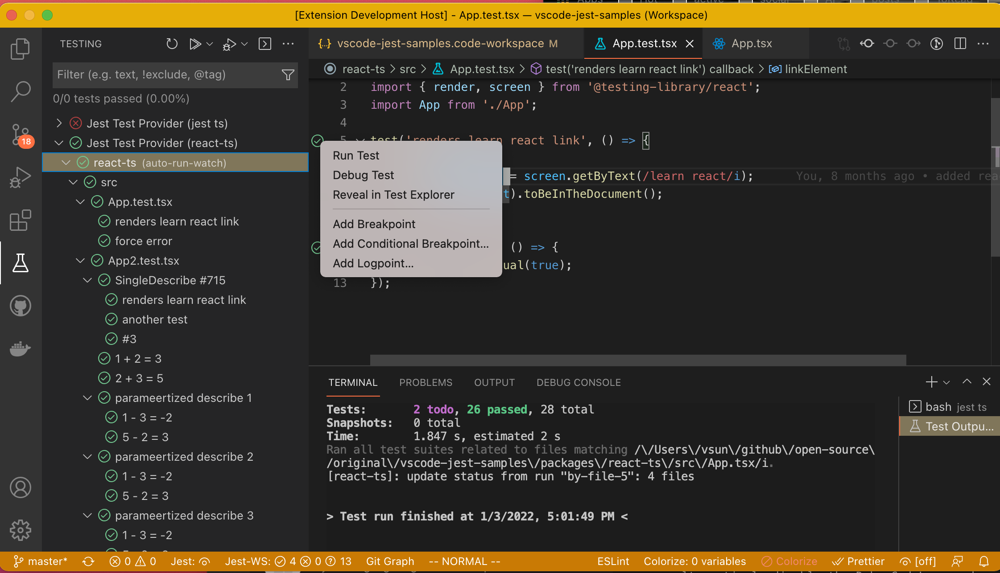
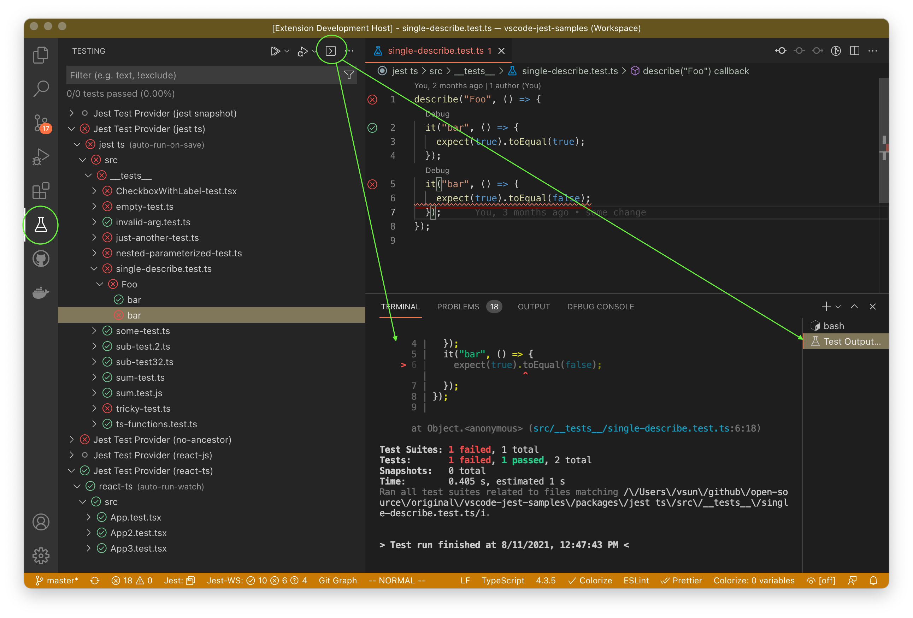
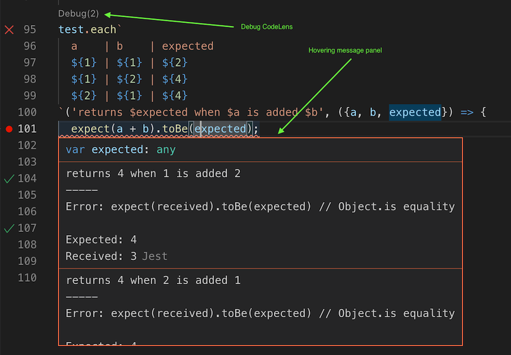
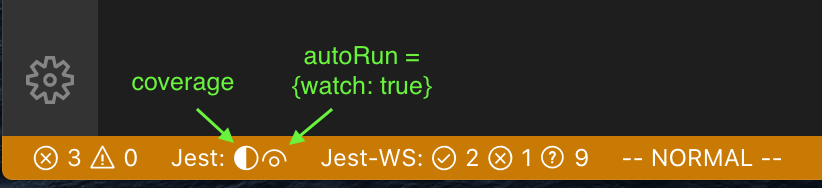
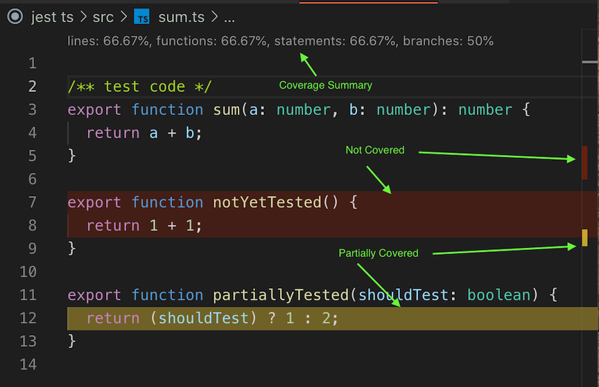
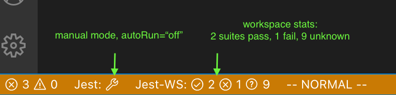
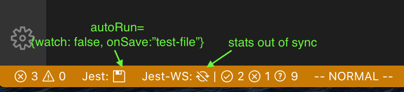
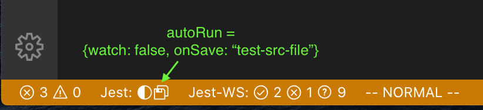
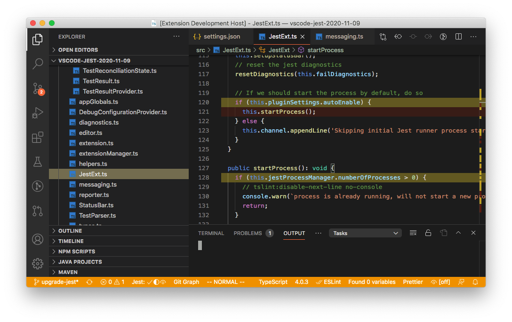
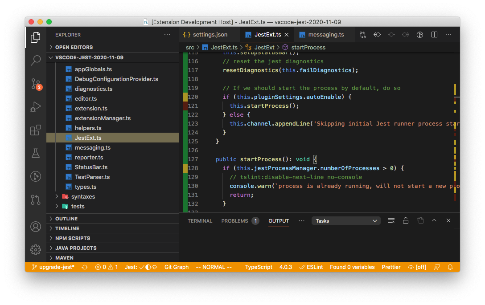

# vscode-jest

[](https://github.com/jest-community/vscode-jest/actions) [](https://coveralls.io/github/jest-community/vscode-jest?branch=master) [](https://marketplace.visualstudio.com/items?itemName=Orta.vscode-jest)

---
## Release Notes<!-- omit in toc -->
### Pre-Release [v4.3.0](https://github.com/jest-community/vscode-jest/releases/tag/v4.3.0)
<details>

<summary>interactive run extended to watch mode</summary>

Users in watch mode can now run any test/folder/workspace interactively just like with non-watch mode. 



</details>

<details>

<summary>more control with debug config v2</summary>

This release introduced debug config v2, which changed how we inject jest runtime information, such as test file and name, to the debug config. Replacing the "behind-the-scene-injection"  with a "variable-substitution" model, so no more hidden operations and surprises, the extension will only substitute the jest specific variables present in the config. 

A default jest debug config in v2 will look like this:

```json
{
  "type": "node",
  "name": "vscode-jest-tests.v2",
  "request": "launch",
  "program": "${workspaceFolder}/node_modules/.bin/jest",
  "args": [
    "--runInBand",
    "--watchAll=false",
    "--testNamePattern",
    "${jest.testNamePattern}",
    "--runTestsByPath",
    "${jest.testFile}"
  ],
  "cwd": "${workspaceFolder}",
  "console": "integratedTerminal",
  "internalConsoleOptions": "neverOpen",
  "disableOptimisticBPs": true,
  "windows": {
    "program": "${workspaceFolder}/node_modules/jest/bin/jest"
  }
}
```
Jest like vscode [variables](https://code.visualstudio.com/docs/editor/variables-reference), the `"${jest.testNamePattern}"` and `"${jest.testFile}"` are jest specific variables and, if present, will be substituted by the extension upon debugging. Note the config name change: `"vscode-jest-tests.v2"`, which signal the extension to use the substitution mode. 

This change is backward compatible. All existing config (with `"vscode-jest-tests"`) will continue to function as before. 

More info see [Debug Config v2](#debug-config-v2)

<!-- Try out pre-release [v4.3.0-rc.1](https://github.com/jest-community/vscode-jest/releases/tag/v4.3.0-rc1) -->

</details>

<details>

<summary>vue support and more</summary>

Other features: 
- supports `vue` file testing
- enhanced test output discovery by automatically opening TestExplorer terminal upon launch. 
- enhance run/debug tests with quotes in the name. 
- update documentations and a few bug fixes.

More details see [v4.3.0 release](https://github.com/jest-community/vscode-jest/releases/tag/v4.3.0)

</details>

### Stable: [v4.2.1](https://github.com/jest-community/vscode-jest/releases/tag/v4.2.1) <!-- omit in toc -->

Test menu is now accessible for all tests, regardless of run mode. If cursor jumping when editing tests is a bit annoying, you can now alternatively disable the DebugCodeLens and use "Debug Test" from the test menu:


For users struggled with the jest process environment, this release added 2 new settings to 
  1. modify nodejs process env (`"jest.nodeEnv"`) 
  2. use custom shell when spawning jest process (`"jest.shell"`)

Also fixed inline error pop-up in vscode 1.61, and enhanced snapshot language support. 

<details>
<summary>v4.1 with Test Explorer</summary>

Test explorer is one of the highly requested feature for this extension. Last year vscode announced the plan for the official test explorer and we have been trying out the new proposed API since. Now the vscode test explorer is live (2021 July release - v1.59), we are excited to release `v4.1` and our users can finally tap into this great new UI experience 🎉




Please note, the test explorer is new and some of the features might be missing or imperfect (see [How to use test explorer](#how-to-use-the-test-explorer) for more details), nevertheless, we will continue to improve it. Please do not hesitate to ask questions or file issues, thanks and have fun!
</details>

<details>
<summary>v4 Release</summary>

After longer than expected development, [v4](https://github.com/jest-community/vscode-jest/releases/tag/v4.0.0) is finally released! 😄

This is a big release packed with changes to address many nagging issues you have been asking for, such as inconsistent test status indicators, high CPU usage, more granular control of the test runner, missing coverage, supporting parameterized tests, mysterious start up failure etc.

Knowing the scope of the changes is significant, while we tried to test it as much as we can, there are probably still some rough edges we have not discovered. If it interrupted your work, our apology! You can either look up on the document below to see if you can find a workaround; or [revert](https://code.visualstudio.com/updates/v1_30#_install-previous-versions) to the earlier version. Please do not hesitate to file [issues](https://github.com/jest-community/vscode-jest/issues) or ask questions in [discussions](https://github.com/jest-community/vscode-jest/discussions), we will be monitoring them closely and address issues as best we can.

Feel free to read more about the [features and migration](https://github.com/jest-community/vscode-jest/releases/tag/v4.0.0) or come chat with us in the [release discussion](https://github.com/jest-community/vscode-jest/discussions/693) for general comments or questions about this release.

P.S. We find the new version did made the development of this extension a bit easier (yes, we do eat our own dog food :dog:), hopefully, it will do the same for your project. Happy coding!
</details>

---

Content
- [vscode-jest](#vscode-jest)
    - [Pre-Release v4.3.0](#pre-release-v430)
  - [The Aim](#the-aim)
  - [Features](#features)
  - [Installation](#installation)
  - [How to use the extension?](#how-to-use-the-extension)
    - [How to get it set up?](#how-to-get-it-set-up)
    - [How to trigger the test run?](#how-to-trigger-the-test-run)
    - [How to debug tests?](#how-to-debug-tests)
    - [How to use code coverage?](#how-to-use-code-coverage)
    - [How to use the extension with monorepo projects?](#how-to-use-the-extension-with-monorepo-projects)
    - [How to read the StatusBar?](#how-to-read-the-statusbar)
    - [How to use the Test Explorer?](#how-to-use-the-test-explorer)
  - [Customization](#customization)
    - [Settings](#settings)
      - [Details](#details)
        - [jestCommandLine](#jestcommandline)
        - [rootPath](#rootpath)
        - [debugCodeLens.showWhenTestStateIn](#debugcodelensshowwhenteststatein)
        - [coverageFormatter](#coverageformatter)
        - [coverageColors](#coveragecolors)
        - [autoRun](#autorun)
        - [testExplorer](#testexplorer)
    - [Debug Config](#debug-config)
    - [Debug Config v2](#debug-config-v2)
  - [Commands](#commands)
  - [Menu](#menu)
  - [Troubleshooting](#troubleshooting)
  - [Want to Contribute?](#want-to-contribute)
  - [License](#license)

---


## The Aim

A comprehensive experience when using [Facebook's Jest](https://github.com/facebook/jest) within a project.

* Useful IDE based Feedback
* Session based test watching
* File based interactive testing


## Features

* Starts Jest automatically when you're in a root folder project with Jest installed.
* Show individual fail / passes inline.
* Show fails inside the problem inspector.
* Highlights the errors next to the `expect` functions.
* Adds syntax highlighting to snapshot files.
* A one button update for failed snapshots.
* Show coverage information in files being tested.
* Help debug jest tests in vscode.
* Supports multiple test run modes (automated, manual, and hybrid onSave) to meet user's preferred development experience.
* Track and shows overall workspace/project test stats

## Installation

Simply open [Jest - Visual Studio Marketplace](https://marketplace.visualstudio.com/items?itemName=Orta.vscode-jest) and click "Install".
Alternatively open Visual Studio Code, go to the extension view and search for "Jest".

For detailed releases and migration help, please see [releases](https://github.com/jest-community/vscode-jest/releases).

## How to use the extension?

This extension should work out of the box for [common jest environments](#common-jest-env). Users should see test status indicators in test file editors and Jest stats in the StatusBar, for example. However, for more sophisticated projects or people who prefer different look-and-feel/behaviors, customization via [settings](#customization) might be needed.

Most features in this extension should be pretty straight forward without much configuration. But in case you want to change the default behavior or encountered some difficulty with the extension, please checkout the following how-to and troubleshooting guides.

---
<a id="common-jest-env">**common jest environments**</a>:

This extension can automatically start the jest process without any custom configuration when

* we find Jest installed in the workspace: `node_modules/.bin/jest`
* we find the workspace has been bootstrapped with create-react-app:
  - `node_modules/react-scripts/node_modules/.bin/jest` or
  - `node_modules/react-native-scripts`

---

### How to get it set up?

This extension runs on top of your Jest installation. Upon starting, it has the expectation that the Jest environment is properly set up, i.e. jest can be executed in VS Code's terminal.

Out of the box, this extension should work for most simple/standard jest and react projects (see [common jest environments](#common-jest-env)). However, if you have a more sophisticated project or custom jest command, the extension might not be able to start the jest process automatically.  In such case you can use the [jest.jestCommandLine](#jestCommandLine) to customize the extension. In v4 and on, a [setup wizard](setup-wizard.md) can be used to configure the essential settings for the extension.

Feel free to checkout the complete list of available [custom settings](#customization).

### How to trigger the test run?

By default, users need not do anything, the extension will automatically trigger related test run when needed by running jest in the watch mode. However, this can be easily changed if more granular control is desired. Below shows the execution models supported and how to use [jest.autoRun](#autorun) to opt into it:

<details>

<summary>fully automated</summary>

No need to manually trigger any test run, all changes will be monitored and related tests will be run accordingly. It is basically running jest with `--watch` or `--watchAll`. This is the default mode prior to v4. Example:
- `"jest.autoRun": {"watch": true}` => will start the jest with the watch flag and leave all tests at "unknown" state until changes are detected.
- `"jest.autoRun": {"watch": true, "onStartup": ["all-tests"]}` => will start running all tests upon project launch to update overall project test stats, followed by the jest watch for changes.

</details>

<details>

<summary>interactive mode</summary>

Allow users to control test run completely either through commands/menu/TestExplorer manually or use vscode's onSave event to automate related test runs:
- fully manual
  - there will be no automatic test run, users will trigger test run by either command or context-menu.
  - Example: `"jest.autoRun": "off"`
- automatically run tests when test file changed
  - the extension will trigger test run for the given test file upon save.
  - Example: "jest.autoRun": `{"watch": false, "onSave": "test-file"}`
- automatically run tests when either test or source file changed:
  - the extension will trigger test run for the given test or source file upon save.
  - Example: "jest.autoRun": `{"watch": false, "onSave": "test-src-file"}`

</details>

Note: other than the "off" mode, users can specify the "onStartup" option for any "jest.autoRun" config, for example: `{"watch": false, "onSave": "test-file", "onStartup": ["all-tests"]}`

### How to debug tests?

A test can be debugged via the debug codeLens appeared above the [debuggable](#debugcodelensshowwhenteststatein) tests. Simply clicking on the codeLens will launch vscode debugger for the specific test. The extension also supports parameterized tests and allows users to pick the specific parameter set to debug.

The simplest use cases should be supported out-of-the-box. If VS Code displays errors about the attribute `program` or `runtimeExecutable` not being available, you can either use [setup wizard](setup-wizard.md) to help or create your own debug configuration within `launch.json`. See more details in [Customization - Debug Config](#debug-config).

<details>

<summary>Illustration</summary>

For parameterized tests, you might see debug codeLens like `Debug (2)`, which indicated there are 2 test candidates can be debugged. In such case, you will be prompted to choose when clicking the debug codeLens. All failed test results will appear in both the hovering message panel and the `PROBLEMS` area.



By default debug codeLens will appear for failed and unknown tests, to change that and others, please see [customization](#customization) for more details.

</details>

### How to use code coverage?

Code coverage can be triggered via [Command Palette](https://code.visualstudio.com/docs/getstarted/userinterface#_command-palette), select command like **Jest: Toggle Coverage** to activate or deactivate code coverage (see full list in [commands](#commands). The coverage state is also shown in the StatusBar:



<details>
<summary>How to read coverage scheme and customize it</summary>

In addition to the coverage summary that is shown on the top of the file, each line will be marked by its coverage status according to the coverage formatter configured. There are 3 types of coverage you might see in your source code, distinguished by colors:

- "covered": if the code is covered. Marked as <span style="color:green">"green"</span> by default.
- "not-covered": if the code is not covered. Marked as <span style="color:red">"red"</span> by default.
- "partially-covered": Usually this mean the branch (such as if, switch statements) only partially tested. Marked as <span style="color:yellow">"yellow"</span> by default.
  - _Please note, istanbuljs (the library jest used to generate coverage info) reports switch branch coverage with the first "case" statement instead of the "switch" statement._



You can customize coverage start up behavior, style and colors, see [customization](#customization) for more details.

</details>

⚠️ In rare cases, coverage info might be less than what it actual is in "watch" mode (with `--watch` flag), where only changed files/tests are run (see facebook/jest#1284).


### How to use the extension with monorepo projects?
The recommended approach is to setup the monorepo project as a [multi-root workspaces](https://code.visualstudio.com/docs/editor/multi-root-workspaces) in vscode, which each sub package is a "folder". While you can use jest `projects` to run all tests without multi-root workspaces, you won't be able to take advantage a more fine grained control such as toggle coverage for a specific package instead of all packages.

You can customize how the extension works in multi-root workspaces, see [customization](#customization) for more details.

### How to read the StatusBar?
StatusBar shows 2 kinds of information:
`Jest` shows the mode and state of the "active" workspace folder.
`Jest-WS` shows the total test suite stats for the whole workspace.
Clicking on each of these button will reveal the OUTPUT channel with more details.

<details>
<summary>Illustration</summary>




shows the active workspace has coverage on.


shows the active workspace has onSave for test file only, and that the workspace stats is out of sync with the code, such as when the source file is changed but the related tests are not run yet.



shows the autoRun will be triggered by either test or source file changes.
</details>

### How to use the Test Explorer?
Users with `vscode` v1.59 and `vscode-jest` v4.1 and up will start to see tests appearing in the test explorer automatically. Test explorer provides a "test-centric" view (vs. "source-centric" view in the editors), allows users to run/debug tests directly from the explorer (in addition to the inline debug codeLens), and provides a native terminal output experience (with colors!):


You can further customize the explorer with [jest.testExplorer](#testexplorer) in [settings](#settings).

However, test explorer is new and some features are still work-in-progress or not available yet:
- can't turn on/off coverage yet (pending on vscode API change)
- not able to accurately indicate run/debug eligibility on the item level, this means you might not be able to run/debug some items through run/debug buttons. (pending on vscode API change)
- the tests stats on the top of the explorer might not be accurate, especially for multiroot workspaces. (pending on vscode fix))
- for watch-mode workspaces, the run button is turned off since tests will be automatically executed.
- debug can only be executed for the test blocks, not on the file or folder level. (Please let us know if you have an use case otherwise)


## Customization
### Settings
Users can use the following settings to tailor the extension for their environments.
- All settings are prefixed with `jest` and saved in standard `.vscode/settings.json`.
- settings crossed out are to be deprecated in the future
- settings marked with 💼 apply to the whole project, otherwise per workspace.


|setting|description|default|example/notes|
|---|---|---|---|
|**Process**|
|autoEnable :x:|Automatically start Jest for this project|true|Please use `autoRun` instead|
|[jestCommandLine](#jestCommandLine)|The command line to start jest tests|undefined|`"jest.jestCommandLine": "npm test -"` or `"jest.jestCommandLine": "yarn test"` or `"jest.jestCommandLine": "node_modules/.bin/jest --config custom-config.js"`|
|nodeEnv|Add additional env variables to spawned jest process|null|`"jest.nodeEnv": {"PORT": "9800", "BAR":"true"}` |
|shell|Custom shell (path) for jest process|null|`"jest.shell": "/bin/bash"` or `"jest.shell": "powershell"` |
|[autoRun](#autorun)|Controls when and what tests should be run|undefined|`"jest.autoRun": "off"` or `"jest.autoRun": {"watch": true, "onStartup": ["all-tests"]}` or `"jest.autoRun": false, onSave:"test-only"}`|
|pathToJest :x:|The path to the Jest binary, or an npm/yarn command to run tests|undefined|Please use `jestCommandLine` instead|
|pathToConfig :x:|The path to your Jest configuration file"|""|Please use `jestCommandLine` instead|
|[rootPath](#rootPath)|The path to your frontend src folder|""|`"jest.rootPath":"packages/app"` or `"jest.rootPath":"/apps/my-app"`|
|runAllTestsFirst :x:| Run all tests before starting Jest in watch mode|true|Please use `autoRun` instead|
|**Editor**|
|<strike>enableInlineErrorMessages</strike> :x:| Whether errors should be reported inline on a file|--|This is now deprecated in favor of `jest.testExplorer` |
|[testExplorer](#testexplorer) |Configure jest test explorer|`{"enabled": true}`| `{"enabled": false}`, `{"enabled": true, showClassicStatus: true, showInlineError: true}`|
|**Snapshot**|
|enableSnapshotUpdateMessages|Whether snapshot update messages should show|true|`"jest.enableSnapshotUpdateMessages": false`|
|enableSnapshotPreviews 💼|Whether snapshot previews should show|true|`"jest.enableSnapshotPreviews": false`|
|restartJestOnSnapshotUpdate :x:| Restart Jest runner after updating the snapshots|false|This is no longer needed in v4|
|**Coverage**|
|showCoverageOnLoad|Show code coverage when extension starts|false|`"jest.showCoverageOnLoad": true`|
|[coverageFormatter](#coverageFormatter)|Determine the coverage overlay style|"DefaultFormatter"|`"jest.coverageFormatter": "GutterFormatter"`|
|[coverageColors](#coverageColors)|Coverage indicator color override|undefined|`"jest.coverageColors": { "uncovered": "rgba(255,99,71, 0.2)", "partially-covered": "rgba(255,215,0, 0.2)"}`|
|**Debug**|
|enableCodeLens 💼|Whether codelens for debugging should show|true|`"jest.enableCodeLens": false`|
|[debugCodeLens.showWhenTestStateIn](#debugcodelensshowwhenteststatein) 💼|Show the debug CodeLens for the tests with the specified status. (window)|["fail", "unknown"]|`"jest.debugCodeLens.showWhenTestStateIn":["fail", "pass", "unknown"]`|
|**Misc**|
|debugMode|Enable debug mode to diagnose plugin issues. (see developer console)|false|`"jest.debugMode": true`|
|disabledWorkspaceFolders 💼|Disabled workspace folders names in multiroot environment|[]|`"jest.disabledWorkspaceFolders": ["package-a", "package-b"]`|

#### Details
##### jestCommandLine

This should be the command users used to kick off the jest tests in the terminal. However, since the extension will append additional options at run time, please make sure the command line can pass along these options, which usually just means if you uses npm, add an additional "--" at the end (e.g. `"npm run test --"`) if you haven't already in your script.
It is recommended not to add the following options as they are managed by the extension: `--watch`, `--watchAll`, `--coverage`

##### rootPath

If your project doesn't live in the root of your repository, you may want to customize the `jest.rootPath` setting to enlighten the extension as to where to look. For instance: `"jest.rootPath": "src/client-app"` will direct the extension to use the `src/client-app` folder as the root for Jest.

##### debugCodeLens.showWhenTestStateIn

Possible status are: `[ "fail", "pass", "skip", "unknown"]`. Please note that this is a window level setting, i.e. its value will apply for all workspaces.

##### coverageFormatter

There are 2 formatters to choose from:
  1. <details><summary> DefaultFormatter: high light uncovered and partially-covered code inlilne as well as on the right overview ruler. (this is the default)</summary>
  
        
  </details>

  1. <details><summary>GutterFormatter: render coverage status in the gutter as well as the overview ruler.</summary>
  
     
  </details>

  _(Note, there is an known issue in vscode (microsoft/vscode#5923) that gutter decorators could interfere with debug breakpoints visibility. Therefore, you probably want to disable coverage before debugging or switch to DefaultFormatter)_
##### coverageColors

Besides the formatter, user can also customize the color via `jest.coverageColors` to change color for 3 coverage categories: `"uncovered", "covered", or "partially-covered"`,
<details>
<summary>example</summary>

for example:
  ```json
  "jest.coverageColors": {
    "uncovered": "rgba(255,99,71, 0.2)",
    "partially-covered": "rgba(255,215,0, 0.2)",
  }
  ```
  the default color scheme below, note the opacity might differ per formatter:
  ```json
  "jest.coverageColors": {
    "covered": "rgba(9, 156, 65, 0.4)",
    "uncovered": "rgba(121, 31, 10, 0.4)",
    "partially-covered": "rgba(235, 198, 52, 0.4)",
  }
  ```
</details>

##### autoRun
  ```ts
  AutoRun =
    | 'off'
    | { watch: true, onStartup?: ["all-tests"] }
    | {
        watch: false,
        onStartup?: ["all-tests"],
        onSave?: 'test-file' | 'test-src-file',
      }
  ```
  <details>
  <summary>example</summary>

  - Turn off auto run, users need to trigger tests run manually via [run commands](#commands-run) and [menus](#context-menu):
    ```json
    "jest.autoRun": "off"
    ```
  - Run all the tests in the workspace upon extension startup, followed by jest watch run for subsequent test/src file changes.
    ```json
    "jest.autoRun": {
      "watch": true,
      "onStartup": ["all-tests"]
    }
    ```


  - Only run tests in the test file when the test file itself changes. It will neither run all tests for the workspace upon startup nor trigger any test run when the source file changes. 
    ``` json
    "jest.autoRun": {
       "watch": false,
       "onSave": "test-file"
    }
    ```
  - Like the one above but does run all tests upon extension start up
    ``` json
    "jest.autoRun": {
      "watch": false,
      "onSave": "test-file",
      "onStartup": ["all-tests"]
    }
    ```
  - migration rule from settings prior to v4:
    -  if `"jest.autoEnabled" = false` => manual mode: `"jest.autoRun": "off"`
    -  if `"jest.runAllTestsFirst" = false` => `"jest.autoRun": {"watch": true }`
    -  if no customization of the 2 settings and no `"jest.autoRun"` found =>
         ``` json
         "jest.autoRun": {
            "watch": true,
            "onStartup": ["all-tests"]
         }
         ```
</details>

##### testExplorer
  ```ts
  testExplorer =
    | {enabled: true; showClassicStatus?: boolean; showInlineError?: boolean}
    | {enabled: false}
  ```
  - `enabled`: switch to turn on/off the explorer support. Default is true.
  - `showClassicStatus`: (optional) show status symbol (prior to 4.1) in editor gutter, in addition to explorer status symbols. Default is false if explorer is enabled.
  - `showInlineError`: (optional) show vscode style inline error and error message viewer. Default is false.

  4.1 default is `"jest.testExplorer": {"enabled": true}`
>
### Debug Config

This extension looks for jest specific debug config (`"vscode-jest-tests"` or `"vscode-jest-tests.v2"`) in the workspace `.vscode/launch.json`. If not found, it will attempt to generate a default config that should work for most standard jest or projects bootstrapped by `create-react-app`.

If the default config is not working for your project, you can either use the [setup wizard](setup-wizard.md), probably the easier approach (available in v4), or edit the `launch.json` file manually.

If you choose to edit the `launch.json` manually, you can use the jest templates, such as "Jest: Default jest configuration" or "Jest: create-react-app", as a starting point. See more detail on how to add debug config in vscode [Debugging](https://code.visualstudio.com/docs/editor/debugging#_launch-configurations).


There are many information online about how to setup vscode debug config for specific environments/frameworks, you might find the following helpful:
  - [vscode debug config properties](https://code.visualstudio.com/docs/nodejs/nodejs-debugging#_launch-configuration-properties)
  - [Launch configurations for common scenarios](https://code.visualstudio.com/docs/nodejs/nodejs-debugging#_launch-configurations-for-common-scenarios)
  - [vscode-recipes for debug jest tests](https://github.com/microsoft/vscode-recipes/tree/master/debugging-jest-tests)

### Debug Config v2

v4.3.0 introduces a "variable substitution" based config with name `"vscode-jest-tests.v2"`. The extension will merely substitute the jest variables in the config, without adding/removing anything else. 

Currently supported variables:
- **${jest.testNamePattern}** - will be replaced by the test block's full name (include the surrounding describe block names).
- **${jest.testFile}** - will be replaced by the test file name.
- **${jest.testFilePattern}** - will be replaced by the test file name suitable for regex arguments such as `--testPathPattern`.
  
<details>
<summary>Examples</summary>

- Plain jest debug config:
  ```json
  {
    "type": "node",
    "name": "vscode-jest-tests.v2",
    "request": "launch",
    "program": "${workspaceFolder}/node_modules/.bin/jest",
    "args": [
      "--runInBand",
      "--watchAll=false",
      "--testNamePattern",
      "${jest.testNamePattern}",
      "--runTestsByPath",
      "${jest.testFile}"
    ],
    "cwd": "${workspaceFolder}",
    "console": "integratedTerminal",
    "internalConsoleOptions": "neverOpen",
    "disableOptimisticBPs": true,
    "windows": {
      "program": "${workspaceFolder}/node_modules/jest/bin/jest"
    }
  }
  ```
- Angular users using yarn:
  ```json
  {
    "type": "node",
    "name": "vscode-jest-tests.v2",
    "request": "launch",
    "runtimeExecutable": "yarn",
    "args": [
      "test",
      "--run-in-band",
      "--watch-all=false",
      "--test-name-pattern",
      "${jest.testNamePattern}",
      "--test-path-pattern",
      "${jest.testFilePattern}"
    ],
    "cwd": "${workspaceFolder}",
    "console": "integratedTerminal",
    "internalConsoleOptions": "neverOpen",
    "disableOptimisticBPs": true
  }
  ``` 
  
</details>

## Commands

This extension contributes the following commands and can be accessed via [Command Palette](https://code.visualstudio.com/docs/getstarted/userinterface#_command-palette):


|command|description|availability|
|---|---|---|
|Jest: Start All Runners| start or restart all jest runners|always
|Jest: Stop All Runners| stop all jest runners |always
|Jest: Toggle Coverage| toggle coverage mode for all runners|always
|Jest: Start Runner (Select Workspace)| start or restart the jest runner for the selected workspace|multi-root workspace
|Jest: Stop Runner (Select Workspace)| stop jest runner for the selected workspace |multi-root workspace
|Jest: Toggle Coverage (Select Workspace)| toggle coverage mode for the selected workspace|multi-root workspace
|Jest: Run All Tests| run all tests for all the workspaces|always
|Jest: Run All Tests (Select Workspace)| run all tests for the selected workspace|multi-root workspace
|Jest: Run All Tests in Current Workspace| run all tests for the current workspace based on the active editor| always
|Jest: Toggle Coverage for Current Workspace| toggle coverage mode for the current workspace based on the active editor| always
|Jest: Setup Extension| start the setup wizard|always|

In addition, TestExplorer also exposed many handy commands, see the full list by searching for `testing` in  [vscode keyboard shortcuts editor](https://code.visualstudio.com/docs/getstarted/keybindings#_keyboard-shortcuts-editor). One can assign/change keyboard shortcut to any of these commands, see [vscode Key Bindings](https://code.visualstudio.com/docs/getstarted/keybindings) for more details.

## Menu
User can trigger the following action from the text editor context-menu


|menu|description|keyboard shortcut
|---|---|---|
|Jest: Run Related Tests| if in test file, run all tests in the file; if in source file, run all tests with dependency to the file|Ctrl-Option-t (Mac) or Ctrl-Alt-t|

Please see [vscode Key Bindings](https://code.visualstudio.com/docs/getstarted/keybindings) if you want to change the keyboard shortcut.


## Troubleshooting
Sorry you are having trouble with the extension. If your issue did not get resolved after checking out the [how-to](#how-to-use-the-extension) section and the tips below (click arrows to expand), feel free to [ask](https://github.com/jest-community/vscode-jest/issues) the community, chances are some one else had a similar experience and could help resolving it.

<details>
<summary>I don't see "Jest" in the bottom status bar</summary>
  This means the extension is not activated.
  The extension should be automatically activated as described in [How to start jest](#how-to-start-jest).
  If it failed because maybe you don't use the root of your project for jest tests, you can use [jest.rootPath](#rootPath) to point to that directory instead.
</details>

<details>
<summary>I got "Jest Process xxx failed unexpectedly..." or "Jest failed too many times..." error message</summary>

  This usually means the extension is not able to start jest process for you. First check the TestExplorer Output, Jest OUTPUT channel or developer console to see what is the actual error (see [self-diagnosis](#self-diagnosis)).

  If it is related to the run time environment, such as
  ```
  env: node: No such file or directory
  ```

  Most likely the child_process environment is not correctly initialized. There are many possible causes, sometimes restarting vscode will fix it, otherwise feel free to check out a more in-depth explanation/suggestion [here](https://github.com/jest-community/vscode-jest/issues/741#issuecomment-921222851). 

  If you see error about not able to find `jest` or some other jest related runtime error: if you can run jest from terminal then you can use the **"Run Setup Wizard"** button in the error panel to help resolving the configuration issue, see [Setup Wizard](setup-wizard.md). If jest doesn't even run from the terminal, then please reference [jest](https://jestjs.io/docs/configuration) to set up your jest test environment. 
  
  There could be other causes, such as jest test root path is different from the project's, which can be fixed by setting [jest.rootPath](#rootPath). Feel free to check out the [customization](#customization) section to manually adjust the extension if needed.
</details>

<details>
<summary>It seems to make my vscode sluggish</summary>

  By default the extension will run all tests when it is launched followed by a jest watch process. If you have many resource extensive tests or source files that can trigger many tests when changed, this could be the reason. Check out [jest.autoRun](#autorun) to see how you can change and control when and what tests should be run.
</details>

<details>
<summary>The tests and status do not match or some tests showing question marks unexpectedly</summary>

If your test file happen to have parameterized tests, i.e. `test.each` variations, please make sure you have jest version >= 26.5.

If the above did not resolve your issue, please see the [self-diagnosis](#self-diagnosis) below that could show more insight of why the test and result could not be matched.

</details>

<details>
<summary><a id='self-diagnosis'></a>The extension is not behaving as expected, what is going on? (try self diagnosis)</summary>

If you can execute jest tests on command line but vscode-jest was not running as expected, here is what you can do to find out more information:
  - [Try configuring the `jest.jestCommandLine`](#jestcommandline) with `yarn test` or `npm run test --`. The extension can auto-config common configurations like create react apps but not custom scripts like [CRACO](https://github.com/gsoft-inc/craco).
  - You can see jest process output with either one of the methods:
    - If you uses TestExplorer, you can see color coded jest output from the TestExplorer's Output terminal (the square arrow icon on the top of the Explorer View) 
    - Otherwise you can see the output in "OUTPUT" channel, which is usually named after the workspace folder, such as `Jest (your-workspace-name)`. Or you can click on `Jest` label on status bar to show Jest Output window. This will show you the jest run output and the errors.
    

  - See additional logging from the developer console (via `Help > Toggle Developer Tools` menu), for example to examine the environment variables passed to jest runner: [examine-env.git](https://github.com/jest-community/vscode-jest/blob/master/images/vscode-jest-env-log.gif)
  
  - Turn on the debug mode to see more internal debugging message in the developer console:
    - set `"jest.debugMode": true` in `.vscode/settings.json`

  Hopefully most issues would be pretty obvious after seeing these extra output, and you can probably fix most yourself by [customizing](#customization) the `jest.jestCommandLine` and others.
</details>

## Want to Contribute?

Thanks for considering! Check [here](CONTRIBUTING.md) for useful tips and guidelines.

## License

vscode-jest is [MIT licensed.](LICENSE)
