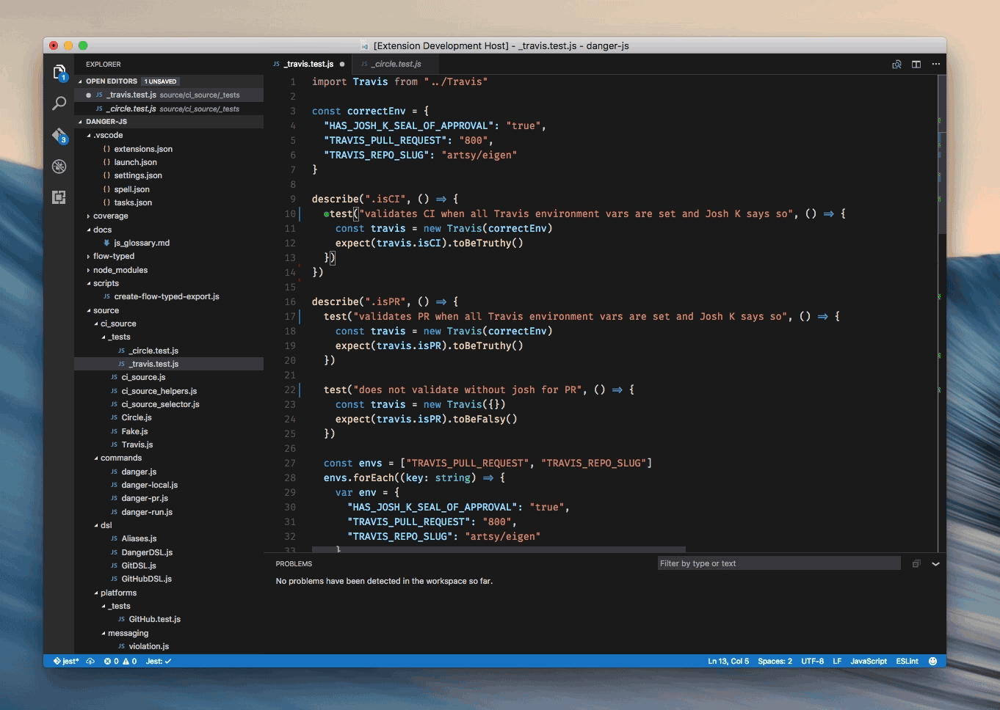

 ## The Aim

A comprehensive experience when using [Faceook's Jest](https://github.com/facebook/jest) within a project. 

* Useful IDE based Feedback
* Session based test watching

## Features

* Starts Jest automatically when you're in a project with Jest installed.
* Show individual fail / passes inline.
* Show fails inside the problem inspector.
* Highlights the errors next to the `expect` functions 

## Future Ideas

* Offer feedback if you are using an old Jest?