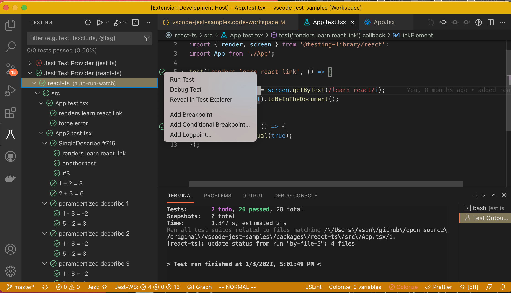

# vscode-jest v4 Release Notes <!-- omit in toc --> 

- [v4.6.0](#v460)
- [v4.4.0](#v440)
- [v4.2.1](#v421)
- [v4.1](#v41)
- [v4.0](#v40)

---
## v4.6.0

- added a new setting ["jest.showTerminalOnLaunch"](../README.md#showTerminalOnLaunch) to control if test explorer terminal should be automatically opened upon launch. Default is true.  
- refactor README 

More details see [v4.6.0 release](https://github.com/jest-community/vscode-jest/releases/tag/v4.6.0)

## v4.4.0

Interactive run has been extended to watch mode in v4.4.0. Users in watch mode can now run any test/folder/workspace interactively just like with non-watch mode. 



Other features:


- debug config v2

  <details>

  <summary>expand for detail</summary>

  This release introduced debug config v2, which changed how we inject jest runtime information, such as test file and name, to the debug config. Replacing the "behind-the-scene-injection"  with a "variable-substitution" model, so no more hidden operations and surprises, the extension will only substitute the jest specific variables present in the config. 

  A default jest debug config in v2 will look like this:

  ```json
  {
  "type": "node",
  "name": "vscode-jest-tests.v2",
  "request": "launch",
  "program": "${workspaceFolder}/node_modules/.bin/jest",
  "args": [
    "--runInBand",
    "--watchAll=false",
    "--testNamePattern",
    "${jest.testNamePattern}",
    "--runTestsByPath",
    "${jest.testFile}"
  ],
  "cwd": "${workspaceFolder}",
  "console": "integratedTerminal",
  "internalConsoleOptions": "neverOpen",
  "disableOptimisticBPs": true,
  "windows": {
    "program": "${workspaceFolder}/node_modules/jest/bin/jest"
  }
  }
  ```
  Jest like vscode [variables](https://code.visualstudio.com/docs/editor/variables-reference), the `"${jest.testNamePattern}"` and `"${jest.testFile}"` are jest specific variables and, if present, will be substituted by the extension upon debugging. Note the config name change: `"vscode-jest-tests.v2"`, which signal the extension to use the substitution mode. 

  This change is backward compatible. All existing config (with `"vscode-jest-tests"`) will continue to function as before. 

  More info see [Debug Config v2](../README.md#debug-config-v2)

  </details>

- supports `vue` file testing
- enhanced test output discovery by automatically opening TestExplorer terminal upon launch. 
- enhance run/debug tests with quotes in the name. 
- update documentations and a few bug fixes.

More details see [v4.4.0 release](https://github.com/jest-community/vscode-jest/releases/tag/v4.4.0)

## v4.2.1

Test menu is now accessible for all tests, regardless of run mode. If cursor jumping when editing tests is a bit annoying, you can now alternatively disable the DebugCodeLens and use "Debug Test" from the test menu:


For users struggled with the jest process environment, this release added 2 new settings to 
  1. modify nodejs process env (`"jest.nodeEnv"`) 
  2. use custom shell when spawning jest process (`"jest.shell"`)

Also fixed inline error pop-up in vscode 1.61, and enhanced snapshot language support. 

more info see [v4.2.1 release](https://github.com/jest-community/vscode-jest/releases/tag/v4.2.1)

## v4.1

Test explorer is one of the highly requested feature for this extension. Last year vscode announced the plan for the official test explorer and we have been trying out the new proposed API since. Now the vscode test explorer is live (2021 July release - v1.59), we are excited to release `v4.1` and our users can finally tap into this great new UI experience 🎉


Please note, the test explorer is new and some of the features might be missing or imperfect (see [How to use test explorer](../README.md#how-to-use-the-test-explorer) for more details), nevertheless, we will continue to improve it. Please do not hesitate to ask questions or file issues, thanks and have fun!

## v4.0

After longer than expected development, [v4](https://github.com/jest-community/vscode-jest/releases/tag/v4.0.0) is finally released! 😄

This is a big release packed with changes to address many nagging issues you have been asking for, such as inconsistent test status indicators, high CPU usage, more granular control of the test runner, missing coverage, supporting parameterized tests, mysterious start up failure etc.

Knowing the scope of the changes is significant, while we tried to test it as much as we can, there are probably still some rough edges we have not discovered. If it interrupted your work, our apology! You can either look up on the document below to see if you can find a workaround; or [revert](https://code.visualstudio.com/updates/v1_30#_install-previous-versions) to the earlier version. Please do not hesitate to file [issues](https://github.com/jest-community/vscode-jest/issues) or ask questions in [discussions](https://github.com/jest-community/vscode-jest/discussions), we will be monitoring them closely and address issues as best we can.

Feel free to read more about the [features and migration](https://github.com/jest-community/vscode-jest/releases/tag/v4.0.0) or come chat with us in the [release discussion](https://github.com/jest-community/vscode-jest/discussions/693) for general comments or questions about this release.

P.S. We find the new version did made the development of this extension a bit easier (yes, we do eat our own dog food :dog:), hopefully, it will do the same for your project. Happy coding!
