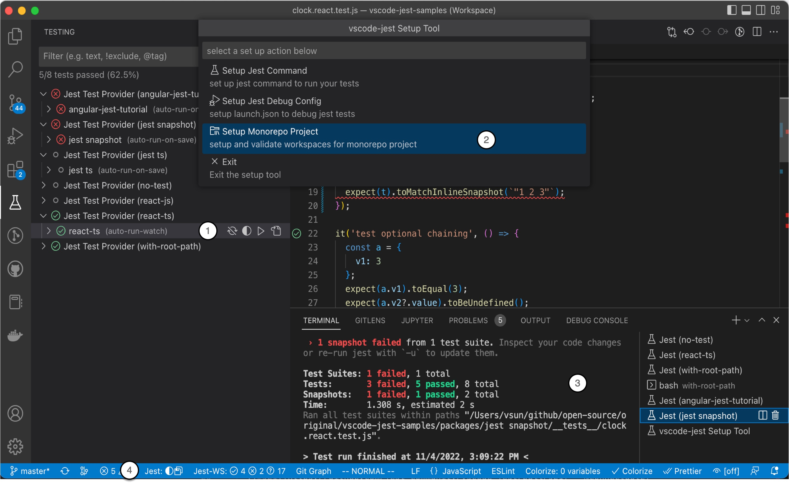

# vscode-jest v5 Releases <!-- omit in toc --> 

---
- [v5.0 (pre-release) (roll-up)](#v50-pre-release-roll-up)
  - [Main Features](#main-features)
    - [1. toggle autoRun and coverage through TestExplorer inline menu](#1-toggle-autorun-and-coverage-through-testexplorer-inline-menu)
    - [2. automate monorepo project setup through "Setup Tool"](#2-automate-monorepo-project-setup-through-setup-tool)
    - [3. improve test run output with terminal](#3-improve-test-run-output-with-terminal)
    - [4. deep activation](#4-deep-activation)
    - [5. login shell support](#5-login-shell-support)
    - [6. long run monitor](#6-long-run-monitor)
    - [7. one-click disable non-jest folder for monorepo project](#7-one-click-disable-non-jest-folder-for-monorepo-project)
    - [8. autoRun change](#8-autorun-change)
  - [Fixes](#fixes)
  - [Breaking Changes](#breaking-changes)
  - [Change log](#change-log)

---
## v5.0 (pre-release) (roll-up)

v5 mainly focuses on addressing performance and ease of use. The goal is to help new and experienced users fully utilize the extension features to make testing a fun experience.

We have also decided to make TestExplorer a preferred UI outlet instead of our custom UI developed before TestExplorer. For example, we no longer support the inline decorator for test status as TestExplorer provided a much more powerful gutter status/menu.
### Main Features



#### 1. toggle autoRun and coverage through TestExplorer inline menu
This allows quick one-click change of autoRun and test-coverage for runtime only. This allow users to change test-run behavior frequently to adapt to different phrases in the development cycle. Hopefully, it also help new users that experiences performance issues to be able to self-help easily.

More details can be found in 
- [how to toggle autoRun](../README.md#how-to-toggle-auto-run)
- [how to toggle coverage](../README.md#how-to-toggle-coverage)
  
Also updated README targeting performance: [performance troubleshooting](https://github.com/jest-community/vscode-jest#performance-issue) guide and [autoRun trade-off](../README.md#autorun) consideration.
    
  ([v5.0.1](https://github.com/jest-community/vscode-jest/releases/tag/v5.0.1): [#932](https://github.com/jest-community/vscode-jest/pull/932) - @connectdotz)
  
#### 2. automate monorepo project setup through "Setup Tool"

This expanded setup-tool (renamed from setup wizard) to help convert monorepo projects from single-root to multi-root workspaces and assisting detecting `jest.rootPath`.

See [setup monorepo project guide](https://github.com/jest-community/vscode-jest/blob/master/setup-wizard.md#setup-monorepo-project) for more info.

([v5.0.1](https://github.com/jest-community/vscode-jest/releases/tag/v5.0.1): [#921](https://github.com/jest-community/vscode-jest/pull/921) - @connectdotz)

#### 3. improve test run output with terminal

Jest run will be shown in Terminal instead of OUTPUT tab to provide familiar run-in-terminal-like experience. We also fixed a few bugs that prevented the full output to be shown. It should be much easier to investigate when tests fail or not executed. 

We will no longer force "reveal" the last run output terminal. The new terminals will only be automatically "revealed" when encountered errors prevented tests to run. Therefore, we are retiring setting `"jest.showTerminalOnLaunch"`

([v5.0.0](https://github.com/jest-community/vscode-jest/releases/tag/v5.0.0): [#910](https://github.com/jest-community/vscode-jest/pull/910) - @connectdotz)

#### 4. deep activation

The extension auto activates (showing "Jest" in status bar and TestExplorer) when it detects jest config files or modules under the project root. For more sophisticated projects that jest root !== project root, they will not be activated automatically even if they set the `jest.rootPath`. In v5, we will look for jest config files in the whole project tree, except in "node_modules" for performance reason.

For projects do not meet any of the existing activation events, there is now a new activation event for  `".vscode-jest"` file, an empty marker file, anywhere in the project tree (however, prefer to be in jest root folder). 

([v5.0.0](https://github.com/jest-community/vscode-jest/releases/tag/v5.0.0): [#907](https://github.com/jest-community/vscode-jest/pull/907) - @connectdotz)

#### 5. login shell support

vscode process env doesn't always fully initialized, especially during restart. This usually manifest into command not found errors (exit code 127), such as `"env: node: No such file or directory"` or `"env: yarn: No such file or directory"` when running jest process. 

While there are many work arounds, we want to add one more option for users prefer launching jest in a login shell, which will initialize the shell env independent of vscode process env. This is accomplished by expanding the current ["jest.shell"](../README.md#shell) setting, for example:
```json
"jest.shell": {"path": "/bin/bash", "args": ["--login"]}
```

Note, the extra initialization might have some performance overhead, use this with caution.

([v5.0.0](https://github.com/jest-community/vscode-jest/releases/tag/v5.0.0): [#874](https://github.com/jest-community/vscode-jest/pull/874) - @connectdotz)

#### 6. long run monitor

In v5 we also added a long-run monitor to be proactive in helping users detect and potential workaround such situation. The threshold setting ["jest.monitorLongRun"](../README.md#monitorlongrun) default is 60 seconds: `"jest.monitorLongRun": 60000`, 

([v5.0.0](https://github.com/jest-community/vscode-jest/releases/tag/v5.0.0): [#904](https://github.com/jest-community/vscode-jest/pull/904) - @connectdotz)

#### 7. one-click disable non-jest folder for monorepo project

Users can now easily one-click to "disable" the failed folder from the error message window. 

([v5.0.0](https://github.com/jest-community/vscode-jest/releases/tag/v5.0.0): [#896](https://github.com/jest-community/vscode-jest/pull/896) - @jonnytest1) 

#### 8. autoRun change

1. Introducing [autoRun short-hand](../README.md#autorun-config) to make setting up autoRun easier 
2. Change autoRun default to drop running all tests on start-up (this is potentially a breaking change)
  
The `"jest.autoRun"` default used to be `{"watch": "true", "onStartup": ["all-tests"]}`. While this ensure no test would be "missing", it does take a toll for start up performance, especially for projects with many expensive tests. With TestExplorer provided complete test tree view, we believe it should be all right for most users to just starts with `{"watch": "true"}`, thus the change.

If you already have the `"jest.autoRun"` in your settings.json file, nothing will change. If you didn't have `"jest.autoRun"`, then you will probably notice a faster start-up, but maybe not all tests are run and marked as circle (unknown) instead. These are the files that have not checkout/changed therefore less risk of being broken (determined by watchman). Of course users can always run them explicitly or change the setting if desired.

:speech_balloon: Discussion: Giving the nature of autoRun trade-off (performance vs. completeness/automation), we would love to hear from our users:
- [what is your autoRun setting?](https://github.com/jest-community/vscode-jest/discussions/933)
- [autoRun default... what should it be?](https://github.com/jest-community/vscode-jest/discussions/934)


([v5.0.0](https://github.com/jest-community/vscode-jest/releases/tag/v5.0.0): [#906](https://github.com/jest-community/vscode-jest/pull/906) - @connectdotz)

### Fixes
- address issues that vscode runs occasionally appears to be hanging when the runs already completed. ([#926](https://github.com/jest-community/vscode-jest/pull/926), [#927](https://github.com/jest-community/vscode-jest/pull/927), [#932](https://github.com/jest-community/vscode-jest/pull/932))  
- missing runtime error detection and reporting when the run fails to start. ([#927](https://github.com/jest-community/vscode-jest/pull/927))
- Fix quoting test names with special characters ([#928](https://github.com/jest-community/vscode-jest/pull/928))
- fixed incorrect TestExplorer tests passed count ([#916](https://github.com/jest-community/vscode-jest/pull/916) - @connectdotz)
- various document updates

### Breaking Changes
- `"jest.showTerminalOnLaunch"` is deprecated. 
- ["jest.textExplorer"](../README.md#testexplorer): 
  - can not be turned off any more. 
  - removed the "enable" and "showClassicStatus" attributes. The only valid attribute is "showInlineError".
- `"jest.autoRun` default value has changed. see detail above.
### Change log
- [v5.0.1 pre-release](https://github.com/jest-community/vscode-jest/releases/tag/v5.0.1)
- [v5.0.0 pre-release](https://github.com/jest-community/vscode-jest/releases/tag/v5.0.0)

