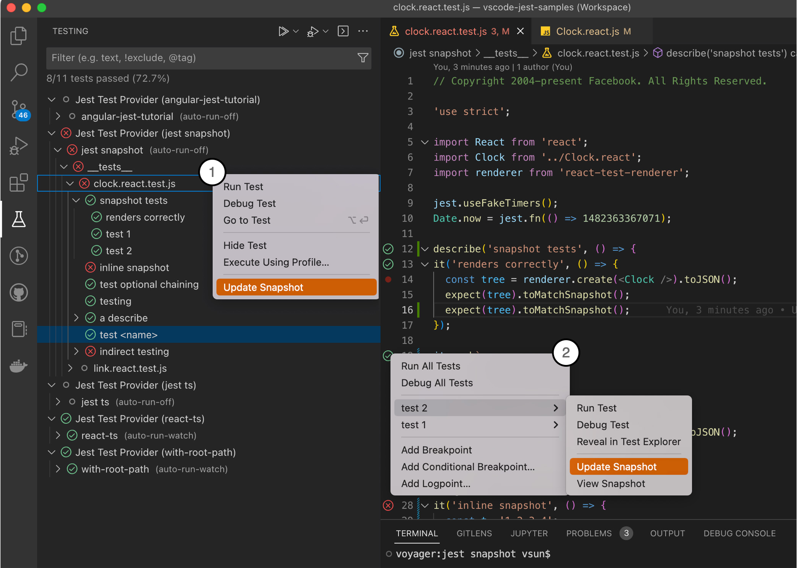

# vscode-jest v5 Releases <!-- omit in toc --> 

---
- [v5.0 (pre-release) (roll-up)](#v50-pre-release-roll-up)
  - [Main Features](#main-features)
    - [1. toggle autoRun and coverage through TestExplorer inline menu](#1-toggle-autorun-and-coverage-through-testexplorer-inline-menu)
    - [2. automate monorepo project setup through "Setup Tool"](#2-automate-monorepo-project-setup-through-setup-tool)
    - [3. improve test run output with terminal](#3-improve-test-run-output-with-terminal)
    - [4. deep activation](#4-deep-activation)
    - [5. enhanced snapshot support](#5-enhanced-snapshot-support)
    - [6. smarter auto-config for jest command and test debugging](#6-smarter-auto-config-for-jest-command-and-test-debugging)
    - [7. no more intermittent "command not found" error (auto recovery with login-shell)](#7-no-more-intermittent-command-not-found-error-auto-recovery-with-login-shell)
    - [8. long run monitor](#8-long-run-monitor)
    - [9. one-click disable non-jest folder for monorepo project](#9-one-click-disable-non-jest-folder-for-monorepo-project)
    - [10. autoRun simplification](#10-autorun-simplification)
    - [11. supports v8 coverage provider](#11-supports-v8-coverage-provider)
    - [12. supports running unresolved parameterized tests directly](#12-supports-running-unresolved-parameterized-tests-directly)
  - [Fixes](#fixes)
  - [Breaking Changes](#breaking-changes)
  - [Change log](#change-log)

---
## v5.0 (pre-release) (roll-up)

v5 mainly focuses on addressing performance, stablity and ease of use. The goal is to help new and experienced users fully utilize the extension features to make testing a fun experience.

We have also decided to make TestExplorer a preferred UI outlet instead of our custom UI developed before TestExplorer. For example, we no longer support the inline decorator for test status as TestExplorer provided a much more powerful gutter status/menu.
### Main Features

**1 - 4**

#### 1. toggle autoRun and coverage through TestExplorer inline menu
This allows quick one-click change of autoRun and test-coverage for runtime only. This allow users to change test-run behavior frequently to adapt to different phrases in the development cycle. Hopefully, it also help new users that experiences performance issues to be able to self-help easily.

More details can be found in 
- [how to toggle autoRun](../README.md#how-to-toggle-auto-run)
- [how to toggle coverage](../README.md#how-to-toggle-coverage)
  
Also updated README targeting performance: [performance troubleshooting](https://github.com/jest-community/vscode-jest#performance-issue) guide and [autoRun trade-off](../README.md#autorun) consideration.
    
  ([v5.0.1](https://github.com/jest-community/vscode-jest/releases/tag/v5.0.1): [#932](https://github.com/jest-community/vscode-jest/pull/932) - @connectdotz)
  
#### 2. automate monorepo project setup through "Setup Tool"

This expanded setup-tool (renamed from setup wizard) to help convert monorepo projects from single-root to multi-root workspaces and assisting detecting `jest.rootPath`.

See [setup monorepo project guide](https://github.com/jest-community/vscode-jest/blob/master/setup-wizard.md#setup-monorepo-project) for more info.

([v5.0.1](https://github.com/jest-community/vscode-jest/releases/tag/v5.0.1): [#921](https://github.com/jest-community/vscode-jest/pull/921) - @connectdotz)

#### 3. improve test run output with terminal

Jest run will be shown in Terminal instead of OUTPUT tab to provide familiar run-in-terminal-like experience. We also fixed a few bugs that prevented the full output to be shown. It should be much easier to investigate when tests fail or not executed. 

We will no longer force "reveal" the last run output terminal. The new terminals will only be automatically "revealed" when encountered errors prevented tests to run. Therefore, we are retiring setting `"jest.showTerminalOnLaunch"`

([v5.0.0](https://github.com/jest-community/vscode-jest/releases/tag/v5.0.0): [#910](https://github.com/jest-community/vscode-jest/pull/910) - @connectdotz)

#### 4. deep activation

The extension auto activates (showing "Jest" in status bar and TestExplorer) when it detects jest config files or modules under the project root. For more sophisticated projects that jest root !== project root, they will not be activated automatically even if they set the `jest.rootPath`. In v5, we will look for jest config files in the whole project tree, except in "node_modules" for performance reason.

For projects do not meet any of the existing activation events, there is now a new activation event for  `".vscode-jest"` file, an empty marker file, anywhere in the project tree (however, prefer to be in jest root folder). 

([v5.0.0](https://github.com/jest-community/vscode-jest/releases/tag/v5.0.0): [#907](https://github.com/jest-community/vscode-jest/pull/907) - @connectdotz)

#### 5. enhanced snapshot support

Snapshot support has moved from codeLens to context menu. Users can update snapshot in any granularity from the context menu:
1. in TestExplorer tree view: Update snapshot for the workspace, folder, test file or just a single test.
2. in Editor's gutter menu: Update and view snapshot for any given test. 
  
Snapshots are now fully supported for parameterized (`test.each`) and template-literal named tests. 

Snapshot codeLens and related settings are, therefore, retired.

([v5.0.3](https://github.com/jest-community/vscode-jest/releases/tag/v5.0.3): [#949](https://github.com/jest-community/vscode-jest/pull/949) - @connectdotz)
#### 6. smarter auto-config for jest command and test debugging

When no customization is found, the extension will do a deep search for test-script/jest-command to auto config `jestCommandLine` and `rootPath`. 

During debugging, if no custom debug config is found, the extension will generate a default debug config incorporating the `jestCommandLine` and `rootPath`. 

This should make life easier for projects that used to require customization to work.

([v5.0.3](https://github.com/jest-community/vscode-jest/releases/tag/v5.0.3): [#953](https://github.com/jest-community/vscode-jest/pull/953) - @connectdotz)
([v5.0.3](https://github.com/jest-community/vscode-jest/releases/tag/v5.0.3): [#958](https://github.com/jest-community/vscode-jest/pull/958) - @connectdotz)
#### 7. no more intermittent "command not found" error (auto recovery with login-shell)

On non-windows platforms, vscode sometimes fails to initialize its process env upon starting up, which crashes jest run/debug with "command not found" errors (exit code 127), such as `"env: node: No such file or directory"` or `"/bin/sh: yarn: command not found"`. This has caused a lot confusion and frustration, therefore, we added the functionality to automatically retry tests with a login shell (instead of the default non-login shell) when detecting the above-mentioned errors. 

The extension can auto generate login shell for `bash`, `zsh`, and `fish`. Users can also configure custom login shells by expanding the current ["jest.shell"](../README.md#shell) setting, such as: `"jest.shell": {"path:": "/bin/bash", "args": ["-l"]}`. This will instruct the extension to always use the login shell.

Please note these changes only apply to test runs; you might experience similar issues when debugging tests, as we do not control how the vscode debugger is launched. But fortunately, a similar solution (login shell) will work for debugging as well - by customizing `"terminal.integrated.automationProfile.<platform>"`; see instruction in [intermitten error troubleshooting](../README.md##intermittent-errors-for-npmyarnnode-command-not-found-during-test-run-or-debugging)

([v5.0.0](https://github.com/jest-community/vscode-jest/releases/tag/v5.0.0): [#874](https://github.com/jest-community/vscode-jest/pull/874) - @connectdotz)
([v5.0.2](https://github.com/jest-community/vscode-jest/releases/tag/v5.0.2): [#941](https://github.com/jest-community/vscode-jest/pull/941) - @connectdotz)

#### 8. long run monitor

In v5 we also added a long-run monitor to be proactive in helping users detect and potential workaround such situation. The threshold setting ["jest.monitorLongRun"](../README.md#monitorlongrun) default is 60 seconds: `"jest.monitorLongRun": 60000`, 

([v5.0.0](https://github.com/jest-community/vscode-jest/releases/tag/v5.0.0): [#904](https://github.com/jest-community/vscode-jest/pull/904) - @connectdotz)

#### 9. one-click disable non-jest folder for monorepo project

Users can now easily one-click to "disable" the failed folder from the error message window. 

([v5.0.0](https://github.com/jest-community/vscode-jest/releases/tag/v5.0.0): [#896](https://github.com/jest-community/vscode-jest/pull/896) - @jonnytest1) 

#### 10. autoRun simplification

1. Introducing [autoRun short-hand](../README.md#autorun-config) to make setting up autoRun easier 
2. Change autoRun default to drop running all tests on start-up (this is potentially a breaking change)
  
The `"jest.autoRun"` default used to be `{"watch": "true", "onStartup": ["all-tests"]}`. While this ensure no test would be "missing", it does take a toll for start up performance, especially for projects with many expensive tests. With TestExplorer provided complete test tree view, we believe it should be all right for most users to just starts with `{"watch": "true"}`, thus the change.

If you already have the `"jest.autoRun"` in your settings.json file, nothing will change. If you didn't have `"jest.autoRun"`, then you will probably notice a faster start-up, but maybe not all tests are run. Of course users can always run them explicitly or change the setting if desired.

([v5.0.0](https://github.com/jest-community/vscode-jest/releases/tag/v5.0.0): [#906](https://github.com/jest-community/vscode-jest/pull/906) - @connectdotz)

#### 11. supports v8 coverage provider

Users with jest coverageProvider `v8` should be able to see coverage like with the default `babel` coverageProvider. Please be mindful that these providers do generate slightly different coverage reports, see [facebook/jest#11188](https://github.com/facebook/jest/issues/11188) for more details.

([v5.0.2](https://github.com/jest-community/vscode-jest/releases/tag/v5.0.0): [#943](https://github.com/jest-community/vscode-jest/pull/943) - @connectdotz)

#### 12. supports running unresolved parameterized tests directly

For developers prefer running test manually, the initial run usually failed with "no test found" for tests with "dynamic names", such as parameterized tests (`test.each`) or tests use template-literal string name, until the whole suite or parent block is run. 

Now the extension will fallback to the parent block automatically when detecting unresolved dynamic names.

([v5.0.3](https://github.com/jest-community/vscode-jest/releases/tag/v5.0.0): [#959](https://github.com/jest-community/vscode-jest/pull/959) - @connectdotz)
### Fixes
- add user id/name to output file name to resolve permission conflict in shared computers. ([#938](https://github.com/jest-community/vscode-jest/pull/938)) 
- support look up debug config from workspace file `.code-workspace`. ([#937](https://github.com/jest-community/vscode-jest/pull/937))  
- address issues that vscode runs occasionally appears to be hanging when the runs already completed. ([#926](https://github.com/jest-community/vscode-jest/pull/926), [#927](https://github.com/jest-community/vscode-jest/pull/927), [#932](https://github.com/jest-community/vscode-jest/pull/932))  
- missing runtime error detection and reporting when the run fails to start. ([#927](https://github.com/jest-community/vscode-jest/pull/927))
- Fix quoting test names with special characters ([#928](https://github.com/jest-community/vscode-jest/pull/928))
- fixed incorrect TestExplorer tests passed count ([#916](https://github.com/jest-community/vscode-jest/pull/916))
- fix various dependency alerts
- various document updates

### Breaking Changes
- Debug and Snapshot-Preview CodeLens are replaced by the gutter context menu
  The codeLens can sometimes interfering with code formatting during editing and it is not as versatile as the context menu especially for parameterized tests. Therefore, we are removing the codeLens and moving and expanding the functionality into the editor gutter menu instead.  
- The following settings are removed:
  - `"jest.runAllTestsFirst"`
  - `"jest.showTerminalOnLaunch"` 
  - `"jest.pathToJest"`
  - `"jest.pathToConfig"`
  - snapshot codeLens
    - `"jest.enableSnapshotUpdateMessages"`
    - `"jest.restartJestOnSnapshotUpdate"`
    - `"jest.enableSnapshotPreviews"`
  - debug codeLens
    - `"jest.enableCodeLens"`
    - `"jest.debugCodeLens.showWhenTestStateIn"`
  
- ["jest.textExplorer"](../README.md#testexplorer): 
  - can not be turned off any more. 
  - removed the "enable" and "showClassicStatus" attributes. The only valid attribute is "showInlineError".
- `"jest.autoRun` default value has changed. see detail above.
- No auto update (all) snapshots messaging any more, instead users can manually update and view any snapshot tests at any level and any time.

### Change log
- [v5.0.3 pre-release](https://github.com/jest-community/vscode-jest/releases/tag/v5.0.3)
- [v5.0.2 pre-release](https://github.com/jest-community/vscode-jest/releases/tag/v5.0.2)
- [v5.0.1 pre-release](https://github.com/jest-community/vscode-jest/releases/tag/v5.0.1)
- [v5.0.0 pre-release](https://github.com/jest-community/vscode-jest/releases/tag/v5.0.0)

