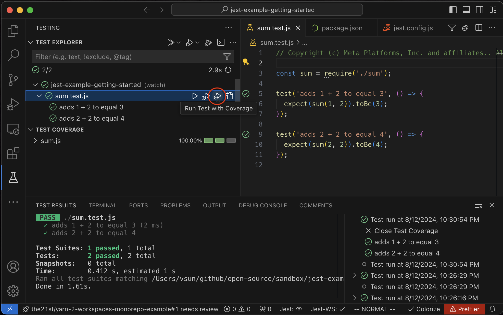
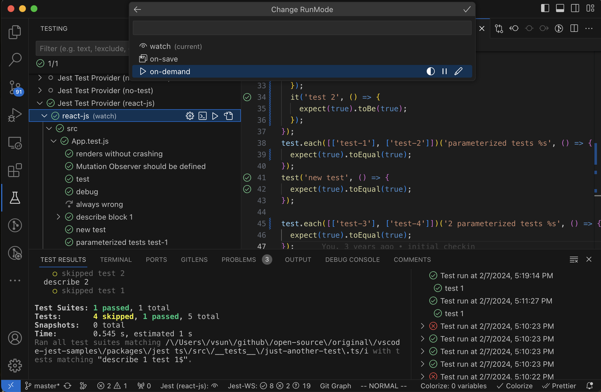

# vscode-jest v6.x Releases <!-- omit in toc --> 

Release Notes <!-- omit in toc --> 
---

- [v6.3 (pre-release)](#v63-pre-release)
  - [Features](#features)
  - [Bug Fixes](#bug-fixes)
- [v6.3 (pre-release)](#v63-pre-release-1)
  - [Features](#features-1)
  - [Bug Fixes](#bug-fixes-1)
- [v6.2](#v62)
  - [v6.2.5](#v625)
  - [v6.2.4](#v624)
  - [v6.2.3](#v623)
  - [v6.2.2](#v622)
    - [CHANGELOG](#changelog)
  - [v6.2.1](#v621)
    - [CHANGELOG](#changelog-1)
  - [v6.2.0](#v620)
    - [New Features Summary](#new-features-summary)
    - [Bug Fixes and Technical Debt Reduction](#bug-fixes-and-technical-debt-reduction)
    - [Breaking Changes](#breaking-changes)
    - [CHANGELOG](#changelog-2)
- [v6.1 (pre-release)](#v61-pre-release)
  - [Main Features](#main-features)
    - [1. Enhanced Test Execution Control with "runMode"](#1-enhanced-test-execution-control-with-runmode)
      - [1.1 The "deferred" mode](#11-the-deferred-mode)
      - [1.2 Configuration and Examples](#12-configuration-and-examples)
      - [1.3 Deprecations and Migrations](#13-deprecations-and-migrations)
    - [2. Support VSCode "TEST RESULTS" Panel with "jest.outputConfig"](#2-support-vscode-test-results-panel-with-jestoutputconfig)
      - [2.1 "TEST RESULTS" Panel Integration](#21-test-results-panel-integration)
      - [2.2 Configuration and Examples](#22-configuration-and-examples)
      - [2.3 Deprecations and Migration](#23-deprecations-and-migration)
  - [Bug Fixes](#bug-fixes-2)
  - [Technical Debt](#technical-debt)
- [v6.0 (pre-release)](#v60-pre-release)
  - [Main Features](#main-features-1)
    - [1. Virtual Folders](#1-virtual-folders)
    - [2. Support spawning jest with dashed arguments](#2-support-spawning-jest-with-dashed-arguments)
    - [3. Control extension activation within each folder](#3-control-extension-activation-within-each-folder)
    - [4. Auto clear output upon test run](#4-auto-clear-output-upon-test-run)
  - [Fixes](#fixes)
  - [CHANGELOG](#changelog-3)

---

## v6.3 (pre-release)

### Features

- **Support for Jest v30** (v30.0.0-alpha.6 and up).
  - The extension now automatically detects Jest v30 and switches to the new syntax, specifically `TestPathPatterns`. This behavior can be controlled via a new setting, `jest.useJest30`, which, when enabled, instructs the extension to immediately use the Jest v30 syntax. ([#1153](https://github.com/jest-community/vscode-jest/pull/1153) - @connectdotz)

- **Integration with VS Code's Test Coverage API and UI**.
  - The extension now provides test coverage via the native VS Code API, enabling interactive coverage runs and displaying results in both the editor and the Test Explorer Coverage panel.  ([#1151](https://github.com/jest-community/vscode-jest/pull/1151) - @connectdotz)

    

  - **Note**: The original coverage feature in the extension will remain functional for now. However, we plan to deprecate it in the near future. If you have any concerns on this change, please open an issue to let us know.

### Bug Fixes

- Correctly incorporate `jest.nodeEnv` into the auto-generated debug configuration. ([#1167](https://github.com/jest-community/vscode-jest/pull/1167) - @connectdotz)
  
- Resolved an issue where tests sometimes failed to reflect the correct status when the test suite couldn't run (e.g., due to compile errors). ([#1165](https://github.com/jest-community/vscode-jest/pull/1165) - @connectdotz)

- Fixed broken links in the setup-wizard documentation. ([#1154](https://github.com/jest-community/vscode-jest/pull/1154) - @pierluigigiancola)

**CHANGELOG**

- [v6.3.0](https://github.com/jest-community/vscode-jest/releases/tag/v6.3.0)

---

## v6.3 (pre-release)

### Features

- Supports jest v30 (v30.0.0-alpha.6 and up). 
  - The extension will auto detect jest 30 and switch to the new syntax (namely `TestPathPatterns`). This behavior can also be controlled by a new setting `jest.useJest30`, when set will instruct the extension to use jest30 syntax immediately. ([#1153](https://github.com/jest-community/vscode-jest/pull/1153) - @connectdotz)

- Supports vscode test coverage API and UI. 
  - The extension will now also provide test coverage information via the native vscode test coverage API. This will enable vscode to run test with coverage via test explorer tree and show test coverage information in the editor and the test explorer coverage panel. ([#1151](https://github.com/jest-community/vscode-jest/pull/1151) - @connectdotz)

    

  - **Note**: The existing coverage feature in the extension will continue to work for now. However, we plan to deprecate the existing coverage in the near future. If you prefer the existing coverage, please open an issue to let us know.  

### Bug Fixes

- Correctly incorporate the `jest.nodeEnv` to auto generated debug config. ([#1167](https://github.com/jest-community/vscode-jest/pull/1167) - @connectdotz)
  
- Fixed an issue where the test file failed to run (compile error for example) but the tests within the file failed to reflect the correct status. ([#1165](https://github.com/jest-community/vscode-jest/pull/1165) - @connectdotz)

- Fixed links in setup-wizard docs. ([#1154](https://github.com/jest-community/vscode-jest/pull/1154) - @pierluigigiancola)
  
**CHANGELOG**

- [v6.3.0](https://github.com/jest-community/vscode-jest/releases/tag/v6.3.0)

---

## v6.2
### v6.2.5

**Bug Fixes**

- Fixed an issue (#1145) where an autoRun (watch, on-save) might not update the test status in Editor and TestExplorer in subsequent runs. ([#1146](https://github.com/jest-community/vscode-jest/pull/1146) - @connectdotz)

**CHANGELOG**

- [v6.2.5](https://github.com/jest-community/vscode-jest/releases/tag/v6.2.5)

---

### v6.2.4

**Enhancements**

- Improved handling of zombie Jest processes during on-demand runs for scenarios like [stencil](https://github.com/jest-community/vscode-jest/issues/1124#issuecomment-2000596099) and [rt-test](https://github.com/jest-community/vscode-jest/issues/1137#issuecomment-2048570421), which previously failed to correctly interpret `"watchAll=false"`. We encourage users to report issues to the underlying systems. In the meantime, this extension will automatically terminate such zombie processes during on-demand runs, preventing them from blocking the execution queue. ([#1134](https://github.com/jest-community/vscode-jest/pull/1134) - @connectdotz)
  
**Bug Fixes**

- Fixed an issue where the Test Explorer's `Stop` button did not terminate the underlying Jest process, potentially blocking the execution queue for subsequent on-demand runs. ([#1134](https://github.com/jest-community/vscode-jest/pull/1134) - @connectdotz)
- Resolved a problem where the "Jest: Run All Tests" command was obstructed by the watch mode's ongoing execution. ([#1132](https://github.com/jest-community/vscode-jest/pull/1132) - @connectdotz)

**CHANGELOG**

- [v6.2.4](https://github.com/jest-community/vscode-jest/releases/tag/v6.2.4)

---

### v6.2.3

This release is a patch release with the following changes:

**Enhancement**  

- Improve output-focus default behavior for auto runs (e.g., "watch", "on-save"). This will eliminate the issue that the focus auto switching to "TEST RESULTS" panel whenever files are saved in auto-run modes. Now the default behavior is runMode aware and will not auto switch for auto runs unless specifically configured to do so. See [default output focus behavior](https://github.com/jest-community/vscode-jest#default-output-focus). ([#1128](https://github.com/jest-community/vscode-jest/pull/1128) - @connectdotz)
- docs: update README to fix jest run mode type. ([#1126](https://github.com/jest-community/vscode-jest/pull/1126) - @kota-kamikawa)
  
**CHANGELOG**

- [v6.2.3](https://github.com/jest-community/vscode-jest/releases/tag/v6.2.3)

---

### v6.2.2

This release is a patch release with the following changes:

**Enhancement**  

- Improved output config validation logic and showed warning if detected upon starting up. ([#1119](https://github.com/jest-community/vscode-jest/pull/1119) - @connectdotz)

- Added more diagnosis and fix-it instructions in the jest terminal: ([#1119](https://github.com/jest-community/vscode-jest/pull/1119) - @connectdotz)

  - Display critical settings such as "jest.runMode", "jest.outputConfig" and "testing.openTesting" settings
  - Provide warning messages for common output issues, such as aggressive auto-focus for auto run modes, when detected. Provides quick fix instructions to address them. 


**Bug Fixes**
- Fixed an outputConfig initialization bug that did not honor "testing.openTesting": "openOnTestFailure" setting correctly. ([#1119](https://github.com/jest-community/vscode-jest/pull/1119) - @connectdotz)
- Fixed missing test error auto focusing for watch mode run. ([#1120](https://github.com/jest-community/vscode-jest/pull/1120) - @connectdotz) 
  
**New Command**
- Added a new command `"Jest: Disable Auto Focus Test Output"` to easily disable TEST RESULTS panel auto focus. It will set the output to the "neutral" mode, i.e., no auto focusing. ([#1119](https://github.com/jest-community/vscode-jest/pull/1119) - @connectdotz)

  
**Documentation**
- Minor docs updates for the migration guides. ([#1116](https://github.com/jest-community/vscode-jest/pull/1116) - @pmcelhaney)
- Minor update for the output config info in README and release notes. ([#1119](https://github.com/jest-community/vscode-jest/pull/1119) - @connectdotz)

#### CHANGELOG

- [v6.2.2](https://github.com/jest-community/vscode-jest/releases/tag/v6.2.2)

---

### v6.2.1
This release is a patch release with the following bug fix:

- Fixed test run errors due to incorrect sub folder paths from the test Explorer panel. ([#1114](https://github.com/jest-community/vscode-jest/pull/1114) - @connectdotz)

#### CHANGELOG
- [v6.2.1](https://github.com/jest-community/vscode-jest/releases/tag/v6.2.1)

---
 
### v6.2.0
This version is a rollup of pre-releases [v6.0](#v60-pre-release) through [v6.1](#v61-pre-release), which implemented a few long requested features, such as better monorepo project support, more intuitive ways to defer and resume testing, and showing accurate test results in TEST RESULT panel.



#### New Features Summary
- **Virtual Folders**: New in v6.0.0, [jest.virtualFolders](https://github.com/jest-community/vscode-jest#virtualfolders) now supports monorepos for single-root workspaces and multiple Jest configurations in the same folder — long-awaited capabilities for developers dealing with complex project setups.  [Details](#1-virtual-folders)
- **Integration with VSCode "TEST RESULTS" Panel**: Introduced in v6.1.0, the [jest.outputConfig](https://github.com/jest-community/vscode-jest#outputconfig) setting enables the display of test results directly in the VSCode "TEST RESULTS" panel and consolidates various output settings.  [Details](#2-support-vscode-test-results-panel-with-jestoutputconfig) (:warning: **Breaking Change**)
- **Replace "autoRun" with "runMode"**: Debuting in v6.1.0, [jest.runMode](https://github.com/jest-community/vscode-jest#runmode) replaces and expands upon [jest.autoRun](https://github.com/jest-community/vscode-jest#autorun) with options like `'deferred'` mode, ideal for large projects seeking just-in-time test execution. It also consolidates related settings for a cleaner configuration experience. [Details](#1-enhanced-test-execution-control-with-runmode) (:warning: **Breaking Change**)
- **Support for Spawning Jest with Dashed Arguments**: Available from v6.0.0, the new [jest.useDashedArgs](https://github.com/jest-community/vscode-jest?tab=readme-ov-file#settings) setting  allows the extension to spawn Jest processes with dashed arguments, required by some frameworks such as Angular. [Details](#2-support-spawning-jest-with-dashed-arguments) 
- **Control Extension Activation within Each Folder:** Introduced in v6.0.0, the [jest.enable](https://github.com/jest-community/vscode-jest?tab=readme-ov-file#settings) setting allows granular control over the Jest extension's activation on a per-folder basis in VS Code workspaces. This enhancement is beneficial for developers working in multi-root workspaces or projects with mixed languages. [Details](#3-control-extension-activation-within-each-folder)

#### Bug Fixes and Technical Debt Reduction
- Please refer to the pre-release notes for a comprehensive list. 

#### Breaking Changes
- The following settings have been consolidated into `runMode` and `outputConfig` and will be removed in the future release: 
  - `"jest.autoRun"`
  - `"jest.showCoverageOnLoad"`
  - `"jest.TestExplorer"`
  - `"jest.autoRevealOutput"`
  - `"jest.autoClearTerminal"`

- While we strive for seamless auto migration and backward compatibility, it might not cover all configurations. Should you discover any discrepancies or unexpected behavior, further guidance and support can be found in the detailed release notes linked above and the migrationn guides below:
  - [RunMode Migration Guide](https://github.com/jest-community/vscode-jest#runmode-migration)
  - [OutputConfig Migration Guide](https://github.com/jest-community/vscode-jest#outputconfig-migration)
  
#### CHANGELOG
- [v6.2.0](https://github.com/jest-community/vscode-jest/releases/tag/v6.2.0)

---

<a id="v610-pre-release"></a>
## v6.1 (pre-release)

This release introduces a more streamlined ["jest.runMode"](https://github.com/jest-community/vscode-jest#runmode) setting to boost test execution efficiency, coupled with the integration of the "TEST RESULTS" panel via the new ["jest.outputConfig"](https://github.com/jest-community/vscode-jest#outputconfig) for a consistent test results display. These enhancements should simplify the transition for newcomers and also improve startup times for larger projects, while offering more control over test output visibility.

While we aim for backward compatibility, the nature of the advancements may not align seamlessly with all existing configurations. Users are advised to refer to the Migration Guide provided for each feature to ensure a smooth transition.

As with any pre-release, your feedback is invaluable to us. If you encounter any unexpected behavior or have suggestions for improvement, do not hesitate to report it [here](https://github.com/jest-community/vscode-jest/issues).


### Main Features
#### 1. Enhanced Test Execution Control with "runMode"

https://github.com/jest-community/vscode-jest/assets/891093/9bd4e414-b7aa-43f1-bc89-ffaf30959fe0

Replacing `jest.autoRun` and related settings, the new `runMode` configuration simplifies the test execution process, resolves confusion for newcomers, and introduces more efficient workflows with modes like "deferred."

##### 1.1 The "deferred" mode
The "deferred" mode addresses startup performance, particularly for large projects, by postponing preparation tasks until the first test run or until the user disables deferred mode.

##### 1.2 Configuration and Examples
`"jest.runMode"` offers flexible configurations, allowing for both predefined modes and detailed customization. Here are some configuration examples:
```json
// for "on-demand" runMode
{
  "jest.runMode": "on-demand"
}

// for "on-demand" and deferred: the most light-weight startup 
{
  "jest.runMode": {
    "type": "on-demand",
    "deferred": true 
  }
}

// watch mode with coverage and startup full run: the most complete setup
{
  "jest.runMode": {
    "type": "watch",
    "runAllTestsOnStartup": true,
    "coverage": true
  }
}

// on-save mode for test file only and show inline error
{
  "jest.runMode": {
    "type": "on-save",
    "testFileOnly": true,
    "showInlineError": true
  }
}
```
Detailed explanations and more examples are available in the [RunMode](https://github.com/jest-community/vscode-jest#runmode).

##### 1.3 Deprecations and Migrations
The following settings have been consolidated into `runMode` and will be removed in the future release: 

- "jest.autoRun"
- "jest.showCoverageOnLoad"
- "jest.TestExplorer"

For a smooth transition, users should migrate to the new `runMode`` setting. Assistance with migration is provided by the `"Jest: Save Current RunMode"`` command in the command palette. Complete migration steps can be found in the [RunMode Migration Guide](https://github.com/jest-community/vscode-jest#runmode-migration).

#### 2. Support VSCode "TEST RESULTS" Panel with "jest.outputConfig"

https://github.com/jest-community/vscode-jest/assets/891093/6b2fa5b6-8790-493a-803a-4cddbce05ccd

The extension now supports the display of test results in VSCode's "TEST RESULTS" panel, complementing the traditional output in the integrated TERMINAL, through a new `"jest.outputConfig"` setting. This allows for a simple and consistent control over both panels.

##### 2.1 "TEST RESULTS" Panel Integration

The VSCode "TEST RESULTS" panel is controlled by a native `"testing.openTesting"` setting, which might not align with the extension's settings. To avoid conflicts, you may set `"testing.openTesting"` to `"neverOpen"` if you prefer this extension to handle the panel behavior through the new `"jest.outputConfig"` setting. More detailed explanation can be found in the [Handling Conflict](https://github.com/jest-community/vscode-jest#outputconfig-conflict) section.

##### 2.2 Configuration and Examples

We've introduced the `"jest.outputConfig"` setting to give users comprehensive control over the test output behavior across TERMINAL and TEST RESULTS panels, moving to a workspace-level setting for broader applicability.

Here are a few scenarios and how to configure them:

```json
// Minimal interaction, suitable for watch/on-save modes
{
  "testing.openTesting": "neverOpen",
  "jest.outputConfig": "neutral"
}

// or semi-minimal interaction, suitable for watch/on-save modes prefer to see output if there is errors
{
  "testing.openTesting": "neverOpen",
  "jest.outputConfig": {
    "revealOn": "error",
    "revealWithFocus": "test-results"
  }
}

// Auto-focus on "TEST RESULTS" when run starts, ideal for on-demand testing
{
  "testing.openTesting": "neverOpen",
  "jest.outputConfig": {
    "revealOn": "run",
    "revealWithFocus": "test-results"
  }
}

// or Auto-focus on "TEST RESULTS" when errors occurred, for on-demand testing prefer to only show output with errors 
{
  "testing.openTesting": "neverOpen",
  "jest.outputConfig": {
    "revealOn": "error",
    "revealWithFocus": "test-results"
  }
}

// Terminal-focused output with clean start for each run, preferred for on-demand mode
{
  "testing.openTesting": "neverOpen",
  "jest.outputConfig": {
    "revealWithFocus": "terminal",
    "clearOnRun": "terminal"
  }
}
```
For more detailed examples and explanations, refer to the [OutputConfig](https://github.com/jest-community/vscode-jest#outputconfig).

##### 2.3 Deprecations and Migration

The following settings have been consolidated into `outputConfig` and will be removed in the future release: 
- `"jest.autoRevealOutput"`
- `"jest.autoClearTerminal"`

To migrate, use the `"Jest: Save Current Output Config"` command, and then manually adjust your "settings.json" as needed. If any conflicts arise, the extension will guide you through resolving them.

For a step-by-step migration process, see the [OutputConfig Migration Guide](https://github.com/jest-community/vscode-jest#outputconfig-migration).


### Bug Fixes
- Fixed an issue where the virtual folder `rootPath` was not resolved correctly for folder test items, causing test runs or debugging to fail. ([#1080](https://github.com/jest-community/vscode-jest/pull/1080) - @akwodkiewicz)
- Resolved a matching problem during manual test runs where a non-exact match led to more tests being run than specified. ([#1091](https://github.com/jest-community/vscode-jest/pull/1091) - @connectdotz)
- Corrected the status recording for running `".each"` test/describe blocks which sometimes did not reflect accurately. ([#1092](https://github.com/jest-community/vscode-jest/pull/1092) - @connectdotz)
- fix anchors in contributing.md file by @krivonos28 in [#1102](https://github.com/jest-community/vscode-jest/pull/1102)
- more fault-tolerant for shell setting by @connectdotz in [#1100](https://github.com/jest-community/vscode-jest/pull/1100)
-  fix active editor files sometimes got attached to the wrong workspace folder by @connectdotz in [#1108](https://github.com/jest-community/vscode-jest/pull/1108)

### Technical Debt
- Updated the CI node version check to now include versions 18 through 20, ensuring compatibility with the latest node releases. ([#1088](https://github.com/jest-community/vscode-jest/pull/1088) - @connectdotz)
- Upgraded tooling dependencies to their latest versions to improve development workflows and bring in new features and bug fixes from those tools. ([#1089](https://github.com/jest-community/vscode-jest/pull/1089) - @connectdotz)


<a id="v610-pre-release"></a>
## v6.0 (pre-release)

This major release introduces the 'Virtual Folders' feature. Much like a VSCode workspace folder, a 'Virtual Folder' allows you to manage a custom Jest runtime environment, each configurable with its own resource-level settings. This is particularly useful for projects with multiple Jest configurations or monorepo structures. While we've ensured backward compatibility, the introduction of 'Virtual Folders' involved significant internal changes that prompted a major version bump. 

### Main Features
#### 1. Virtual Folders 

Supporting multiple jest configs is a common use cases for monorepo projects and projects with multiple test environments, such as unit and integration tests. We introduced monorepo support with vscode multi-root workspaces a few years ago. While it works well for most use cases, it fell short for multi-test-environment that share the same code base (folder). This version will close this gap with the [Virtual Folders](https://github.com/jest-community/vscode-jest#virtualfolders).

For example, the unit vs. integration tests can now be set up as the following:
```json
// <project>/.vscode/settings.json
{
     "jest.virtualFolders": [
       {
        "name": "unit-tests", 
        "jestCommandLine": "yarn test --config=jest.unit.config.js", 
        "autoRun": "watch"
      },
      {
        "name": "integration-tests", 
        "jestCommandLine": "yarn test --config=jest.integration.config.js", 
        "autoRun": "off"
      }
     ]
   }
```

And yes you can indeed use virtual folders with monorepo projects. For example, the following configuration will run tests for each package in a monorepo project:
```json
// <project>/.vscode/settings.json 
{
 "jest.virtualFolders": [
   {"name": "package1", "rootPath": "packages/package1"},
   {"name": "package2", "rootPath": "packages/package2"}
 ]
}
```

So when to use multi-root workspaces vs. virtual folders? In short, if you created a multi-root workspace simply for running different jest config - you could probably just use `"jest.virtualFolders"` instead. If you do require different non-jest vscode settings for each folder, continue to use multi-root workspace. More details in [Virtual Folders](https://github.com/jest-community/vscode-jest#virtualfolders).


- [#1035](https://github.com/jest-community/vscode-jest/pull/1035) - @connectdotz

#### 2. Support spawning jest with dashed arguments

In light of Angular's decision to drop support for CamelCase arguments, we've been hearing a lot of you asking for a switch to dashed-arguments when running Jest commands. Therefore, a new optional setting `"jest.useDashedArgs"` is introduced.

However, bear in mind that you might encounter compatibility issue with other tools/systems. For instance, we've identified an issue in react-script where `"watch-all"=false` (an argument the extension appended) isn't recognized (see facebook/react-script#12801 for more details). Please report them if you encounter any.

See [useDashedArgs](https://github.com/jest-community/vscode-jest#usedashedargs) for more details.


<!-- cSpell:ignore mjamin -->
- [jest-community/jest-editor-support#103](https://github.com/jest-community/jest-editor-support/pull/103) - @mjamin
- [#1034](https://github.com/jest-community/vscode-jest/pull/1034) - @connectdotz

#### 3. Control extension activation within each folder
A new setting`"jest.enable"` is added as a quick way to turn off the extension feature for the given folder/virtual-folder without uninstall/disable completely in vscode. 

This is indeed similar to `"jest.disabledWorkspaceFolders"`, which is a "window" level setting (on the root of the workspace). Given the target is the folder itself, we believe it makes more sense to put the control `"jest.enable"` in folder level instead. It could also provide better extensibility down the road, such as "deferred-activation". We hope `"jest.enable"` will eventually replace `"jest.disabledWorkspaceFolders"`.

See [Customization](https://github.com/jest-community/vscode-jest#customization) for more details.

- [#1009](https://github.com/jest-community/vscode-jest/pull/1009) - @connectdotz

#### 4. Auto clear output upon test run

Introduced a new setting - `"jest.autoClearOutput"` - to clear the output terminal before each test run. Default is false for backward compatibility. This is useful when you want to see only the last run output. 

See [Customization](https://github.com/jest-community/vscode-jest#customization) for more details.

<!-- cSpell:ignore jgillick -->
- [#1014](https://github.com/jest-community/vscode-jest/pull/1014) - @jgillick

### Fixes
<!-- cSpell:ignore adrianisk Jazzkid0 ykray -->
- Fixed v2 debug config variable substitution for multi-variable in a given argument. ([#1040](https://github.com/jest-community/vscode-jest/pull/1040) - @adrianisk)
- Fixed a source code parsing error for nonLiteralName. ([#1024](https://github.com/jest-community/vscode-jest/pull/1024) - @connectdotz)
- Various documentation fixes 
  - [#1016](https://github.com/jest-community/vscode-jest/pull/1016) - @Jazzkid0 
  - [#1023](https://github.com/jest-community/vscode-jest/pull/1023) - @connectdotz 
  - [#1032](https://github.com/jest-community/vscode-jest/pull/1032) - @Ryan-Dia
  - [#1038](https://github.com/jest-community/vscode-jest/pull/1038) - @ykray (epic work!)
- Address security vulnerability with dependencies. ([#1011](https://github.com/jest-community/vscode-jest/pull/1011))

### CHANGELOG 
- [v6.0.0](https://github.com/jest-community/vscode-jest/releases/tag/v6.0.0)
  
---


