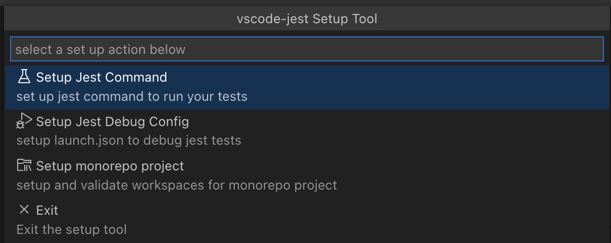
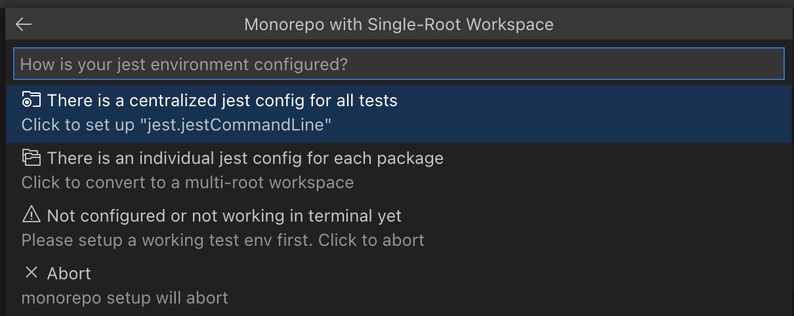

# Extension Setup Tool <!-- omit in toc -->


The extension setup tool is an interactive tool to help users set up the vscode-jest extension if the default configuration is insufficient.


---

- [Overview](#overview)
- [How to run it](#how-to-run-it)
- [How does it work](#how-does-it-work)
  - [Setup Jest Command](#setup-jest-command)
  - [Setup Jest Debug Config](#setup-jest-debug-config)
  - [Setup Monorepo Project](#setup-monorepo-project)
    - [Single-Root Workspace](#single-root-workspace)
    - [Multi-Root Workspace](#multi-root-workspace)
- [FAQ](#faq)

---
## Overview

This tool helps users set up the extension's basic configurations via a simple UI. While the extension provides default configurations that work for the typical standard environments, such as CRA and plain jest, the more sophisticated projects might need to customize the extension via a few simple settings, which the tool can assist with.

The tool asks questions and collects answers to update `settings.json`, `launch.json` or workspace file `xxx.code-workspace` ( [How does it work ?](#how-does-it-work)). It works for both single and multi-root workspaces. An output Terminal `"vscode-jest Setup"` will show progress and tips throughout the process.

Users can run the setup tool any time ([How to run it ?](how-to-run-it)) and safely abort if desired.

The tool tries its best to create accurate configurations, but it will not be able to cover all use cases out there. However, it always strikes for transparency and shows where and what the configuration will be updated so users can easily modify it manually if needed.

_(Note: this setup tool is not for setting up [jest](https://jestjs.io) itself. A working jest environment (such that you can run jest tests in the terminal) is a prerequisite for running the `vscode-jest` extension.)_
## How to run it
in v4.0, there are multiple ways to activate the setup tool:

1. via [Command Palette](https://code.visualstudio.com/docs/getstarted/userinterface#_command-palette): one can launch the wizard on-demand via vscode command palette `"Jest: Setup Extension"`
2. via the setup button in various message panels, such as when the jest process failed to start or when detecting missing debug config.

## How does it work

The tool provides 3 main setup tasks:



1. [Setup Jest Command](#jest-command-line): used by the extension to kick off a jest test run on behave of users.
2. [Setup Jest Debug Config](#debug-config): to enable debugging individual jest tests via the debug codeLens.
3. [Setup Monorepo Project](#debug-config): to assist the monorepo projects adapting to the vscode environment.

### Setup Jest Command
The extension starts the jest test process by issuing the same jest command users run in the terminal. The tool will examine the existing settings, looking for `"jest.jestCommandLine"` or the deprecated `"jest.pathToJest"` and `"jest.pathToConfig"`. If found, it will help users [migrate](#note-1)/edit it; if not found, it will ask the user to input the command line manually.

Please be aware that all relative paths in the settings are resolved against the `rootPath`, which, by default, is the current workspace folder unless you customize it with `"jest.rootPath"`.


While users can pass any jest CLI options in the `"jest.jestCommandLine"`, it is recommended NOT to pass the following:
- the watch options (--watch, --watch-all): the extension will append a watch flag when appropriate.
- the coverage option (--coverage): user can easily toggle on/off coverage via the jest command; therefore, no need to add it in the jestCommandLine.

Because the extension appends additional options to the jestCommandLine at run time, please make sure these additional options can be passed through; for example, if the jestCommandLine is `"npm test"`, make sure to add `"--"` at the end to pass through the additional options: `"npm test --"`.

**Note: the "jest.jestCommandLine"` setting is required to configure the debug config below.**

### Setup Jest Debug Config
When clicked on the debug codeLens, the extension will look for a debug config named `"vscode-jest-tests.v2"` or `"vscode-jest-tests"`, and translate the jest specific information when launching the debugger.

If there is no existing `"jest.jestCommandLine"`, it will suggest setting one up before proceeding. After all, a working jest environment is the prerequisite of this extension.

The tool will examine `launch.json` for the existing config. If found, users can choose to use it as it is, replace (rename the old one and generate a new one), or manually edit it; if not found, the tool will try to [generate](#note-2) a new one.

The debug config is saved in `launch.json` under the workspace folder. If the user chooses to "replace" the existing config, the old configure will be renamed to `vscode-jest-tests.v2-xxxxx` for reference purposes only, which can be safely deleted if not needed.

The generated config probably works fine for most projects but could require further adjustment for projects including but not limited to the following:
- projects use different jest config between debug and regular test run
- projects with [platform specific properties](#note-3).

Check out [here](#note-4) if you encountered problems running vscode-jest debug.

### Setup Monorepo Project


#### Single-Root Workspace

If the current workspace is a single-root workspace:



- **There is a centralized jest config for all tests**
If a project can run all its tests with this centralized jest config - it can use a regular single-root workspace for the monorepo project. If the project cannot run tests in this situation, it might need to customize the jest command line. Choose this action to set up `"jest.jestCommandLine"` setting.

 - **There is an individual jest config for each package**
If each monorepo package has its separate jest config and runs tests either by going to its local root, via jest's `"projects"`, or via 3rd party tools like `lerna` - the project will need to convert to a multi-root workspace. Choose this action to let the tool perform the conversion, followed by the [multi-root workspace](#multi-root-workspace) setup below.

 - **Not configured or not working in terminal yet**
If the project has not completed the jest configuration, i.e., not able to run jest tests in the terminal - Sorry, but it will need to finish the jest configuration first before resuming the setup. Choose this to abort.

#### Multi-Root Workspace

If the current workspace is a multi-root workspace, the tool will perform the following:

- **add folders**: If there is only a root folder, the tool will try to find eligible packages from the file system and add them to the workspace configuration. Once the folders are added, the validation step below will occur.
- **validate folders**: if there are multiple folders in the workspace. The tool will validate each folder to determine if it is jest eligible, which checks for the "activation" events. The "invalid" jest folders will be added to `"jest.disabledWorkspaceFolders"`  in the `.code-workspace` file.

After the workspace structure is set up, some folders might need to be further adjusted if encountered run time issues, such as an incorrect jest command line. Users can use the setup tool to adjust the settings for the given folder.

Please note, given the variety of user configurations, the tool might not get it right completely; therefore, it is recommended to examine the updated configurations and adjust accordingly.
## FAQ

- <a id="note-5">**After upgrade my monorepo to multi-root via the setup tool, I still see jest run error, why?**</a>

  The "monorepo setup" mainly creates and validates workspaces for "jest eligibility", i.e., does this folder has jest artifacts, such as jest config or binary? To ensure each folder runs as expected, users might need to adjust the "jest.jestCommandLine", "jest.rootPath", or other settings, no different from any single-root workspace. Feel free to use the setup tool's other tasks to assist each folder.

- <a id="note-1">**What does jestCommandLine migration process do?**</a>

  The wizard will combine `jest.PathToJest` and `jest.pathToConfig` into a single command line `jest.jestCommandLine` , e.g.
  ```
  //example 1
  jest.PathToJest = 'yarn test'
  jest.PathToConfig = '../../shared-jest.json'
  ==> jest.jestCommandLine = 'yarn test --config ../../shared-jest.json'


  // example 2
  jest.PathToJest = '../../node_modules/.bin/jest '
  jest.PathToConfig = './jest-config.json'
  ==> jest.jestCommandLine = '../../node_modules/.bin/jest --config ./jest-config.json'
  ```

  The `jest.jestCommandLine` setting will be saved in the workspace folder's local "settings.json" file.

- <a id="note-2">**How is debug config generated?**</a>
  The process goes like this:
  - parse `jest.jestCommandLine` into command and arguments. Resolve relative command path based on `jest.rootPath` if defined otherwise uses vscode variable `"${workspaceFolder}"`.
  - obtain a debug template from `DebugConfigurationProvider`
  - merge the jest command and arguments with the template.
    - if the command is `npm` or `yarn` it updates `runtimeExecutable` property; otherwise updates `program`
    - the arguments will be added to the `args` property, plus jest debug specific flags such as `--run-in-band`.
  - update `cwd` property with either `jest.rootPath` if defined, otherwise the vscode variable `"${workspaceFolder}"`


- <a id="note-3">**How is platform specific properties handled in DebugConfig generation?**</a>

  Currently, the tool does not generate platform-specific properties. Users will need to maintain them in the `launch.json` file manually.

  For example, for a different jest command under windows, add the `windows.program` section in `launch.json`:

  ```
  // launch.json
  "configurations": [
    ...
     {
       type: "node",
       name: "vscode-jest-tests.v2",
       ...
       program = "${workspaceFolder}/node_modules/.bin/jest",
       windows = {
         program: '${workspaceFolder}/node_modules/jest/bin/jest',
       },
     },
  ]
  ```
  See more details and examples in [vscode: platform specific properties](https://code.visualstudio.com/docs/editor/debugging#_platformspecific-properties).


- <a id="note-4">**vscode-jest debug failed, now what?**</a>

  If the regular jest run was fine, but the test debug failed after running the tool: there should be some error message in the terminal that might help pinpoint the culprit.

  There is much information online about how to setup vscode debug config for specific environments/frameworks; the following might  be helpful:
  - [vscode debug config properties](https://code.visualstudio.com/docs/nodejs/nodejs-debugging#_launch-configuration-properties)
  - [Launch configurations for common scenarios](https://code.visualstudio.com/docs/nodejs/nodejs-debugging#_launch-configurations-for-common-scenarios)
  - [vscode-recipes for debug jest tests](https://github.com/microsoft/vscode-recipes/tree/master/debugging-jest-tests)

